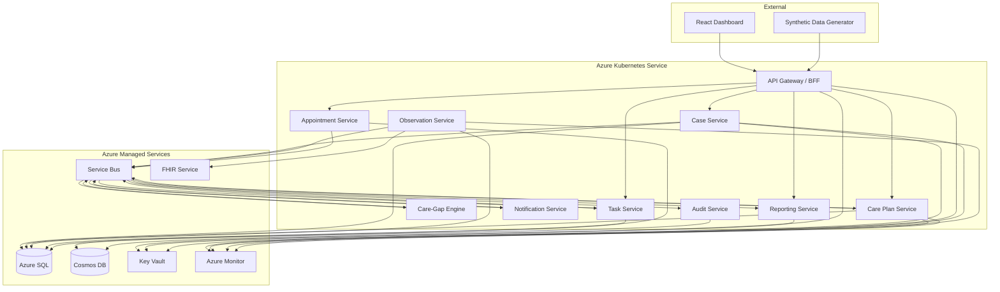

# CareBridge

**Cloud-Native Post-Discharge Care Coordination Platform**

CareBridge is a reference implementation of a healthcare operations platform built on Azure and Kubernetes. It manages the first 30 days after hospital discharge for high-risk patients — coordinating outreach, monitoring, alerting, task management, and follow-up scheduling across a care team.

> **Disclaimer:** This is a portfolio-grade reference implementation using **synthetic data only**. It is not a certified clinical platform, medical device, or production healthcare system. No real patient data is used anywhere in this project.

---

## Current Status

**v0.4 — Operational Workflows** (completed 2026-03-31)

The system currently implements the first four stages of the delivery plan:

| Stage | What's Working |
|---|---|
| **Foundation** | Solution structure, shared contracts/middleware, Docker Compose (SQL Server + RabbitMQ + Azurite), EF Core database migration tooling |
| **Case Intake** | Case Service (CRUD + events), Care Plan Service (event-driven activation with 5 milestones), API Gateway/BFF, React case list + case detail pages |
| **Monitoring & Alerting** | Observation Service (ingestion + validation + dedup), Care-Gap Engine (threshold evaluation + milestone scanning), alert lifecycle API, observations + alerts in React UI |
| **Coordinator Workflows** | Task Service (CRUD + alert-to-task automation + state transitions), Appointment Service (full lifecycle), Notification Service (event-driven log-based delivery), task completion → milestone update, appointment completion → milestone update, React task management + appointment management |

**69 automated tests pass** (contract serialization, threshold evaluation, task/appointment state transitions). Solution builds with 0 warnings. Frontend TypeScript compiles cleanly.

Services not yet implemented: Reporting Service, Audit Service, cloud deployment, synthetic data generator.

---

## Why This Project Exists

Most portfolio projects in healthcare either stay too shallow (a CRUD patient list) or become unrealistically broad (a full EHR). CareBridge focuses on **one strong operational workflow** — post-discharge care coordination — and implements it with the kind of architecture, security posture, and operational maturity expected in enterprise healthcare systems.

The goal is to demonstrate practical, defensible skills in:

- Azure-native cloud architecture
- Kubernetes and AKS delivery
- Microservices with event-driven workflows
- Healthcare interoperability using FHIR
- Security, identity, and secret management
- Observability and operational maturity
- CI/CD and infrastructure-as-code

---

## Core Capabilities

| Capability | Description |
|---|---|
| **Discharge Intake** | Ingest synthetic discharge bundles and create post-discharge cases |
| **Care Plan Activation** | Automatically activate diagnosis-specific care plans with tracked milestones |
| **Remote Observation Ingestion** | Accept simulated vital signs (BP, HR, SpO2, glucose, temperature, weight) |
| **Care-Gap Detection** | Rules-based detection of missed milestones and abnormal readings |
| **Alerting** | Severity-classified alerts with acknowledgment and resolution lifecycle |
| **Task Orchestration** | Create, assign, and track operational tasks for care coordinators |
| **Appointment Scheduling** | Schedule and monitor follow-up appointments with reminder triggers |
| **Notifications** | Template-based notifications via email, in-app, and simulated SMS |
| **Case Timeline** | Unified chronological view of every event in a patient's post-discharge journey |
| **Audit Trail** | Immutable, searchable audit log for all user and system actions |
| **Operational Dashboard** | Real-time views of open alerts, overdue tasks, workload, and queue health |

---

## Architecture at a Glance



The system uses **domain-oriented microservices** communicating through **Azure Service Bus** for event-driven workflows. Each service owns its data. Synchronous calls flow through the BFF for UI aggregation; asynchronous events drive the core care coordination workflow.

---

## Technology Stack

| Layer | Technology |
|---|---|
| **Backend** | .NET 10, ASP.NET Core Minimal APIs, EF Core |
| **Frontend** | React, TypeScript, Tailwind CSS |
| **Container Orchestration** | Azure Kubernetes Service (AKS), Helm |
| **Messaging** | Azure Service Bus (topics, subscriptions, dead-letter queues) |
| **Transactional Data** | Azure SQL Database (per-service databases, elastic pool) |
| **Read Models / Audit** | Azure Cosmos DB (NoSQL API, serverless tier) |
| **Clinical Interoperability** | Azure Health Data Services FHIR R4 |
| **Identity** | Microsoft Entra ID, AKS Workload Identity |
| **Secrets** | Azure Key Vault, Secrets Store CSI Driver |
| **Observability** | OpenTelemetry, Azure Monitor, Application Insights, Managed Prometheus, Managed Grafana |
| **CI/CD** | GitHub Actions, OIDC federation to Azure |
| **Infrastructure** | Terraform |
| **Local Development** | Docker Compose, Azurite, RabbitMQ (Service Bus stand-in) |

---

## Why This Design Is Relevant for Healthcare

Healthcare systems have specific architectural requirements that generic web applications don't face:

- **Auditability** — Every state change must be traceable. CareBridge maintains an immutable audit trail with correlation IDs across all services.
- **Data Sensitivity** — Even with synthetic data, the architecture enforces the patterns required for PHI protection: field-level access control, log scrubbing, encryption at rest and in transit.
- **Interoperability** — FHIR R4 alignment through Azure Health Data Services enables standards-based clinical data exchange.
- **Reliability** — Missed alerts or lost observations have clinical consequences. The event-driven architecture uses at-least-once delivery, idempotent processing, and dead-letter queues to prevent silent data loss.
- **Operational Visibility** — Care teams need real-time views of patient status. The CQRS read model pattern ensures dashboard performance without compromising transactional integrity.

---

## Local Development

```bash
# Prerequisites: .NET 10 SDK, Node.js 20+, Docker Desktop

# Start infrastructure dependencies
docker-compose up -d

# Run database migrations
dotnet run --project tools/db-migrator

# Seed synthetic data
dotnet run --project tools/synthetic-data-generator

# Start all services
dotnet run --project src/gateway

# Start the frontend
cd src/web/carebridge-ui && npm install && npm run dev
```

See [Local Development Guide](docs/developer/local-development.md) for detailed setup instructions.

---

## Azure Deployment

CareBridge deploys to Azure using GitHub Actions with OIDC federation (no stored credentials):

1. **Infrastructure** — Terraform provisions Azure resources (AKS, SQL, Cosmos DB, Service Bus, Key Vault, FHIR, ACR)
2. **Build** — GitHub Actions builds, tests, scans, and pushes container images to ACR
3. **Deploy** — Helm charts deploy services to AKS with environment-specific configuration
4. **Validate** — Smoke tests verify deployment health

See [Deployment Strategy](docs/deployment/deployment-strategy.md) and [CI/CD Pipeline](docs/deployment/ci-cd.md) for details.

---

## Repository Structure

```
carebridge/
├── docs/
│   ├── architecture/          # Solution, service, Azure, K8s, security, data, observability docs
│   ├── adr/                   # Architecture Decision Records
│   ├── runbooks/              # Operational runbooks
│   ├── deployment/            # Deployment strategy, environments, CI/CD
│   ├── developer/             # Local development, architecture guide, coding boundaries
│   └── product/               # Domain overview, personas, workflows, NFRs
├── src/
│   ├── gateway/               # API Gateway / BFF
│   ├── services/
│   │   ├── case-service/
│   │   ├── careplan-service/
│   │   ├── observation-service/
│   │   ├── caregap-engine/
│   │   ├── task-service/
│   │   ├── appointment-service/
│   │   ├── notification-service/
│   │   ├── audit-service/
│   │   └── reporting-service/
│   ├── web/
│   │   └── carebridge-ui/     # React frontend
│   └── shared/                # Shared contracts, middleware, OTEL config
├── tests/
│   ├── unit/
│   ├── integration/
│   └── contract/
├── infra/
│   └── terraform/             # Azure infrastructure provisioning
├── deploy/
│   └── helm/                  # Helm charts per service
├── tools/
│   ├── synthetic-data-generator/
│   └── scenario-runner/
└── .github/
    ├── ISSUE_TEMPLATE/        # Structured issue intake for bugs and feature requests
    ├── pull_request_template.md
    └── workflows/             # CI/CD pipeline definitions
```

---

## Documentation Map

### Architecture
- [Solution Architecture](docs/architecture/solution-architecture.md) — System design, service decomposition, communication model, deployment topology
- [Service Catalog](docs/architecture/service-catalog.md) — Per-service responsibilities, APIs, events, data ownership
- [Azure Architecture](docs/architecture/azure-architecture.md) — Azure resource topology, service selection rationale, networking, cost
- [Kubernetes Architecture](docs/architecture/kubernetes-architecture.md) — AKS runtime design, namespaces, scaling, Helm structure
- [Security and Compliance](docs/architecture/security-and-compliance.md) — Identity, RBAC, secrets, encryption, threat model, compliance posture
- [Observability](docs/architecture/observability.md) — Logging, metrics, tracing, dashboards, alerts, SLIs/SLOs
- [Data Architecture](docs/architecture/data-architecture.md) — Data ownership, FHIR integration, consistency model, event-carried state
- [API and Event Contracts](docs/architecture/api-and-event-contracts.md) — REST conventions, event envelope, schema evolution, sample payloads

### Decisions
- [Architecture Decision Records](docs/adr/) — 10 ADRs covering key technology and design choices

### Operations
- [Incident Response](docs/runbooks/incident-response.md)
- [Failed Message Processing](docs/runbooks/failed-message-processing.md)
- [Service Degradation](docs/runbooks/service-degradation.md)
- [High Alert Volume](docs/runbooks/high-alert-volume.md)
- [Deployment Rollback](docs/runbooks/deployment-rollback.md)

### Deployment
- [Deployment Strategy](docs/deployment/deployment-strategy.md)
- [Environment Strategy](docs/deployment/environments.md)
- [CI/CD Pipeline](docs/deployment/ci-cd.md)

### Developer
- [Local Development Guide](docs/developer/local-development.md)
- [Architecture Overview for Developers](docs/developer/architecture-overview-for-developers.md)
- [Coding Boundaries](docs/developer/coding-boundaries.md)

### Product
- [Domain Overview](docs/product/domain-overview.md)
- [User Personas](docs/product/user-personas.md)
- [Core Workflows](docs/product/core-workflows.md)
- [Non-Functional Requirements](docs/product/non-functional-requirements.md)

### Product Requirements
- [Product Requirements Document](docs/product/prd.md)

### Community Standards
- [Code of Conduct](CODE_OF_CONDUCT.md)
- [Contributing Guide](CONTRIBUTING.md)
- [Security Policy](SECURITY.md)
- [Issue Templates](.github/ISSUE_TEMPLATE/)
- [Pull Request Template](.github/pull_request_template.md)
- [License](LICENSE)

---

## Key Non-Functional Qualities

| Quality | Approach |
|---|---|
| **Performance** | CQRS with Cosmos DB read models. Case page p95 < 500ms. Dashboard p95 < 2s. |
| **Scalability** | Designed for 10K active cases, 500K observations/day. HPA for API services, KEDA for event consumers. |
| **Reliability** | At-least-once delivery, idempotent processing, dead-letter queues, circuit breakers. |
| **Security** | Workload Identity (no static secrets), Entra ID RBAC, Key Vault, TLS everywhere, audit trail. |
| **Observability** | OpenTelemetry traces + metrics + logs, Application Insights, Grafana dashboards, SLI/SLO tracking. |
| **Maintainability** | Clean service boundaries, documented contracts, automated tests, CI validation gates. |

---

## What This Project Demonstrates

**Solution Architecture** — Decomposing a healthcare workflow into bounded contexts with clear data ownership, synchronous and asynchronous communication patterns, and explicit trade-offs.

**Azure Platform Knowledge** — Selecting and integrating Azure services for defensible architectural reasons, not because they appeared in a tutorial. Each choice has an [ADR](docs/adr/) explaining the rationale and alternatives considered.

**Kubernetes Maturity** — Namespace strategy, probe design, autoscaling (HPA + KEDA), Workload Identity, Helm-based deployment, resource management, and operational observability — not just "it runs in a container."

**Event-Driven Design** — Service Bus topics, event-carried state transfer, eventual consistency, outbox pattern, dead-letter handling, and idempotent consumers — the patterns that matter when synchronous REST isn't enough.

**Healthcare Awareness** — FHIR R4 alignment, audit trail design, data sensitivity patterns, and honest compliance positioning. The system is HIPAA-aware by design without making misleading certification claims.

**Operational Thinking** — Runbooks, SLIs/SLOs, error budgets, correlation ID propagation, DLQ visibility, and incident response procedures. The kind of operational maturity that separates production-ready thinking from demo-only code.

---

## License

This project is licensed under the MIT License. See [LICENSE](LICENSE) for details.

---

> **CareBridge** is a portfolio project by Artem Semenov. It demonstrates cloud architecture, Kubernetes delivery, and healthcare systems design using synthetic data in a public reference implementation.
