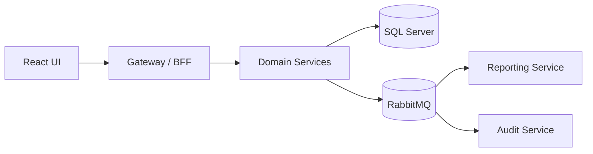

# CareBridge

Cloud-native post-discharge care coordination platform built as a portfolio-grade reference implementation for Azure and Kubernetes.

> Synthetic data only. CareBridge is not a production-certified clinical system, medical device, or EHR. No real patient data is used anywhere in this repository.

## What This Project Does

- Ingests synthetic discharge cases and creates active coordination workflows
- Activates care plans and tracks milestone completion
- Accepts remote observations and raises care-gap alerts
- Converts alerts into coordinator tasks, appointments, and notifications
- Exposes an operational dashboard, per-case timeline, and immutable audit trail
- Demonstrates local-first microservices patterns that map cleanly to Azure and AKS

## Why It Exists

Most healthcare portfolio projects are either too shallow to be technically credible or too broad to be believable. CareBridge focuses on one operational workflow, the first 30 days after hospital discharge, and uses it to demonstrate event-driven architecture, CQRS read models, observability, resilience, and healthcare-aware system design in a bounded, defensible scope.

## Current Status

`v0.6 Hardened` completed on `2026-04-02`.

| Area | Status |
|---|---|
| Delivery progress | 44 of 52 planned issues completed |
| Epic completion | 6 of 7 epics complete |
| Quality | 140 automated tests passing, solution builds with 0 warnings, frontend TypeScript compiles cleanly |
| What works today | Intake, care plans, monitoring, alerts, tasks, appointments, notifications, dashboard, timeline, audit, and service hardening |
| Next | Dockerfiles, Helm charts, Terraform, GitHub Actions CI/CD, and synthetic data generation tooling |

Detailed progress lives in [Delivery Dashboard](docs/delivery/README.md) and [Delivery Plan](docs/delivery/delivery-plan.md).

## Quickstart

Prerequisites: `.NET 9`, `Node.js 20+`, `Docker Desktop`

```bash
docker-compose up -d
dotnet run --project tools/db-migrator/CareBridge.DbMigrator
```

Start the backend services listed in [Local Development Guide](docs/developer/local-development.md), then start the frontend:

```bash
cd src/web/carebridge-ui
npm install
npm run dev
```

Useful local endpoints:

- UI: `http://localhost:5173`
- Gateway / BFF: `http://localhost:5000`
- Example health checks: `http://localhost:5000/ready`, `http://localhost:5010/healthz`

Full setup, ports, test commands, and troubleshooting: [Local Development Guide](docs/developer/local-development.md).

## Architecture At a Glance

CareBridge runs today as a local-first microservices system with SQL Server, RabbitMQ, and a React frontend. The target cloud shape is Azure + AKS, but the service boundaries and workflow orchestration already exist locally.



Key implementation themes:

- Event-driven workflows across bounded contexts
- CQRS-style read models for dashboard and timeline
- Immutable audit logging for domain events
- Structured logging, OpenTelemetry tracing, health probes, and HTTP resilience

Architecture details: [Solution Architecture](docs/architecture/solution-architecture.md), [Service Catalog](docs/architecture/service-catalog.md), and [API and Event Contracts](docs/architecture/api-and-event-contracts.md).

## Technology Stack

| Layer | Technology |
|---|---|
| Backend | .NET 9, ASP.NET Core Minimal APIs, EF Core |
| Frontend | React, TypeScript, Tailwind CSS, React Router, React Query |
| Local runtime | Docker Compose, SQL Server, RabbitMQ, Azurite |
| Target cloud | Azure, AKS, Azure SQL, Service Bus, Cosmos DB, Key Vault, Azure Monitor |

## Documentation Map

| Need | Document |
|---|---|
| Product intent and scope | [PRD](docs/product/prd.md), [Domain Overview](docs/product/domain-overview.md), [Core Workflows](docs/product/core-workflows.md) |
| Architecture | [Solution Architecture](docs/architecture/solution-architecture.md), [Security and Compliance](docs/architecture/security-and-compliance.md), [Observability](docs/architecture/observability.md) |
| Delivery status | [Delivery Dashboard](docs/delivery/README.md), [Delivery Plan](docs/delivery/delivery-plan.md), [Epic Files](docs/delivery/epics/) |
| Developer onboarding | [Local Development Guide](docs/developer/local-development.md), [Architecture Overview for Developers](docs/developer/architecture-overview-for-developers.md), [Coding Boundaries](docs/developer/coding-boundaries.md) |
| Deployment design | [Deployment Strategy](docs/deployment/deployment-strategy.md), [CI/CD Pipeline](docs/deployment/ci-cd.md), [Environment Strategy](docs/deployment/environments.md) |
| Decisions and operations | [ADRs](docs/adr/), [Runbooks](docs/runbooks/) |

## Roadmap

- `v0.7 Cloud-Deployed`: multi-stage Dockerfiles, Helm charts, Terraform, and GitHub Actions pipelines
- `v1.0 Demo-Ready`: synthetic data generator and a guided end-to-end walkthrough

See [Delivery Dashboard](docs/delivery/README.md) and [Epic 7: Infrastructure and Cloud Deployment](docs/delivery/epics/epic-7-infrastructure.md) for the remaining scope.

## Project Standards

- [Contributing Guide](CONTRIBUTING.md)
- [Security Policy](SECURITY.md)
- [License](LICENSE)
