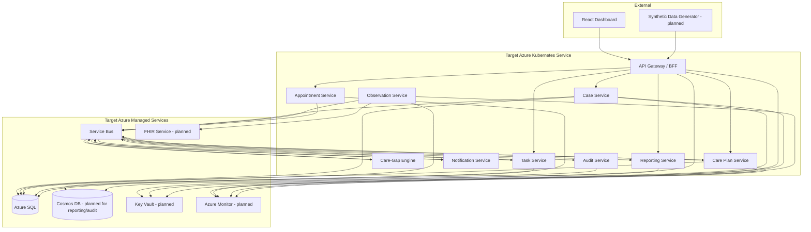

# CareBridge

**Cloud-Native Post-Discharge Care Coordination Platform**

CareBridge is a reference implementation of a healthcare operations platform targeting Azure and Kubernetes. It currently runs as a local-first microservices system and manages the first 30 days after hospital discharge for high-risk patients, coordinating outreach, monitoring, alerting, task management, and follow-up scheduling across a care team.

> **Disclaimer:** This is a portfolio-grade reference implementation using **synthetic data only**. It is not a certified clinical platform, medical device, or production healthcare system. No real patient data is used anywhere in this project.

---

## Current Status

**v0.5 — Dashboard & Audit** (completed 2026-04-01)

The system currently implements the first six stages of the delivery plan in local development:

| Stage | What's Working |
|---|---|
| **Foundation** | Solution structure, shared contracts/middleware, Docker Compose (SQL Server + RabbitMQ + Azurite), EF Core database migration tooling |
| **Case Intake** | Case Service (CRUD + events), Care Plan Service (event-driven activation with 5 milestones), API Gateway/BFF, React case list + case detail pages |
| **Monitoring & Alerting** | Observation Service (ingestion + validation + dedup), Care-Gap Engine (threshold evaluation + milestone scanning), alert lifecycle API, observations + alerts in React UI |
| **Coordinator Workflows** | Task Service (CRUD + alert-to-task automation + state transitions), Appointment Service (full lifecycle), Notification Service (event-driven log-based delivery), task completion → milestone update, appointment completion → milestone update, React task management + appointment management |
| **Dashboard & Reporting** | Reporting Service (consumes all 14 domain event types, EventId-based deduplication, in-memory read model store), operational dashboard API + React page (summary cards, alert queue, recent cases), case timeline API + React component (category filtering, sort toggle, pagination, relative timestamps) |
| **Audit & Compliance** | Audit Service (consumes all 14 domain event types, immutable append-only store, idempotent by EventId, 5-retry policy), read-only query API (multi-dimensional filters, cursor pagination, ISO 8601 date ranges), BFF proxy endpoints, React standalone audit log page with filters and expandable JSON payload, case detail "Recent Activity" section with link to full audit trail |

**140 automated tests pass** (18 contract + 3 case service + 19 care-gap engine + 18 task service + 11 appointment service + 27 reporting service + 44 audit service). Solution builds with 0 warnings. Frontend TypeScript compiles cleanly.

Still planned after v0.5: Azure deployment automation and synthetic data generation tooling. `tools/synthetic-data-generator/` currently exists only as a scaffold.

---

## Why This Project Exists

Most portfolio projects in healthcare either stay too shallow (a CRUD patient list) or become unrealistically broad (a full EHR). CareBridge focuses on **one strong operational workflow** — post-discharge care coordination — and implements it with the kind of architecture, security posture, and operational maturity expected in enterprise healthcare systems.

The goal is to demonstrate practical, defensible skills in:

- Azure-native cloud architecture
- Kubernetes and AKS delivery
- Microservices with event-driven workflows
- Healthcare interoperability using FHIR
- Security, identity, and secret management
- Observability and operational maturity
- CI/CD and infrastructure-as-code

---

## Core Capabilities

| Capability | Description |
|---|---|
| **Discharge Intake** | Ingest synthetic discharge bundles and create post-discharge cases |
| **Care Plan Activation** | Automatically activate diagnosis-specific care plans with tracked milestones |
| **Remote Observation Ingestion** | Accept simulated vital signs (BP, HR, SpO2, glucose, temperature, weight) |
| **Care-Gap Detection** | Rules-based detection of missed milestones and abnormal readings |
| **Alerting** | Severity-classified alerts with acknowledgment and resolution lifecycle |
| **Task Orchestration** | Create, assign, and track operational tasks for care coordinators |
| **Appointment Scheduling** | Schedule and monitor follow-up appointments with reminder triggers |
| **Notifications** | Rule-based notification records with channel selection and log-based delivery simulation |
| **Case Timeline** | Unified chronological view of every event in a patient's post-discharge journey |
| **Audit Trail** | Immutable, searchable audit log for all domain events with multi-dimensional filters and expandable event payloads |
| **Operational Dashboard** | Live view of active cases, open alerts by severity/status, overdue tasks, pending appointments, recent cases, and top alerts |

---

## Architecture at a Glance

The current implementation runs locally with SQL Server, RabbitMQ, and an in-memory reporting store. The diagram below shows the target Azure shape and marks the pieces that are still planned beyond v0.5.



Today, the same service boundaries run locally with RabbitMQ standing in for Azure Service Bus, SQL Server standing in for Azure SQL, and in-memory stores standing in for Cosmos DB on the reporting and audit sides. Each service owns its data. Synchronous calls flow through the BFF for UI aggregation; asynchronous events drive the core care coordination workflow.

---

## Technology Stack

| Layer | Technology |
|---|---|
| **Backend** | .NET 9, ASP.NET Core Minimal APIs, EF Core |
| **Frontend** | React, TypeScript, Tailwind CSS, React Router, React Query |
| **Local Runtime** | Docker Compose, SQL Server, RabbitMQ, Azurite |
| **Messaging** | RabbitMQ locally; Azure Service Bus is the target cloud equivalent |
| **Transactional Data** | SQL Server locally; Azure SQL is the target cloud equivalent |
| **Read Models / Audit** | In-memory reporting read models locally; Cosmos DB is planned for cloud read models and audit |
| **Clinical Interoperability** | Azure Health Data Services FHIR R4 is planned beyond the current MVP |
| **Identity** | Mock local auth today; Microsoft Entra ID and AKS Workload Identity are planned |
| **Secrets** | Local `.env` configuration today; Azure Key Vault and CSI Driver are planned |
| **Observability** | Shared service defaults and correlation IDs today; broader OTEL/Azure Monitor work is planned |
| **CI/CD and Infra** | Local-first today; GitHub Actions, Helm, Terraform, and AKS deployment are planned |

---

## Why This Design Is Relevant for Healthcare

Healthcare systems have specific architectural requirements that generic web applications don't face:

- **Auditability** — Every state change must be traceable. CareBridge captures all 14 domain event types into an immutable, queryable audit store with multi-dimensional search and full event payload inspection.
- **Data Sensitivity** — Even with synthetic data, the architecture enforces the patterns required for PHI protection: field-level access control, log scrubbing, encryption at rest and in transit.
- **Interoperability** — FHIR R4 alignment is part of the target Azure design and is intentionally deferred until after the current MVP slices.
- **Reliability** — Missed alerts or lost observations have clinical consequences. The current event-driven architecture already uses at-least-once delivery and idempotent consumers; DLQ and circuit-breaker hardening are planned for later infrastructure work.
- **Operational Visibility** — Care teams need real-time views of patient status. The CQRS read model pattern already powers the dashboard and case timeline without querying transactional databases.

---

## Local Development

```bash
# Prerequisites: .NET 9 SDK, Node.js 20+, Docker Desktop

# Start infrastructure dependencies
docker-compose up -d

# Run database migrations
dotnet run --project tools/db-migrator/CareBridge.DbMigrator

# Start implemented backend services in separate terminals
dotnet run --project src/services/case-service/CareBridge.CaseService
dotnet run --project src/services/careplan-service/CareBridge.CarePlanService
dotnet run --project src/services/observation-service/CareBridge.ObservationService
dotnet run --project src/services/caregap-engine/CareBridge.CareGapEngine
dotnet run --project src/services/task-service/CareBridge.TaskService
dotnet run --project src/services/appointment-service/CareBridge.AppointmentService
dotnet run --project src/services/notification-service/CareBridge.NotificationService
dotnet run --project src/services/reporting-service/CareBridge.ReportingService
dotnet run --project src/services/audit-service/CareBridge.AuditService
dotnet run --project src/gateway/CareBridge.Gateway

# Start the frontend
cd src/web/carebridge-ui
npm install
npm run dev
```

At v0.5, the synthetic data generator is not runnable yet. Use the implemented APIs and UI flows for manual walkthroughs.

See [Local Development Guide](docs/developer/local-development.md) for detailed setup instructions.

---

## Planned Azure Deployment

The repository includes the deployment design for an Azure rollout using GitHub Actions with OIDC federation (no stored credentials), but the Terraform, Helm, and workflow implementation are still future work after v0.5:

1. **Infrastructure** — Terraform provisions Azure resources (AKS, SQL, Cosmos DB, Service Bus, Key Vault, FHIR, ACR)
2. **Build** — GitHub Actions builds, tests, scans, and pushes container images to ACR
3. **Deploy** — Helm charts deploy services to AKS with environment-specific configuration
4. **Validate** — Smoke tests verify deployment health

See [Deployment Strategy](docs/deployment/deployment-strategy.md) and [CI/CD Pipeline](docs/deployment/ci-cd.md) for details.

---

## Repository Structure

```
carebridge/
├── docs/
│   ├── architecture/          # Solution, service, Azure, K8s, security, data, observability docs
│   ├── adr/                   # Architecture Decision Records
│   ├── runbooks/              # Operational runbooks
│   ├── deployment/            # Deployment strategy, environments, CI/CD
│   ├── developer/             # Local development, architecture guide, coding boundaries
│   └── product/               # Domain overview, personas, workflows, NFRs
├── src/
│   ├── gateway/               # API Gateway / BFF
│   ├── services/
│   │   ├── case-service/
│   │   ├── careplan-service/
│   │   ├── observation-service/
│   │   ├── caregap-engine/
│   │   ├── task-service/
│   │   ├── appointment-service/
│   │   ├── notification-service/
│   │   ├── audit-service/     # Immutable audit trail (Epic 6)
│   │   └── reporting-service/
│   ├── web/
│   │   └── carebridge-ui/     # React frontend
│   └── shared/                # Shared contracts and infrastructure middleware
├── tests/
│   ├── unit/
│   ├── integration/
│   └── contract/
├── infra/
│   └── terraform/             # Planned Azure infrastructure provisioning
├── deploy/
│   └── helm/                  # Planned Helm charts per service
├── tools/
│   ├── db-migrator/           # EF Core migration runner
│   └── synthetic-data-generator/ # Placeholder scaffold for Epic 7
└── .github/
    ├── ISSUE_TEMPLATE/        # Structured issue intake for bugs and feature requests
    ├── pull_request_template.md
    └── workflows/             # CI/CD pipeline definitions
```

---

## Documentation Map

### Architecture
- [Solution Architecture](docs/architecture/solution-architecture.md) — System design, service decomposition, communication model, deployment topology
- [Service Catalog](docs/architecture/service-catalog.md) — Per-service responsibilities, APIs, events, data ownership
- [Azure Architecture](docs/architecture/azure-architecture.md) — Azure resource topology, service selection rationale, networking, cost
- [Kubernetes Architecture](docs/architecture/kubernetes-architecture.md) — AKS runtime design, namespaces, scaling, Helm structure
- [Security and Compliance](docs/architecture/security-and-compliance.md) — Identity, RBAC, secrets, encryption, threat model, compliance posture
- [Observability](docs/architecture/observability.md) — Logging, metrics, tracing, dashboards, alerts, SLIs/SLOs
- [Data Architecture](docs/architecture/data-architecture.md) — Data ownership, FHIR integration, consistency model, event-carried state
- [API and Event Contracts](docs/architecture/api-and-event-contracts.md) — REST conventions, event envelope, schema evolution, sample payloads

### Decisions
- [Architecture Decision Records](docs/adr/) — 11 ADRs covering key technology and design choices

### Operations
- [Incident Response](docs/runbooks/incident-response.md)
- [Failed Message Processing](docs/runbooks/failed-message-processing.md)
- [Service Degradation](docs/runbooks/service-degradation.md)
- [High Alert Volume](docs/runbooks/high-alert-volume.md)
- [Deployment Rollback](docs/runbooks/deployment-rollback.md)

### Deployment
- [Deployment Strategy](docs/deployment/deployment-strategy.md)
- [Environment Strategy](docs/deployment/environments.md)
- [CI/CD Pipeline](docs/deployment/ci-cd.md)

### Developer
- [Local Development Guide](docs/developer/local-development.md)
- [Architecture Overview for Developers](docs/developer/architecture-overview-for-developers.md)
- [Coding Boundaries](docs/developer/coding-boundaries.md)

### Product
- [Domain Overview](docs/product/domain-overview.md)
- [User Personas](docs/product/user-personas.md)
- [Core Workflows](docs/product/core-workflows.md)
- [Non-Functional Requirements](docs/product/non-functional-requirements.md)

### Product Requirements
- [Product Requirements Document](docs/product/prd.md)

### Community Standards
- [Code of Conduct](CODE_OF_CONDUCT.md)
- [Contributing Guide](CONTRIBUTING.md)
- [Security Policy](SECURITY.md)
- [Issue Templates](.github/ISSUE_TEMPLATE/)
- [Pull Request Template](.github/pull_request_template.md)
- [License](LICENSE)

---

## Key Non-Functional Qualities

| Quality | Approach |
|---|---|
| **Performance** | CQRS read models already back dashboard and timeline queries locally; Cosmos DB-backed read models are planned for cloud deployment. |
| **Scalability** | Service boundaries and async workflows are in place; HPA/KEDA scale-out is part of the planned AKS rollout. |
| **Reliability** | At-least-once delivery and idempotent consumers are implemented now; DLQ and circuit-breaker hardening are planned next. |
| **Security** | Mock auth is used locally today; an immutable audit trail is implemented. Entra ID, Workload Identity, and Key Vault are planned for cloud deployment. |
| **Observability** | Correlation IDs and shared service defaults are in place; broader OpenTelemetry, Azure Monitor, and dashboarding are planned. |
| **Maintainability** | Clean service boundaries, documented contracts, 140 passing tests, and delivery docs keep the codebase navigable. |

---

## What This Project Demonstrates

**Solution Architecture** — Decomposing a healthcare workflow into bounded contexts with clear data ownership, synchronous and asynchronous communication patterns, and explicit trade-offs.

**Azure Platform Knowledge** — Selecting and documenting Azure services for defensible architectural reasons, not because they appeared in a tutorial. Each choice has an [ADR](docs/adr/) explaining the rationale and alternatives considered.

**Kubernetes Delivery Design** — Namespace strategy, probe design, autoscaling (HPA + KEDA), Workload Identity, Helm-based deployment, resource management, and operational observability are documented as the next deployment stage, not hand-waved.

**Event-Driven Design** — Service Bus topics, event-carried state transfer, eventual consistency, outbox pattern, dead-letter handling, and idempotent consumers — the patterns that matter when synchronous REST isn't enough.

**Healthcare Awareness** — FHIR R4 alignment, audit trail design, data sensitivity patterns, and honest compliance positioning. The system is HIPAA-aware by design without making misleading certification claims.

**Operational Thinking** — Runbooks, SLIs/SLOs, error budgets, correlation ID propagation, DLQ visibility, and incident response procedures. The kind of operational maturity that separates production-ready thinking from demo-only code.

---

## License

This project is licensed under the MIT License. See [LICENSE](LICENSE) for details.
