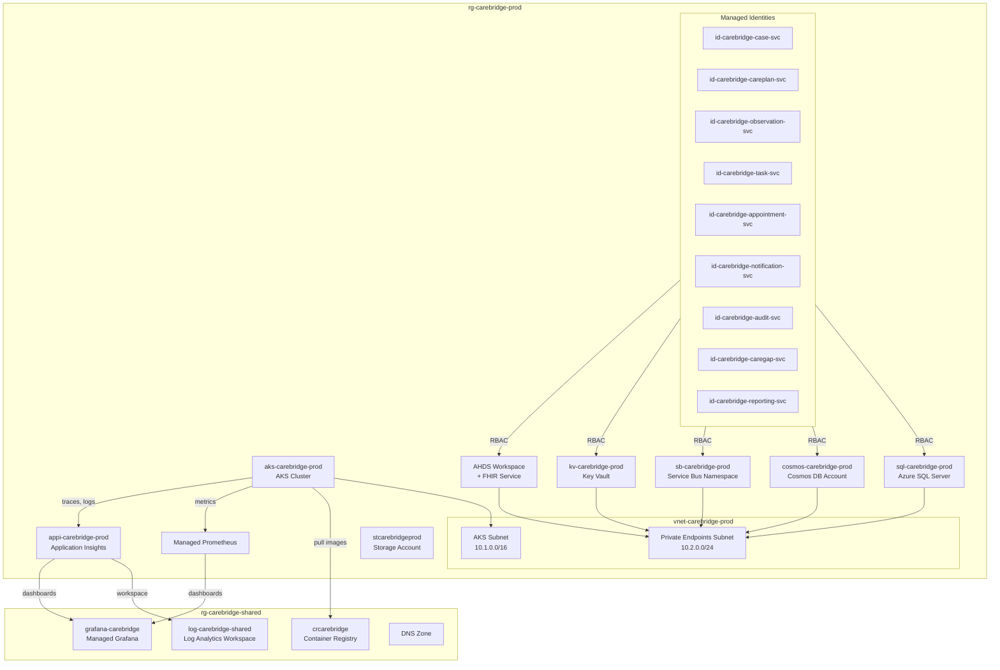
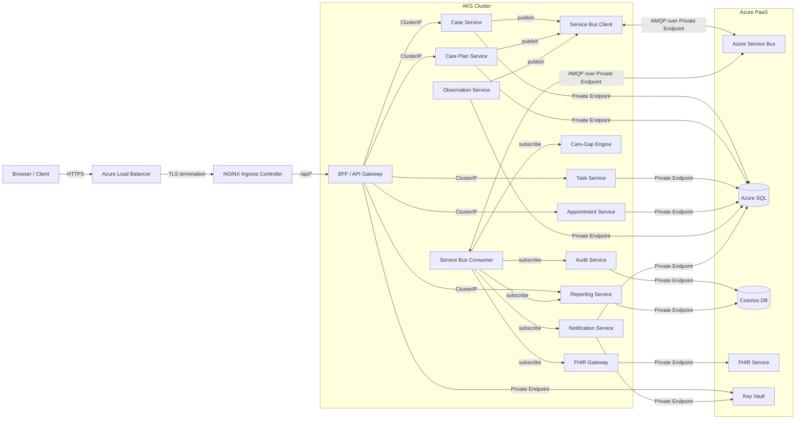

# Azure Architecture

**Document type:** Platform architecture
**Status:** Living document
**Last updated:** 2026-03-27

---

## Overview

This document describes the Azure platform architecture for CareBridge -- the specific Azure services selected, how they are configured, how they relate to each other, and why each was chosen over alternatives. It is the reference artifact for anyone reviewing the infrastructure design, estimating cost, or planning deployment.

CareBridge is a cloud-native post-discharge care coordination platform. It is a portfolio and reference implementation using synthetic data only. The architecture reflects real enterprise patterns but is right-sized for portfolio cost and operational simplicity where appropriate.

This document should be read alongside [Solution Architecture](solution-architecture.md) for system-level design and [Kubernetes Architecture](kubernetes-architecture.md) for AKS runtime details.

---

## 1. Azure Resource Topology

### Resource Group Strategy

All Azure resources are organized into resource groups following the naming convention `rg-carebridge-{env}`:

| Resource Group | Purpose |
|---|---|
| `rg-carebridge-dev` | Development environment -- shared AKS cluster, minimal SKUs, used for active development |
| `rg-carebridge-staging` | Pre-production validation -- mirrors production topology at reduced scale |
| `rg-carebridge-prod` | Production environment -- full redundancy, zone-aware configuration |
| `rg-carebridge-shared` | Cross-environment resources: ACR, Managed Grafana, DNS zones, Log Analytics workspace |

### Naming Conventions

Resources follow the pattern `{abbreviation}-carebridge-{resource}-{env}`:

| Resource Type | Abbreviation | Example |
|---|---|---|
| AKS Cluster | `aks` | `aks-carebridge-dev` |
| Azure SQL Server | `sql` | `sql-carebridge-dev` |
| Cosmos DB Account | `cosmos` | `cosmos-carebridge-dev` |
| Service Bus Namespace | `sb` | `sb-carebridge-dev` |
| Key Vault | `kv` | `kv-carebridge-dev` |
| Container Registry | `cr` | `crcarebridge` (global, no hyphens allowed) |
| Storage Account | `st` | `stcarebridgedev` (global, no hyphens allowed) |
| FHIR Service | `fhir` | `fhir-carebridge-dev` |
| Managed Identity | `id` | `id-carebridge-patient-svc-dev` |
| Virtual Network | `vnet` | `vnet-carebridge-dev` |
| Application Insights | `appi` | `appi-carebridge-dev` |
| Log Analytics Workspace | `log` | `log-carebridge-shared` |

These conventions align with [Azure naming conventions guidance](https://learn.microsoft.com/en-us/azure/cloud-adoption-framework/ready/azure-best-practices/resource-naming) from the Cloud Adoption Framework.

### Resource Topology Diagram



---

## 2. AKS Role in the System

Azure Kubernetes Service is the compute layer for all CareBridge microservices. A single AKS cluster is deployed per environment.

### Why AKS Over App Service or Container Apps

The decision to use AKS instead of Azure App Service or Azure Container Apps was deliberate. CareBridge's requirements exceed what PaaS compute services offer at this level of architectural depth:

- **Fine-grained networking.** Services communicate over ClusterIP, with NGINX Ingress for external traffic. Private endpoints for Azure services are routed from within the VNet. App Service VNet integration and Container Apps environments provide some network control, but not the subnet-level isolation and NetworkPolicy enforcement available in AKS.
- **Sidecar patterns.** OpenTelemetry Collector sidecars, Secrets Store CSI Driver, and potential future service mesh integration require pod-level control over container composition. Container Apps has introduced sidecar support, but AKS provides the mature, well-documented Kubernetes-native model.
- **Namespace isolation.** Multiple environments in a single dev cluster (dev namespaces for cost savings), RBAC per namespace, and resource quotas per team are standard Kubernetes capabilities not available in App Service.
- **Helm-based deployment.** The deployment model uses Helm charts with environment-specific values files. This is the deployment primitive; AKS is the runtime that supports it.
- **Enterprise pattern alignment.** Most enterprise healthcare organizations deploying microservices on Azure use AKS. Demonstrating proficiency with AKS, its identity model, networking, scaling, and operational tooling carries more weight in a portfolio context than App Service or Container Apps.

AKS is not the simplest option. It is the option that best demonstrates the architectural depth this project is designed to showcase.

### Node Pool Configuration

Each AKS cluster runs two node pools:

| Node Pool | Purpose | VM Size (Portfolio) | VM Size (Production) | Min/Max Nodes |
|---|---|---|---|---|
| `system` | CoreDNS, kube-proxy, metrics-server, NGINX Ingress Controller, Secrets Store CSI Driver | Standard_B2s | Standard_D2s_v5 | 1 / 2 |
| `user` | CareBridge application workloads (all microservices) | Standard_B4ms | Standard_D4s_v5 | 1 / 5 |

For portfolio deployment, B-series burstable VMs are sufficient because the workload is synthetic and bursty rather than continuously saturated. Production sizing moves to D-series for consistent baseline performance.

System and user node pools are separated to prevent application memory pressure or OOM events from destabilizing cluster infrastructure components. The system pool uses taints (`CriticalAddonsOnly=true:NoSchedule`) to prevent user workloads from being scheduled on system nodes.

---

## 3. Azure Container Registry

Azure Container Registry serves as the single image registry for all CareBridge container images.

### Configuration

- **SKU:** Basic for portfolio (sufficient for image storage and pull throughput), Standard or Premium for production (geo-replication, private link).
- **AKS integration:** The AKS cluster authenticates to ACR via managed identity (`AcrPull` role assignment on the kubelet identity). No image pull secrets are stored in Kubernetes.
- **Image scanning:** Defender for Containers scans pushed images for OS and language-package vulnerabilities. Scans run on push and are surfaced in the GitHub Actions pipeline output.
- **Retention:** Untagged manifests are purged after 7 days to prevent registry bloat.

### Image Tag Strategy

Every image is tagged with two identifiers:

1. **Git SHA** (`crcarebridge.azurecr.io/carebridge/case-service:a1b2c3d`) -- immutable reference for traceability from a running pod back to the exact commit.
2. **Semantic version** (`crcarebridge.azurecr.io/carebridge/case-service:1.2.0`) -- human-readable version used in Helm values files and release tracking.

The `latest` tag is never used in any environment. Helm values files pin exact image references. This ensures that every deployment is reproducible and that `kubectl describe pod` immediately reveals which code version is running.

---

## 4. Azure Health Data Services FHIR Service

Azure Health Data Services (AHDS) provides the FHIR R4 service used as CareBridge's clinical data interoperability layer.

### Role in the Architecture

The FHIR service is **not** the primary transactional store. Each microservice owns its operational data in Azure SQL (see Section 5). The FHIR service is the **interoperability projection** -- a standards-compliant representation of clinical data that external systems or analytics consumers could query using the FHIR API.

Resources stored in FHIR:

| FHIR Resource | Source | Purpose |
|---|---|---|
| `Patient` | Case Service | Demographic identity for the patient in FHIR-compliant form |
| `Encounter` | Case Service | The discharge encounter that initiated the post-discharge case |
| `Condition` | Case Service | Primary and secondary conditions associated with the discharge |
| `Observation` | Observation Service | Remote monitoring readings (blood pressure, heart rate, SpO2, glucose, temperature, weight) |
| `CarePlan` | Care Plan Service | Active care plan with milestones mapped to FHIR `CarePlan.activity` |

### Synchronization Model

Services publish domain events to Azure Service Bus (e.g., `PatientRegistered`, `ObservationRecorded`, `CarePlanActivated`). A dedicated FHIR Gateway consumer subscribes to these events and translates them into FHIR R4 resources, which it writes to the AHDS FHIR service. This is an eventually consistent projection, not a synchronous write path. The latency target for FHIR projection is under 30 seconds from event publication.

This approach means:

- Operational services are never blocked by FHIR write latency or availability.
- The FHIR schema does not constrain the operational data model.
- FHIR projection logic is isolated in one service, not scattered across every microservice.

### Why AHDS Over Self-Hosted HAPI FHIR

HAPI FHIR is a robust open-source FHIR server commonly deployed on Kubernetes. For CareBridge, AHDS was chosen because:

- **Managed service.** AHDS eliminates the operational burden of running a Java-based FHIR server (JVM tuning, database management, upgrade coordination). The CareBridge team manages infrastructure-as-code for the AHDS workspace, not the FHIR server itself.
- **Azure ecosystem integration.** AHDS supports Managed Identity authentication, Private Link, and diagnostic logging to Azure Monitor. These integrate with the same identity and networking model used by every other Azure resource in the platform.
- **Compliance posture.** AHDS is a HITRUST-certified Azure service. While CareBridge is a reference implementation and not production-certified, using a compliance-certified FHIR service demonstrates awareness of the compliance toolchain that a real healthcare deployment would require.
- **Portfolio alignment.** The project demonstrates Azure platform proficiency. Using the Azure-native FHIR service is more aligned with that objective than deploying a self-hosted alternative.

The trade-off is cost (AHDS has per-API-call pricing) and less control over FHIR server behavior. For portfolio workloads, the cost is negligible with synthetic data volumes.

---

## 5. Azure SQL

Azure SQL Database is the primary transactional data store for all services that require relational persistence.

### Database Topology

A single Azure SQL logical server hosts per-service databases:

| Database | Owning Service | Key Tables |
|---|---|---|
| `db-case` | Case Service | Cases, PatientSummaries, CaseStatusHistory |
| `db-careplan` | Care Plan Service | CarePlans, Milestones, MilestoneHistory, PathwayTemplates |
| `db-task` | Task Service | Tasks, TaskComments, TaskAssignmentHistory |
| `db-appointment` | Appointment Service | Appointments, AppointmentHistory, ReminderSchedule |
| `db-observation` | Observation Service | Observations, ObservationBatches, DeviceSources |
| `db-notification` | Notification Service | NotificationAttempts, NotificationTemplates, DeliveryLog |

Each service connects exclusively to its own database. Cross-service data access happens through Service Bus events or synchronous API calls to the BFF, never through shared database access. This is logical isolation within a single server -- the same permission boundary pattern used in multi-tenant SaaS systems.

### Elastic Pool

All databases are grouped in an elastic pool (`pool-carebridge-{env}`):

- **Portfolio:** Basic elastic pool, 50 eDTUs shared across all databases. Total cost is approximately one-third of running six individual S0 databases.
- **Production:** Standard elastic pool, 100-200 eDTUs, with per-database min/max eDTU limits to prevent noisy-neighbor effects.

Elastic pools are the correct cost optimization for this workload because no individual service database sustains high throughput continuously. Discharge intake is bursty (morning batch), observation ingestion has daily peaks, and administrative operations are sporadic. The pool absorbs these heterogeneous patterns.

### Access Model

Services authenticate to Azure SQL using Managed Identity (see Section 9). The connection string contains no password:

```
Server=sql-carebridge-prod.database.windows.net;Database=db-case;Authentication=Active Directory Managed Identity;
```

Each managed identity is granted `db_datareader` and `db_datawriter` on its specific database. No identity has `db_owner` or cross-database access. Schema migrations run under a separate identity with elevated permissions, executed during deployment only.

### Why Azure SQL Over PostgreSQL Flexible Server

Both Azure SQL and Azure Database for PostgreSQL Flexible Server are production-grade managed relational databases. Azure SQL was chosen for CareBridge because:

- **EF Core alignment.** Entity Framework Core has the deepest provider support for SQL Server. The SQL Server provider supports advanced features (temporal tables, hierarchyid, output clauses for bulk operations) that the PostgreSQL provider handles through third-party extensions. For a .NET project, SQL Server is the path of least friction.
- **AHDS ecosystem consistency.** Azure Health Data Services uses SQL Server internally. Staying in the SQL Server ecosystem reduces the cognitive and operational surface area when debugging data flows end-to-end.
- **Elastic pools.** Azure SQL elastic pools provide a mature, well-documented cost-sharing model for multiple databases on a single server. PostgreSQL Flexible Server does not have an equivalent elastic pool primitive; cost optimization requires manual sizing of individual server instances.
- **Portfolio context.** Azure SQL is widely deployed in enterprise healthcare. Demonstrating competence with Azure SQL, its security model, and its operational characteristics is directly relevant to the target audience.

PostgreSQL would be an equally valid technical choice. The decision is driven by ecosystem alignment and portfolio positioning, not by a fundamental capability gap.

---

## 6. Cosmos DB

Azure Cosmos DB is used for two specific workloads where its characteristics provide clear advantages over relational storage.

### Workload 1: Audit Event Store

The Audit Service writes immutable audit events to Cosmos DB. Each event records a system or user action (case created, task assigned, observation processed, notification sent) with full context.

- **Container:** `audit-events`
- **Partition key:** `/caseId`
- **Access pattern:** Append-only writes. Reads are by `caseId` (retrieve all events for a case timeline) or by time range within a case.
- **Why Cosmos:** Audit events are schema-variable (a task assignment event has different properties than an observation event). The NoSQL document model accommodates this naturally without ALTER TABLE migrations. Partitioning by `caseId` co-locates all events for a single case, making timeline reconstruction a single-partition query with sub-10ms latency.

### Workload 2: Dashboard and Timeline Read Models

The Reporting Service maintains denormalized read models that power the coordinator dashboard and patient case timeline views.

- **Container:** `read-models`
- **Partition key:** `/caseId`
- **Access pattern:** Write on domain event receipt (projection). Read by `caseId` for case detail, by coordinator ID for dashboard views (cross-partition query, acceptable at portfolio scale).
- **Why Cosmos:** Read models are denormalized projections rebuilt from events. Their schema evolves as dashboard requirements change, without requiring relational schema migrations. The document model aligns with the shape of the data the frontend consumes -- a single document per case containing nested care plan status, recent observations, alert summaries, and task counts.

### Configuration

- **API:** NoSQL (core SQL API). Chosen over Table API or MongoDB API because the SQL-like query syntax is the most natural fit for the query patterns described above, and the .NET SDK for the NoSQL API is the most mature.
- **Consistency:** Session consistency. Sufficient for read-after-write within a single user session (the Reporting Service writes a projection and the BFF reads it for the same case). Strong consistency is unnecessary and would double RU cost.
- **Throughput model:** Serverless for portfolio deployment. Serverless charges per RU consumed with no minimum throughput commitment. For synthetic workloads with sporadic access, this is dramatically cheaper than provisioned throughput. Production would evaluate autoscale provisioned throughput (400 to 4000 RU/s) based on observed traffic patterns.

### Why Cosmos for These Workloads Specifically

Cosmos DB is not used as a general-purpose store. It is used where its specific characteristics align with the access pattern:

- **Schema flexibility** for event payloads that vary by event type and evolve over time.
- **Partition-key-aligned reads** for case-centric access patterns that need single-digit millisecond latency.
- **Serverless tier** for cost efficiency in a portfolio context where throughput is unpredictable and often zero.
- **Append-only guarantees** for the audit store, where TTL and change feed provide lifecycle management and downstream integration without application-level complexity.

Services with stable schemas and relational query needs (joins, transactions across entities) use Azure SQL. Cosmos DB is reserved for the workloads described above.

---

## 7. Azure Service Bus

Azure Service Bus is the messaging backbone for all asynchronous communication between CareBridge services.

### Topology

Service Bus uses topics and subscriptions for publish-subscribe event distribution:

| Topic | Publisher | Subscribers | Event Examples |
|---|---|---|---|
| `patient-events` | Case Service | Care Plan Service, FHIR Gateway, Audit Service, Reporting Service | `PatientRegistered`, `CaseCreated`, `CaseStatusChanged` |
| `careplan-events` | Care Plan Service | Care-Gap Engine, Task Service, Audit Service, Reporting Service | `CarePlanActivated`, `MilestoneCompleted`, `MilestoneOverdue` |
| `observation-events` | Observation Service | Care-Gap Engine, FHIR Gateway, Audit Service, Reporting Service | `ObservationRecorded`, `ObservationBatchProcessed` |
| `alert-events` | Care-Gap Engine | Task Service, Notification Service, Audit Service, Reporting Service | `AlertRaised`, `AlertAcknowledged`, `AlertResolved` |
| `task-events` | Task Service | Notification Service, Audit Service, Reporting Service | `TaskCreated`, `TaskAssigned`, `TaskCompleted` |
| `appointment-events` | Appointment Service | Care Plan Service, Notification Service, Audit Service, Reporting Service | `AppointmentScheduled`, `AppointmentCompleted`, `AppointmentNoShow` |
| `notification-events` | Notification Service | Audit Service | `NotificationSent`, `NotificationFailed` |

Each subscribing service has its own subscription on the relevant topic. Subscriptions have independent cursor positions -- one slow consumer does not block others.

### Dead-Letter Queues

Every subscription has an associated dead-letter queue (DLQ). Messages are dead-lettered when:

- Maximum delivery count is exceeded (configured at 10 attempts with exponential backoff).
- The consumer explicitly dead-letters the message (e.g., deserialization failure, business rule violation that is not retryable).
- The message TTL expires (configured at 24 hours for most topics).

DLQ depth is monitored via Managed Prometheus metrics and surfaced in the operations dashboard. The Platform Administrator persona (Alex Kumar) uses the Dead-Letter Inspector to review, replay, or discard failed messages. See [Failed Message Processing runbook](../runbooks/failed-message-processing.md) for operational procedures.

### Sessions

Ordered processing is required for care plan state transitions (a milestone cannot be completed before it is activated) and case status changes. These topics use **Service Bus sessions** with `SessionId` set to the `caseId`. Sessions guarantee FIFO delivery within a session, meaning all events for a single case are processed in order, while events for different cases are processed concurrently.

Sessions are not used on all topics. Observation events, for example, are idempotent and order-independent -- a blood pressure reading at 10:00 AM and a heart rate reading at 10:05 AM can be processed in any order. Unnecessary session usage reduces throughput because it serializes processing per session.

### Why Service Bus Over Event Grid or Event Hubs

- **Event Grid** is optimized for reactive, push-based event routing (resource events, webhook delivery). It does not provide built-in DLQ with message inspection, session ordering, or scheduled delivery. CareBridge needs transactional messaging semantics with retry, DLQ, and ordered processing -- these are Service Bus capabilities.
- **Event Hubs** is optimized for high-throughput event streaming (millions of events per second) with consumer group-based processing. CareBridge's event volume (thousands per day in portfolio, hundreds of thousands in a production simulation) is well below the threshold where Event Hubs' partitioned log model provides advantages. Event Hubs does not support per-message DLQ or sessions. It is the right choice for telemetry ingestion at scale; it is not the right choice for domain event messaging.
- **Service Bus** provides exactly the semantics CareBridge needs: topic-based pub/sub, per-subscription DLQ with message inspection and replay, sessions for ordered processing, scheduled delivery for reminder events, and transactional receive with completion acknowledgment. It is the messaging service designed for application-level domain events.

### Configuration

- **SKU:** Standard for portfolio (supports topics, subscriptions, sessions). Premium for production (dedicated capacity, VNet integration via Private Link).
- **Authentication:** Managed Identity with `Azure Service Bus Data Sender` and `Azure Service Bus Data Receiver` roles scoped per service per topic/subscription.

---

## 8. Azure Key Vault

Azure Key Vault stores secrets that cannot be replaced by RBAC-based managed identity authentication.

### What Key Vault Stores

| Secret Type | Examples | Why Not Managed Identity |
|---|---|---|
| External API keys | Simulated SMS provider API key, synthetic data generation API key | Third-party services that do not support Entra ID authentication |
| Encryption keys | Data encryption key for field-level encryption of sensitive-looking synthetic fields | Key management requires centralized HSM-backed storage |
| Configuration secrets | Feature flags requiring signed validation, webhook signing keys | Application-level secrets with no Azure RBAC equivalent |
| Certificates | TLS certificates for NGINX Ingress (if not using Let's Encrypt), mTLS certificates for cross-cluster communication | Certificate lifecycle management requires Key Vault's renewal and notification features |

Key Vault does **not** store Azure SQL connection strings, Service Bus connection strings, or Cosmos DB keys. These services are accessed via Managed Identity and RBAC. Storing connection strings in Key Vault when Managed Identity is available creates unnecessary secret rotation obligations and violates the zero-static-secrets principle described in [ADR-007](../adr/007-workload-identity.md).

### Access Model

Pods access Key Vault through the **Secrets Store CSI Driver** with the Azure Key Vault provider. The driver mounts secrets as files in the pod's filesystem at a configured path. The CSI driver authenticates to Key Vault using the pod's Workload Identity -- no Key Vault access credentials are stored anywhere.

The mount is configured in the Helm chart's `SecretProviderClass` custom resource:

```yaml
apiVersion: secrets-store.csi.x-k8s.io/v1
kind: SecretProviderClass
metadata:
  name: carebridge-notification-svc-secrets
spec:
  provider: azure
  parameters:
    usePodIdentity: "false"
    useVMSSClientId: "false"
    clientID: "<notification-svc-managed-identity-client-id>"
    keyvaultName: "kv-carebridge-prod"
    tenantId: "<tenant-id>"
    objects: |
      array:
        - |
          objectName: sms-provider-api-key
          objectType: secret
        - |
          objectName: webhook-signing-key
          objectType: secret
```

### RBAC

Key Vault uses Azure RBAC (not access policies). Each service's managed identity is granted `Key Vault Secrets User` scoped to the specific secrets it needs. The Notification Service identity can read `sms-provider-api-key` but cannot read secrets belonging to other services.

---

## 9. AKS Workload Identity

AKS Workload Identity is the authentication mechanism for all pod-to-Azure-resource communication. This is a foundational cross-cutting concern documented in detail in [ADR-007](../adr/007-workload-identity.md).

### How It Works

1. Each CareBridge microservice has a **dedicated Azure Managed Identity** (e.g., `id-carebridge-case-svc-prod`).
2. A **federated credential** on the managed identity trusts the AKS cluster's OIDC issuer for a specific Kubernetes ServiceAccount in a specific namespace.
3. The Kubernetes **ServiceAccount** is annotated with `azure.workload.identity/client-id`, pointing to the managed identity.
4. Pods using that ServiceAccount and labeled with `azure.workload.identity/use: "true"` receive a projected JWT token via a mutating admission webhook.
5. The **Azure Identity SDK** (`DefaultAzureCredential`) discovers the token automatically. Service code does not reference workload identity directly.

### Identity-to-Resource Mapping

| Service | Managed Identity | Azure SQL | Cosmos DB | Service Bus | FHIR | Key Vault |
|---|---|---|---|---|---|---|
| Case Service | `id-carebridge-case-svc` | `db-case` (read/write) | -- | Sender: `patient-events` | -- | -- |
| Care Plan Service | `id-carebridge-careplan-svc` | `db-careplan` (read/write) | -- | Sender: `careplan-events`; Receiver: `patient-events`, `appointment-events` | -- | -- |
| Observation Service | `id-carebridge-observation-svc` | `db-observation` (read/write) | -- | Sender: `observation-events` | -- | -- |
| Care-Gap Engine | `id-carebridge-caregap-svc` | -- | -- | Sender: `alert-events`; Receiver: `observation-events`, `careplan-events` | -- | -- |
| Task Service | `id-carebridge-task-svc` | `db-task` (read/write) | -- | Sender: `task-events`; Receiver: `alert-events`, `careplan-events` | -- | -- |
| Appointment Service | `id-carebridge-appointment-svc` | `db-appointment` (read/write) | -- | Sender: `appointment-events` | -- | -- |
| Notification Service | `id-carebridge-notification-svc` | `db-notification` (read/write) | -- | Receiver: `alert-events`, `task-events`, `appointment-events` | -- | Secrets User |
| Audit Service | `id-carebridge-audit-svc` | -- | `audit-events` (contributor) | Receiver: all topics | -- | -- |
| Reporting Service | `id-carebridge-reporting-svc` | -- | `read-models` (contributor) | Receiver: all topics | -- | -- |
| FHIR Gateway | `id-carebridge-fhir-gw` | -- | -- | Receiver: `patient-events`, `observation-events`, `careplan-events` | FHIR Data Contributor | -- |
| BFF / Gateway | `id-carebridge-bff` | -- | `read-models` (reader) | -- | -- | -- |

This matrix is the source of truth for RBAC assignments in the Terraform configuration. Every permission is explicit, scoped, and reviewable in a pull request.

### Why Workload Identity Over Pod-Managed Identity (v1)

Pod-managed identity (AAD Pod Identity v1) used a DaemonSet (NMI) to intercept IMDS requests and inject tokens. Microsoft deprecated this approach due to reliability issues with the NMI pod and the architectural limitations of IMDS interception. AKS Workload Identity is the supported, recommended replacement. It uses OIDC federation -- a standards-based mechanism that does not require a DaemonSet and works reliably during cluster upgrades. Adopting a deprecated identity model in a new reference implementation would be counterproductive.

---

## 10. Azure Monitor / Application Insights / OpenTelemetry

Observability is detailed in [ADR-008](../adr/008-opentelemetry-azure-monitor.md) and the [Observability architecture document](observability.md). This section covers the Azure platform components.

### Instrumentation

All .NET services use the **OpenTelemetry .NET SDK** with automatic instrumentation for ASP.NET Core, HttpClient, Entity Framework Core, and Azure SDK clients. Custom activity sources cover domain-specific operations (care plan transitions, alert evaluation, FHIR projection).

- **Traces and logs** are exported to Application Insights via the Azure Monitor Exporter using the OTLP protocol.
- **Metrics** are exposed on `/metrics` endpoints using the OpenTelemetry Prometheus exporter and scraped by Managed Prometheus.

### Application Insights

Application Insights (`appi-carebridge-{env}`) provides:

- **Distributed tracing.** End-to-end traces from the React frontend through the BFF, backend services, Service Bus consumers, and Cosmos DB queries. The Application Map visualizes service dependencies and highlights latency hotspots.
- **Live Metrics.** Real-time view of request rates, failure rates, and dependency calls. Useful during demo scenarios and incident investigation.
- **Failure analysis.** Automatic grouping of exceptions and failed requests by root cause. Correlation with the specific trace that triggered the failure.
- **Log Analytics integration.** All Application Insights data flows to the shared Log Analytics workspace (`log-carebridge-shared`), enabling KQL queries across environments.

The connection string is injected via Helm values (`APPLICATIONINSIGHTS_CONNECTION_STRING`) -- this is one of the few values that is environment-specific configuration rather than a secret, since it contains no credentials.

### Container Insights

Container Insights is enabled on each AKS cluster and provides:

- Node-level CPU, memory, disk, and network metrics.
- Pod-level resource consumption and restart counts.
- Container log collection to Log Analytics.
- Kubernetes event logging (pod scheduling failures, OOM kills, node pressure events).

Container Insights data complements application-level telemetry from OpenTelemetry. When a service is slow, Application Insights shows the request trace; Container Insights shows whether the pod was CPU-throttled or memory-constrained during that period.

---

## 11. Managed Prometheus / Managed Grafana

### Managed Prometheus

Azure Monitor Managed Prometheus collects metrics from two sources:

1. **Kubernetes infrastructure metrics.** Node, pod, and container metrics scraped by the Azure Monitor agent (configured via `ama-metrics` ConfigMap). These include `kube_pod_status_phase`, `container_cpu_usage_seconds_total`, `container_memory_working_set_bytes`, and the full `kube-state-metrics` set.
2. **Application metrics.** Custom metrics exposed by each service's `/metrics` endpoint, scraped via `PodMonitor` custom resources. These include request rates, error rates, latency histograms, Service Bus message processing duration, Cosmos DB RU consumption, and business KPIs (cases created per hour, alerts raised per hour, tasks overdue count).

Prometheus metrics are stored in the Azure Monitor workspace with 18 months of retention.

### Managed Grafana

Azure Managed Grafana (`grafana-carebridge`) is the primary dashboarding tool for operational visibility.

**Pre-built dashboards (AKS):**
- Kubernetes cluster overview (node health, pod distribution, resource utilization)
- Namespace-level resource consumption
- Pod restart and OOM tracking

**Custom dashboards (CareBridge):**
- **Service health overview:** Request rate, error rate, and p95 latency per service. Deployment markers.
- **Service Bus health:** Messages in queue, active message count, DLQ depth per topic/subscription. Processing rate and consumer lag.
- **Cosmos DB operations:** RU consumption per container, request latency, throttled requests (429s).
- **Care coordination KPIs:** Cases created per hour, care plans activated, milestones completed vs. overdue, alerts by severity, task completion rate, notification delivery success rate.
- **SLA compliance:** Percentage of cases with outreach within 48 hours, percentage with follow-up appointment within 7 days. Trend line over rolling 7-day window.

Dashboard definitions are stored as JSON models in the repository (`deploy/grafana/dashboards/`) and deployed via Terraform. This is dashboards-as-code -- changes are versioned, reviewed, and reproducible.

Grafana connects to both Managed Prometheus (for metrics) and Application Insights (via the Azure Monitor data source plugin) for a unified operational view.

---

## 12. Storage Account / Blob Storage

An Azure Storage Account (`stcarebridge{env}`) provides Blob Storage for file-based workloads.

### Containers

| Blob Container | Purpose | Access Pattern |
|---|---|---|
| `synthetic-data` | Synthetic patient data files, FHIR bundles for import, scenario definitions | Write by CI/CD or data generator; read by scenario runner |
| `notification-templates` | Handlebars or Liquid templates for email, SMS, and in-app notifications | Write by admin tooling; read by Notification Service |
| `fhir-import` | FHIR Bundle JSON files staged for bulk import into AHDS | Write by data generator; read by FHIR Gateway |
| `exports` | Exported operational reports (CSV, PDF) generated by the Reporting Service | Write by Reporting Service; read by operations users via signed URLs |

### Access

- Services access Blob Storage via Managed Identity (`Storage Blob Data Contributor` or `Storage Blob Data Reader` scoped to specific containers).
- Export downloads for operations users use short-lived SAS tokens generated by the BFF.
- Storage account is configured with `AllowBlobPublicAccess: false`. No anonymous access.

### Configuration

- **Redundancy:** LRS (locally redundant storage) for portfolio. GRS for production.
- **Access tier:** Hot for active containers (`notification-templates`, `exports`). Cool for archival containers (`synthetic-data`, `fhir-import`) to reduce storage cost.

---

## 13. Ingress and Traffic Flow

### External Traffic

External traffic enters the cluster through an **NGINX Ingress Controller** deployed in the `ingress-system` namespace on the system node pool.

- **TLS termination** occurs at the Ingress Controller. Certificates are sourced from Key Vault via the Secrets Store CSI Driver, or from cert-manager with Let's Encrypt for portfolio deployment.
- **Single ingress resource** routes external traffic to the BFF. The BFF is the only service exposed to external traffic. No backend microservice has an externally routable endpoint.

### Internal Traffic

The BFF communicates with backend services over **ClusterIP services** within the cluster network. All inter-service HTTP calls use cluster-internal DNS names (e.g., `case-service.carebridge.svc.cluster.local`).

Asynchronous communication flows through Azure Service Bus. Services never call each other directly for event-driven workflows.

### Traffic Flow Diagram



### Request Flow Example: Load Patient Case Detail

1. User navigates to `/cases/12345` in the React dashboard.
2. Browser sends `GET /api/cases/12345` over HTTPS.
3. Azure Load Balancer forwards to NGINX Ingress Controller.
4. NGINX routes to the BFF based on path prefix.
5. BFF calls Case Service (`GET /cases/12345`) via ClusterIP for case metadata.
6. BFF calls Reporting Service (`GET /read-models/cases/12345`) via ClusterIP for the denormalized case view (care plan progress, recent observations, alerts, tasks).
7. BFF aggregates responses and returns a unified JSON payload to the browser.
8. Total target latency: < 500ms at p95.

---

## 14. Network Segmentation

### Virtual Network Layout

Each environment has a dedicated VNet (`vnet-carebridge-{env}`) with the following subnets:

| Subnet | CIDR (prod) | Purpose |
|---|---|---|
| `snet-aks` | `10.1.0.0/16` | AKS node pool VMs. Azure CNI assigns pod IPs from this range. |
| `snet-private-endpoints` | `10.2.0.0/24` | Private endpoints for Azure SQL, Cosmos DB, Service Bus, Key Vault, FHIR, Storage |

### Private Endpoints

All Azure PaaS services are accessed via Private Link. Public network access is disabled on:

- Azure SQL Server (`publicNetworkAccess: Disabled`)
- Cosmos DB Account (`publicNetworkAccess: Disabled`)
- Service Bus Namespace (Premium SKU required for Private Link; Standard SKU uses firewall rules with VNet service endpoints in portfolio)
- Key Vault (`publicNetworkAccess: Disabled`)
- AHDS FHIR Service (`publicNetworkAccess: Disabled`)
- Storage Account (`publicNetworkAccess: Disabled`)

Private DNS zones (e.g., `privatelink.database.windows.net`, `privatelink.documents.azure.com`) are linked to the VNet so that service DNS names resolve to private IP addresses within the cluster.

### Network Security Groups

| NSG | Applied To | Key Rules |
|---|---|---|
| `nsg-aks` | `snet-aks` | Allow outbound to `snet-private-endpoints` on specific ports (1433, 443, 5671). Allow inbound from Azure Load Balancer on 80/443. Deny all other inbound from internet. |
| `nsg-private-endpoints` | `snet-private-endpoints` | Allow inbound from `snet-aks` on specific ports. Deny all other inbound. |

### Kubernetes Network Policies

Within the AKS cluster, Kubernetes `NetworkPolicy` resources restrict pod-to-pod communication:

- Backend services can only receive traffic from the BFF and from Service Bus consumer pods.
- The BFF can receive traffic from the NGINX Ingress Controller.
- Inter-service direct communication is denied by default (services communicate through Service Bus, not direct HTTP calls, for event workflows).

### What Is In Scope vs. Out of Scope

**In scope for portfolio deployment:**
- VNet with subnet separation
- Private endpoints for Azure SQL, Cosmos DB, Key Vault, Storage
- NSGs with restrictive inbound/outbound rules
- Kubernetes NetworkPolicy for pod-level isolation

**Out of scope for portfolio (would be added for production):**
- Azure Firewall or NVA for egress traffic inspection
- DDoS Protection Standard
- Private Link for Service Bus (requires Premium SKU)
- Azure Bastion for secure admin access to the VNet
- Hub-and-spoke network topology for multi-environment connectivity

These omissions are cost-driven. The network architecture is designed to be extended to production by adding these components without restructuring the existing topology.

---

## 15. Environment Separation

### Strategy

| Environment | Resource Group | AKS Cluster | Purpose |
|---|---|---|---|
| `dev` | `rg-carebridge-dev` | Shared cluster, `carebridge-dev` namespace | Active development, integration testing |
| `staging` | `rg-carebridge-staging` | Shared cluster (same as dev in portfolio), `carebridge-staging` namespace | Pre-production validation, demo environment |
| `prod` | `rg-carebridge-prod` | Dedicated cluster | Production simulation, portfolio showcase |

### Portfolio vs. Production Separation

In the portfolio deployment, `dev` and `staging` share a single AKS cluster with namespace-level isolation. This reduces cost by approximately 60% compared to running separate clusters. Namespace isolation is enforced through:

- Kubernetes RBAC (RoleBindings scoped to the namespace)
- ResourceQuotas per namespace (prevent one environment from starving another)
- NetworkPolicy per namespace (prevent cross-namespace traffic)
- Separate Helm releases per namespace with environment-specific values

For a production deployment, `staging` and `prod` would run on dedicated clusters in separate resource groups. `dev` could remain as namespace-based isolation on a shared development cluster. This is a common enterprise pattern -- cluster-per-environment for environments that need SLA guarantees, namespace-per-environment for cost-sensitive development workloads.

### Azure Resource Isolation

Even when AKS clusters are shared, Azure PaaS resources are always separate per environment:

- Separate Azure SQL servers per environment (no cross-environment database access)
- Separate Cosmos DB accounts per environment
- Separate Service Bus namespaces per environment
- Separate Key Vaults per environment
- Separate FHIR workspaces per environment

This ensures that a misconfigured connection string in dev cannot accidentally write to production data.

### Infrastructure-as-Code

Infrastructure is provisioned using Terraform with separate state files per environment:

```
infra/terraform/
  modules/              # Reusable modules (AKS, SQL, Cosmos, Service Bus, etc.)
  environments/
    dev/
      main.tf           # Module composition for dev
      terraform.tfvars  # Dev-specific variable values
    staging/
      main.tf
      terraform.tfvars
    prod/
      main.tf
      terraform.tfvars
```

Separate state files (stored in Azure Storage backend) rather than Terraform workspaces. Workspaces share a single state file with workspace-keyed isolation, which creates a risk of accidental cross-environment operations. Separate state files provide hard isolation between environments.

---

## 16. Deployment Considerations

### CI/CD Pipeline

GitHub Actions is the CI/CD platform. Authentication to Azure uses **OIDC federation** -- no service principal client secrets are stored in GitHub. The GitHub Actions workflow exchanges a GitHub-issued OIDC token for an Azure access token, which is valid only for the duration of the workflow run.

### Deployment Flow

1. **Build and test.** On pull request: build all changed services, run unit tests, run integration tests against local dependencies (Docker Compose with Azurite, RabbitMQ).
2. **Image push.** On merge to `main`: build container images, tag with git SHA and semantic version, push to ACR, run Defender vulnerability scan.
3. **Deploy to dev.** Automatically after image push: Helm upgrade for changed services in the `carebridge-dev` namespace. Health check gates verify readiness before marking deployment as successful.
4. **Deploy to staging.** Manually triggered or automatically after dev validation passes: Helm upgrade in the `carebridge-staging` namespace. Smoke tests run against the staging API.
5. **Deploy to prod.** Manually triggered with approval gate: Helm upgrade in the production AKS cluster. Canary or blue-green deployment for critical services.

### Helm Releases

Each service has its own Helm chart (or a shared base chart with per-service values):

```
deploy/helm/
  charts/
    carebridge-service/     # Base chart (Deployment, Service, HPA, PodMonitor, etc.)
  values/
    case-service/
      values-dev.yaml
      values-staging.yaml
      values-prod.yaml
    careplan-service/
      values-dev.yaml
      ...
```

Environment-specific values control replica count, resource requests/limits, image tag, environment variables, and feature flags.

### Blue-Green and Canary Considerations

For portfolio scope, rolling deployments (`maxSurge: 1`, `maxUnavailable: 0`) are sufficient. Rolling deployments provide zero-downtime updates for stateless HTTP services.

For production, the deployment model would evolve to:

- **Canary deployments** for high-traffic services (BFF, Case Service) using Argo Rollouts or Flagger. Route a percentage of traffic to the new version, monitor error rates, and automatically roll back if thresholds are exceeded.
- **Blue-green deployments** for stateful consumers (Audit Service, Reporting Service) where processing behavior changes require validation before full cutover.

These are documented as the production path. The portfolio deployment uses rolling updates, which is honest about scope.

### What Is Realistic for Portfolio Scope

- Automated build, test, push, and deploy to dev on merge to `main`.
- Manual promotion to staging and prod with Helm.
- Rolling deployments with health check gates.
- Smoke tests after deployment.
- Rollback via `helm rollback`.

What is not implemented in the portfolio:

- Canary analysis automation
- GitOps with Argo CD or Flux
- Multi-cluster deployment coordination
- Progressive delivery with traffic splitting

These are documented as future enhancements, not omitted silently.

---

## 17. Cost Awareness and Right-Sizing

### Portfolio Cost Optimization

CareBridge is designed to run on Azure at the lowest reasonable cost for a portfolio deployment without sacrificing architectural integrity.

| Resource | Portfolio Configuration | Monthly Estimate (USD) | Production Alternative |
|---|---|---|---|
| AKS (1 cluster, 2 nodes) | B4ms system, B4ms user | $120 - $160 | D4s_v5 nodes, 3-5 user nodes |
| Azure SQL (elastic pool) | Basic, 50 eDTU | $75 | Standard, 100-200 eDTU |
| Cosmos DB | Serverless | $5 - $15 | Autoscale provisioned, 400-4000 RU/s |
| Service Bus | Standard | $10 | Premium (Private Link, dedicated capacity) |
| Key Vault | Standard | $1 - $3 | Standard (same tier, cost is per-operation) |
| AHDS FHIR | Pay-per-call | $5 - $10 | Depends on call volume |
| ACR | Basic | $5 | Standard or Premium |
| Application Insights | Pay-per-GB | $10 - $20 | Depends on trace/log volume |
| Managed Prometheus | Included with AKS | $0 | $0 |
| Managed Grafana | Standard | $10 | Standard |
| Storage Account | LRS, Hot/Cool | $1 - $3 | GRS |
| **Total estimate** | | **$240 - $300/month** | **$600 - $1500/month** |

### Key Cost Strategies

- **Cosmos DB serverless** charges per RU consumed. With synthetic workloads, this is typically under $15/month. Provisioned throughput would cost a minimum of $24/month per container even at idle.
- **Azure SQL elastic pool** shares eDTUs across six databases. Without the elastic pool, six individual S0 databases would cost approximately $90/month.
- **B-series AKS nodes** are burstable VMs that accumulate CPU credits during low-usage periods and burst when needed. Ideal for workloads with sporadic activity like synthetic data demos.
- **Spot nodes** could reduce user node pool cost by 60-80% for development workloads. Spot nodes can be evicted with 30 seconds notice, which is acceptable for dev/test but not for production.
- **Auto-shutdown** for dev environments: AKS node pools can scale to zero outside business hours using scheduled scaling rules, reducing compute cost by ~65%.
- **Reserved Instances** are not used for portfolio (1-year commitment). For production, 1-year reservations on AKS nodes and SQL elastic pools reduce cost by 30-40%.

---

## 18. Availability and DR

### What Is Implemented for Portfolio

| Component | Availability Configuration |
|---|---|
| AKS | Single cluster, zone-redundant node pools (nodes spread across availability zones) |
| Azure SQL | Zone-redundant configuration enabled on the elastic pool |
| Cosmos DB | Single-region, automatic failover within the region (inherent to Cosmos) |
| Service Bus | Standard tier (zone-redundant in supported regions) |
| Key Vault | Inherently zone-redundant |
| FHIR Service | Single-region deployment |
| Storage | LRS (locally redundant) |

### What Would Be Added for Production

| Component | Production Enhancement |
|---|---|
| AKS | Multi-cluster deployment with Azure Front Door for regional failover. Minimum 3 user nodes across 3 availability zones. |
| Azure SQL | Active geo-replication to a paired region. Automatic failover group for transparent endpoint failover. |
| Cosmos DB | Multi-region writes with automatic failover. Read replicas in a secondary region for low-latency reads. |
| Service Bus | Premium tier with geo-disaster recovery (paired namespace in a secondary region). |
| Storage | GRS (geo-redundant storage) with RA-GRS (read-access) for exports and templates. |
| FHIR Service | Multi-region deployment behind Traffic Manager for failover. |

### Explicit Statement of What Is NOT Implemented

The following disaster recovery capabilities are **not** part of the portfolio deployment:

- Multi-region deployment
- Automated regional failover
- Cross-region data replication (SQL geo-replication, Cosmos multi-region)
- Backup and restore procedures (Azure SQL PITR is inherent, but DR procedures are not tested)
- RPO/RTO targets (not defined for portfolio scope)
- Chaos engineering or failure injection testing
- Multi-cluster AKS with global load balancing

These are documented here and in the [Solution Architecture](solution-architecture.md) as the production path. The portfolio deployment demonstrates the single-region, zone-redundant foundation that production DR builds upon.

### Recovery Point / Recovery Time Expectations (Production Reference)

If CareBridge were deployed as a production system, the target would be:

| Tier | RPO | RTO | Applicable Components |
|---|---|---|---|
| Transactional data (SQL) | < 5 minutes | < 1 hour | Azure SQL with active geo-replication |
| Event backbone (Service Bus) | 0 (messages are replicated) | < 30 minutes | Service Bus Premium geo-DR |
| Read models (Cosmos DB) | < 5 minutes | < 15 minutes | Cosmos multi-region with automatic failover |
| Audit trail (Cosmos DB) | < 5 minutes | < 15 minutes | Same as read models |
| Application (AKS) | N/A (stateless) | < 15 minutes | Multi-cluster with health probes |

These are reference targets, not SLAs. They are included to demonstrate awareness of DR planning, not to claim production certification.

---

## 19. Why These Azure Services

The following table summarizes the service selection rationale for every Azure service in the CareBridge platform.

| Azure Service | Role in CareBridge | Why Chosen | Alternative Considered | Why Not the Alternative |
|---|---|---|---|---|
| **AKS** | Compute layer for all microservices | Fine-grained networking, namespace isolation, sidecar patterns, Helm deployment, enterprise pattern alignment | Azure Container Apps | Less control over networking and pod composition; weaker enterprise signal for portfolio |
| **ACR** | Container image registry | Native AKS integration via managed identity, image scanning, private link support | Docker Hub, GitHub Container Registry | External registry adds network latency and authentication complexity; ACR is Azure-native |
| **Azure SQL** | Transactional data for 6 services | EF Core alignment, elastic pools for cost, AHDS ecosystem consistency, enterprise healthcare familiarity | PostgreSQL Flexible Server | Weaker EF Core feature coverage, no elastic pool equivalent, less Azure ecosystem alignment |
| **Cosmos DB** | Audit events, dashboard read models | Schema flexibility for variable event payloads, partition-key-aligned reads for case-centric access, serverless tier for cost | Azure SQL (additional tables) | Relational schema requires migrations for evolving event shapes; no serverless tier; worse performance for document-oriented access patterns |
| **Azure Service Bus** | Domain event pub/sub messaging | Topics/subscriptions, DLQ with inspection, sessions for ordered processing, transactional receive | Event Grid | No DLQ inspection, no sessions, designed for reactive routing not domain messaging |
| | | | Event Hubs | No per-message DLQ, no sessions, designed for high-throughput streaming not application events |
| **Azure Key Vault** | External API keys, certificates, encryption keys | HSM-backed, integrated with Secrets Store CSI Driver and Workload Identity, RBAC-based access | Kubernetes Secrets | Not encrypted at rest by default, no audit trail, no rotation support, not suitable for sensitive material |
| **AHDS FHIR Service** | Clinical data interoperability layer | Managed FHIR R4 server, Managed Identity auth, HITRUST-certified, Azure-native | Self-hosted HAPI FHIR | Operational burden (JVM, database, upgrades), no Azure-native identity integration, compliance gap |
| **AKS Workload Identity** | Pod-to-Azure authentication | Zero static secrets, least-privilege RBAC per service, Microsoft-recommended path | Pod-Managed Identity (v1) | Deprecated, DaemonSet reliability issues, not the supported path forward |
| **Application Insights** | Distributed tracing, log analytics | Native OTel exporter, Application Map, failure analysis, Log Analytics integration | Datadog | Third-party SaaS cost, less Azure-native for portfolio positioning |
| | | | Self-hosted Jaeger | Operational overhead of running distributed tracing infrastructure |
| **Managed Prometheus** | Kubernetes and application metrics | AKS-native integration, PodMonitor support, no operational overhead | Self-hosted Prometheus | StatefulSet management, storage provisioning, operational complexity disproportionate to benefit |
| **Managed Grafana** | Operational dashboards | Native Prometheus and App Insights data source integration, dashboards-as-code | Azure Monitor Workbooks | Less flexible visualization, no Prometheus-native query language, weaker community dashboard ecosystem |
| **Azure Storage (Blob)** | Synthetic data, templates, exports | Simple, cheap, Managed Identity access, lifecycle policies | Azure Data Lake Storage Gen2 | Hierarchical namespace is unnecessary overhead for blob-oriented access patterns |
| **NGINX Ingress Controller** | TLS termination, routing | Mature, widely adopted, configurable, good community support | Azure Application Gateway Ingress Controller (AGIC) | AGIC has slower reconciliation, less community adoption, and the Application Gateway resource adds cost and latency for portfolio workloads |

---

## Cross-References

- [Solution Architecture](solution-architecture.md) -- system design, service decomposition, communication patterns
- [Kubernetes Architecture](kubernetes-architecture.md) -- AKS runtime, namespaces, scaling, Helm structure, probes, resource management
- [ADR-007: Workload Identity](../adr/007-workload-identity.md) -- detailed rationale for the authentication model
- [ADR-008: OpenTelemetry with Azure Monitor](../adr/008-opentelemetry-azure-monitor.md) -- detailed rationale for the observability stack
- [PRD Section 13: Recommended Azure Architecture](../product/prd.md) -- product-level Azure architecture guidance
