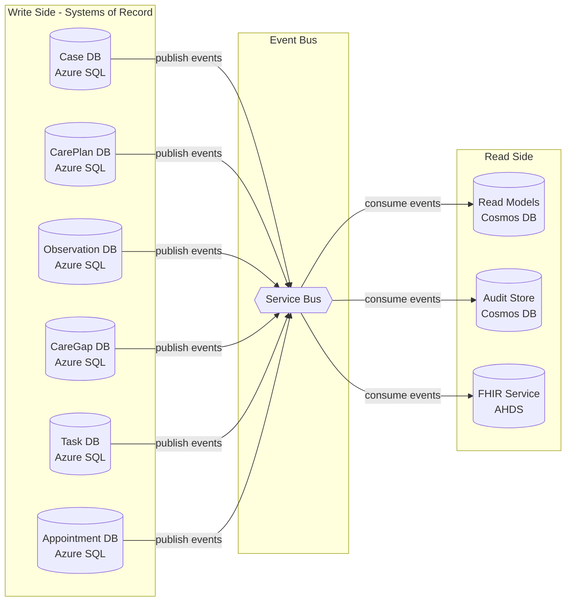
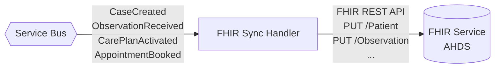
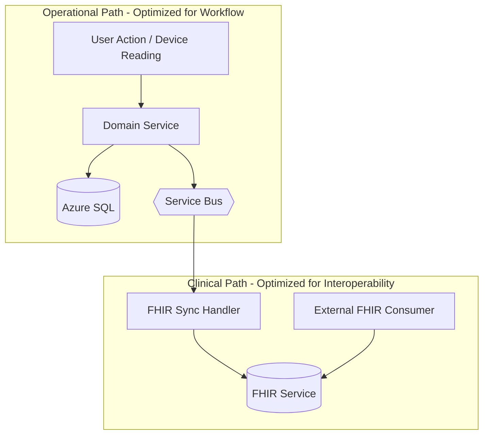
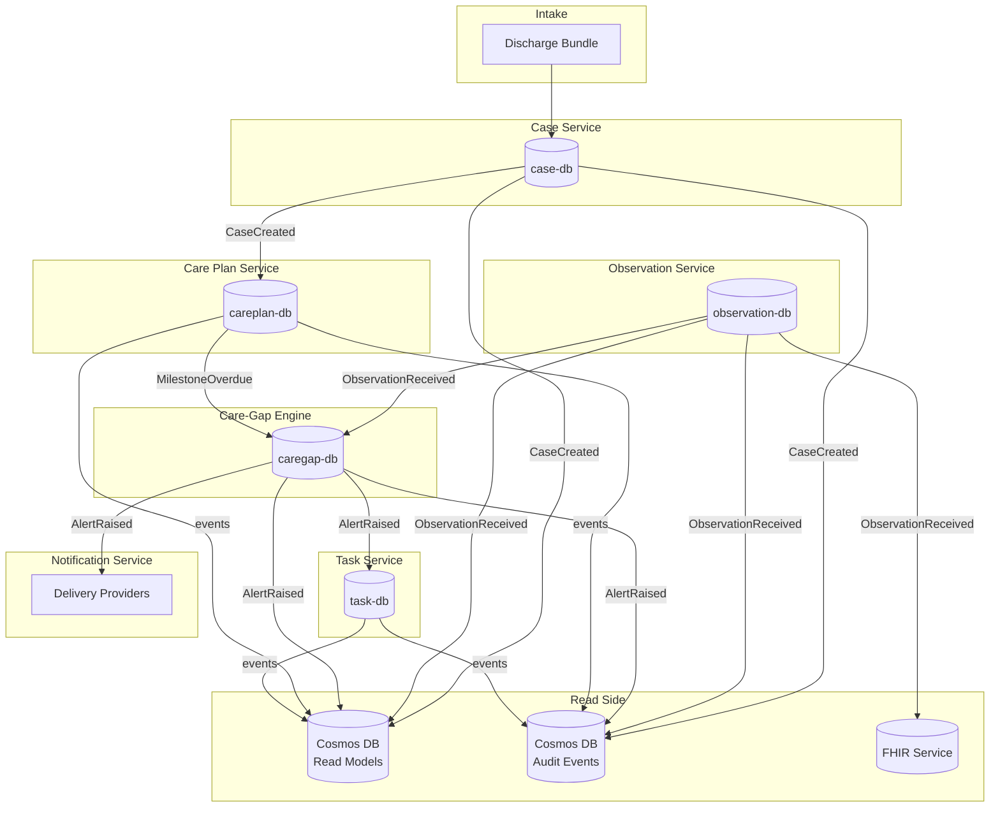

# Data Architecture

**Document type:** Data architecture
**Status:** Living document
**Last updated:** 2026-03-27

This document describes how data flows through CareBridge, who owns what, and how consistency is maintained across services. For service-level details, see [Service Catalog](service-catalog.md). For API/event schemas, see [API and Event Contracts](api-and-event-contracts.md).

---

## Data Architecture Principles

1. **Each service owns its data.** No shared databases. No cross-service SQL joins.
2. **Events carry state across boundaries.** When a service needs data from another domain, it consumes events and maintains a local projection.
3. **Operational data and clinical data are separated.** Services use Azure SQL for fast, transactional operational workflows. FHIR is a secondary projection for interoperability.
4. **Audit data is append-only and immutable.** Once written, audit events are never modified or deleted.
5. **Read models are disposable.** Dashboard views in Cosmos DB can be rebuilt from events at any time.

---

## System of Record vs Read Model



| Store Type | Technology | Purpose | Consistency |
|---|---|---|---|
| **System of record** | Azure SQL (per-service DB) | Transactional operations, ACID writes | Strong (within service) |
| **Read model** | Cosmos DB | Dashboard queries, case timeline | Eventually consistent |
| **Audit store** | Cosmos DB | Immutable event log | Eventually consistent (append-only) |
| **Interoperability projection** | Azure Health Data Services FHIR | Standards-based clinical data exchange | Eventually consistent |

---

## Transactional Data Boundaries

| Service | Database | Key Entities | Primary Key | Access Pattern |
|---|---|---|---|---|
| Case Service | case-db | Case, CaseStatusHistory, PatientRef | caseId (GUID) | CRUD by caseId, list with filters |
| Care Plan Service | careplan-db | CarePlanTemplate, CarePlan, Milestone | planId, milestoneId | CRUD by planId, query by caseId |
| Observation Service | observation-db | Observation, ProcessedMessage | observationId | Write-heavy, range query by caseId + timestamp |
| Care-Gap Engine | caregap-db | Rule, AlertRecord, CaseContext | ruleId, alertId | Config reads, alert writes, context projection |
| Task Service | task-db | Task, TaskComment | taskId | CRUD by taskId, filtered lists by owner/status |
| Appointment Service | appointment-db | Appointment | appointmentId | CRUD by appointmentId, query by caseId + date |

All databases are on a shared Azure SQL server using an elastic pool for cost efficiency. Logical isolation is enforced by per-service credentials — each service's managed identity only has access to its own database.

---

## Event-Carried State Transfer

When a service needs data from another service's domain, it consumes events and maintains a **local projection** — a lightweight copy of the data it needs.

### Examples

**Care-Gap Engine → Case Context:**
The Care-Gap Engine needs to know when a case was created and when the last outreach occurred to evaluate "no outreach within 48h" rules. It consumes `CaseCreated` and `MilestoneCompleted` (outreach type) events and maintains a `CaseContext` table in its own database:

```
CaseContext
├── caseId (PK)
├── dischargeDate
├── lastOutreachAt
├── lastObservationAt
└── updatedAt
```

**Reporting Service → Dashboard View:**
The Reporting Service consumes events from all services to build a denormalized `CaseDashboardView`:

```
CaseDashboardView (Cosmos DB document)
├── caseId (partition key)
├── patientName
├── status
├── dischargeDate
├── carePlanProgress (% milestones completed)
├── openAlertCount
├── overdueTaskCount
├── nextAppointmentDate
├── lastObservationAt
└── lastUpdatedAt
```

**Design rule:** Local projections are **read-only** for the consuming service. They are updated only by event handlers, never by user actions. If the projection becomes stale or corrupt, it can be rebuilt by replaying events.

---

## FHIR Resource Usage

### Resource Mapping

| Operational Entity | FHIR R4 Resource | Key Mappings | Sync Trigger |
|---|---|---|---|
| Patient (from Case) | Patient | name, identifier (MRN), birthDate, telecom | CaseCreated |
| Discharge event | Encounter | status, class, period, reasonCode | CaseCreated |
| Primary conditions | Condition | code, clinicalStatus, verificationStatus | CaseCreated |
| Vital sign reading | Observation | code (LOINC), valueQuantity, effectiveDateTime | ObservationReceived |
| Care plan | CarePlan | status, intent, activity, period | CarePlanActivated |
| Follow-up appointment | Appointment | status, start, end, participant | AppointmentBooked |

### Sync Architecture



- The FHIR Sync Handler is a Service Bus consumer that maps operational events to FHIR resources and writes them to Azure Health Data Services.
- It runs as a background processor — it's not in the critical path of any user-facing flow.
- If FHIR sync fails, the operational system is unaffected. Sync retries via Service Bus retry policy.
- FHIR resources use the operational entity ID as the FHIR `id` for consistent references.

---

## Relationship Between Operational and Clinical Data



| Aspect | Operational Data (SQL) | Clinical Data (FHIR) |
|---|---|---|
| **Optimized for** | Workflow execution, fast writes, complex queries | Standards-based data exchange, interoperability |
| **Schema** | Relational, normalized, service-specific | FHIR R4 resources (JSON) |
| **Consistency** | Strong (ACID within service) | Eventually consistent (async sync) |
| **Primary consumers** | Application services, dashboard | External systems, FHIR-aware tools |
| **Latency** | Low (direct SQL query) | Higher (REST API, async sync lag) |

The two data paths coexist by design. The operational path serves the application's workflow needs. The clinical path serves the interoperability story. Neither depends on the other for correctness.

---

## Denormalized Views

### Cosmos DB Read Model Containers

| Container | Partition Key | Document Type | Purpose |
|---|---|---|---|
| `case-views` | /caseId | CaseDashboardView | Pre-computed case summary for dashboard list |
| `case-views` | /caseId | PatientTimeline | Chronological event stream for case detail |
| `operational-metrics` | /date | DailyMetrics | Aggregated counts for operations dashboard |

### CaseDashboardView Example
```json
{
  "id": "view-case-5678",
  "caseId": "case-5678",
  "type": "dashboard-view",
  "patientName": "Jane Doe (Synthetic)",
  "mrn": "MRN-12345",
  "status": "active",
  "dischargeDate": "2026-03-20",
  "carePlan": {
    "templateName": "CHF Post-Discharge",
    "totalMilestones": 8,
    "completedMilestones": 3,
    "overdueMilestones": 1
  },
  "openAlertCount": 2,
  "highSeverityAlerts": 1,
  "overdueTaskCount": 1,
  "nextAppointment": "2026-03-28T10:00:00Z",
  "lastObservationAt": "2026-03-27T08:15:00Z",
  "assignedCoordinator": "sarah.chen@contoso.com",
  "lastUpdatedAt": "2026-03-27T14:30:00Z"
}
```

### PatientTimeline Example
```json
{
  "id": "timeline-case-5678",
  "caseId": "case-5678",
  "type": "timeline",
  "events": [
    {
      "timestamp": "2026-03-20T09:00:00Z",
      "eventType": "CaseCreated",
      "summary": "Post-discharge case created",
      "source": "case-service"
    },
    {
      "timestamp": "2026-03-20T09:01:00Z",
      "eventType": "CarePlanActivated",
      "summary": "CHF Post-Discharge care plan activated (8 milestones)",
      "source": "careplan-service"
    },
    {
      "timestamp": "2026-03-21T08:15:00Z",
      "eventType": "ObservationReceived",
      "summary": "Blood pressure reading received: within normal range",
      "source": "observation-service"
    }
  ]
}
```

---

## Audit Data

### Storage Design
- **Container:** `audit-events` in Cosmos DB
- **Partition key:** `/caseId` — enables efficient per-case audit queries
- **TTL:** 365 days (configurable)
- **Access:** Append-only by Audit Service, read-only via Audit API

### Document Structure
```json
{
  "id": "evt-a1b2c3d4",
  "caseId": "case-5678",
  "timestamp": "2026-03-27T14:30:00Z",
  "actor": "user:sarah.chen@contoso.com",
  "action": "TaskCompleted",
  "entityType": "Task",
  "entityId": "task-1234",
  "correlationId": "corr-3456",
  "metadata": {
    "previousStatus": "in-progress",
    "newStatus": "completed",
    "source": "task-service"
  }
}
```

### Partition Key Trade-off
Partitioning by `caseId` optimizes for the primary query pattern: "show me all audit events for this case." The trade-off is that time-range queries across all cases require a cross-partition query, which is slower. For the operations dashboard "recent audit activity" view, the Reporting Service maintains a separate time-ordered projection.

---

## Retention Considerations

| Data Type | Store | Retention | Mechanism |
|---|---|---|---|
| Operational data (cases, tasks, etc.) | Azure SQL | Active + 90 days after case closure | Soft delete + cleanup job |
| Audit events | Cosmos DB | 365 days | TTL policy on container |
| Read models | Cosmos DB | No independent retention | Rebuilt as needed, pruned by case lifecycle |
| FHIR resources | AHDS | Indefinite | Clinical data retained for interoperability |
| Observations | Azure SQL | Active + 90 days | Same as operational data |
| Service Bus messages | Service Bus | 7 days (default) | Auto-expiry |

---

## Idempotency Strategy

Every event consumer must be idempotent — processing the same message twice must not create duplicate side effects.

### Approach: Processed Message Table

Each consumer maintains a `ProcessedMessages` table in its database:

```sql
CREATE TABLE ProcessedMessages (
    MessageId NVARCHAR(256) PRIMARY KEY,
    ProcessedAt DATETIME2 NOT NULL DEFAULT GETUTCDATE()
);
```

**Processing flow:**
1. Receive message from Service Bus.
2. Check if `messageId` exists in `ProcessedMessages`.
3. If yes → acknowledge and skip (duplicate).
4. If no → process message, insert into `ProcessedMessages`, commit both in one transaction.
5. Acknowledge message to Service Bus.

**Cosmos DB variant (Audit/Reporting):**
Use the `messageId` as the document `id`. Cosmos DB returns a 409 Conflict for duplicate inserts. The consumer catches 409 and skips.

---

## Duplicate Message Handling

Azure Service Bus provides **at-least-once delivery**. Duplicate messages can occur during retries, consumer restarts, or network issues.

### Defense Layers

| Layer | Mechanism | Scope |
|---|---|---|
| **Service Bus duplicate detection** | 10-minute dedup window on topics | Prevents rapid resubmission |
| **Consumer-side dedup** | ProcessedMessages table | Catches duplicates beyond the SB window |
| **SQL unique constraints** | On business keys (e.g., idempotencyKey on Observation) | Database-level safety net |

Belt-and-suspenders approach. No single layer is relied upon exclusively.

---

## Consistency Model

| Scope | Consistency | Mechanism |
|---|---|---|
| Within a service (SQL) | **Strong** | ACID transactions, EF Core unit of work |
| Across services | **Eventually consistent** | Events via Service Bus, seconds to low minutes lag |
| Read models (Cosmos DB) | **Eventually consistent** | Updated by event consumers, rebuildable |
| FHIR projection | **Eventually consistent** | Async sync, non-critical path |
| Audit trail | **Eventually consistent** | Append-only, at-least-once delivery |

### No Distributed Transactions
CareBridge does not use distributed transactions (2PC) or saga orchestrators. The workflow is based on **event choreography**:
- Each service commits its local transaction and publishes an event.
- Downstream services react to events independently.
- If a downstream service fails, the event remains in Service Bus and is retried.

This works because the care coordination workflow is inherently sequential and tolerant of short delays. A care plan activation that takes 5 seconds instead of 1 second has no clinical impact.

---

## Data Lifecycle



---

## Data Ownership Summary

| Service | Owns | Stores In | Projects To |
|---|---|---|---|
| Case Service | Cases, patient operational view | Azure SQL | Events → Read Model, Audit, FHIR |
| Care Plan Service | Plans, milestones, templates | Azure SQL | Events → Read Model, Audit, FHIR |
| Observation Service | Vital sign readings | Azure SQL | Events → Read Model, Audit, FHIR |
| Care-Gap Engine | Rules, alert records, case context | Azure SQL | Events → Read Model, Audit |
| Task Service | Tasks, comments | Azure SQL | Events → Read Model, Audit |
| Appointment Service | Appointments | Azure SQL | Events → Read Model, Audit, FHIR |
| Audit Service | Audit events | Cosmos DB | None (terminal) |
| Reporting Service | Dashboard views, timeline | Cosmos DB | None (serves reads) |
