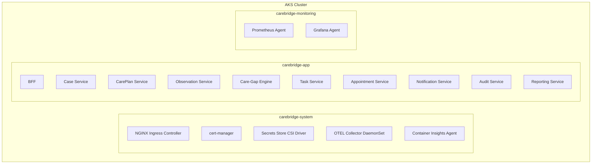
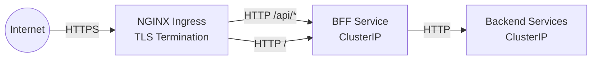
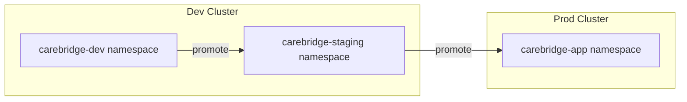

# Kubernetes Architecture

**Document type:** Runtime architecture
**Status:** Living document
**Last updated:** 2026-03-27

This document describes how CareBridge services run on Azure Kubernetes Service. For Azure resource design, see [Azure Architecture](azure-architecture.md). For per-service details, see [Service Catalog](service-catalog.md).

---

## Namespace Strategy



| Namespace | Purpose | Contents |
|---|---|---|
| `carebridge-system` | Infrastructure components | Ingress controller, cert-manager, CSI driver, OTEL collector |
| `carebridge-app` | All application workloads | 10 services (API + workers), CronJobs |
| `carebridge-monitoring` | Observability agents | Prometheus scraper, Grafana agent |

### Why a Single Application Namespace

For this portfolio scope, all 10 services share one namespace. This simplifies:
- RBAC configuration (one set of role bindings)
- Service discovery (DNS within namespace)
- Helm deployment (single namespace target)
- Network policies (one ingress/egress rule set)

In an enterprise deployment, per-team or per-domain namespaces would provide better blast radius isolation and independent RBAC. That's a documented trade-off, not an oversight.

---

## Workload Types

| Workload | Type | Services |
|---|---|---|
| API servers | Deployment | BFF, Case, CarePlan, Task, Appointment, Observation, Reporting |
| Event consumers | Deployment | Care-Gap Engine, Notification, Audit, Reporting (consumer sidecar or separate deployment) |
| Scheduled evaluations | CronJob | Care-Gap Engine sweep (every 15 min) |
| Database migrations | Job | EF Core migration runner (pre-deploy) |

No StatefulSets. All state lives in Azure managed services (SQL, Cosmos DB, Service Bus). Pods are stateless and disposable.

---

## Deployment Model

Each service runs as a single-container pod. No sidecar containers except the OTEL Collector DaemonSet, which runs at the node level.

```yaml
# Example: Case Service deployment spec (simplified)
spec:
  replicas: 2
  strategy:
    type: RollingUpdate
    rollingUpdate:
      maxSurge: 1
      maxUnavailable: 0
  template:
    spec:
      serviceAccountName: sa-case-service
      containers:
        - name: case-service
          image: acrcarebridge.azurecr.io/case-service:abc123
          ports:
            - containerPort: 8080
          resources:
            requests:
              cpu: 100m
              memory: 256Mi
            limits:
              cpu: 250m
              memory: 512Mi
          startupProbe:
            httpGet:
              path: /startup
              port: 8080
            failureThreshold: 30
            periodSeconds: 2
          readinessProbe:
            httpGet:
              path: /ready
              port: 8080
            periodSeconds: 5
          livenessProbe:
            httpGet:
              path: /healthz
              port: 8080
            periodSeconds: 15
          volumeMounts:
            - name: secrets
              mountPath: /mnt/secrets
              readOnly: true
      volumes:
        - name: secrets
          csi:
            driver: secrets-store.csi.k8s.io
            readOnly: true
            volumeAttributes:
              secretProviderClass: case-service-secrets
```

---

## Ingress Strategy



- **NGINX Ingress Controller** deployed in `carebridge-system` namespace.
- Single Ingress resource routes all external traffic to the BFF.
- TLS terminated at NGINX using cert-manager with Let's Encrypt (or Azure-provided certificate).
- Backend services are ClusterIP only — no external exposure.

```yaml
# Ingress resource (simplified)
apiVersion: networking.k8s.io/v1
kind: Ingress
metadata:
  name: carebridge-ingress
  annotations:
    cert-manager.io/cluster-issuer: letsencrypt-prod
spec:
  ingressClassName: nginx
  tls:
    - hosts:
        - carebridge.example.com
      secretName: carebridge-tls
  rules:
    - host: carebridge.example.com
      http:
        paths:
          - path: /
            pathType: Prefix
            backend:
              service:
                name: bff
                port:
                  number: 80
```

---

## Service-to-Service Communication

| Pattern | Mechanism | Use Case |
|---|---|---|
| Sync (user-facing) | HTTP via ClusterIP Services | BFF → backend services for API calls |
| Async (event-driven) | Azure Service Bus | Domain event propagation between services |
| Service discovery | Kubernetes DNS | `http://case-service.carebridge-app.svc.cluster.local` |

**No service mesh.** This is an explicit trade-off:
- **Benefit of a mesh:** Automatic mTLS, traffic observability, retries, circuit breaking at the infrastructure level.
- **Cost of a mesh:** Significant operational complexity (Istio/Linkerd sidecars, control plane, CRDs, debugging proxy behavior).
- **Decision:** For portfolio scope, the complexity is not justified. mTLS within the cluster is a lower-risk boundary than internet-facing traffic. OpenTelemetry provides observability without a mesh. Application-level circuit breakers (Polly in .NET) handle retries.

---

## Secrets Handling

Secrets flow from Azure Key Vault to pods via the Secrets Store CSI Driver:

```
Azure Key Vault
    → Secrets Store CSI Driver (DaemonSet)
        → SecretProviderClass (per service)
            → Volume mount in pod (/mnt/secrets/)
```

- **No Kubernetes Secret objects with sensitive data in manifests.** SecretProviderClass CRDs reference Key Vault secrets by name.
- **Workload Identity** authenticates the CSI driver to Key Vault. No Key Vault access keys stored in the cluster.
- **Sync interval:** CSI driver re-syncs secrets periodically (default 2 minutes). Pod restart picks up rotated secrets.

```yaml
# SecretProviderClass example
apiVersion: secrets-store.csi.x-k8s.io/v1
kind: SecretProviderClass
metadata:
  name: case-service-secrets
spec:
  provider: azure
  parameters:
    usePodIdentity: "false"
    useVMManagedIdentity: "false"
    clientID: "<case-service-managed-identity-client-id>"
    keyvaultName: kv-carebridge-prod
    objects: |
      array:
        - |
          objectName: sql-case-db-connection
          objectType: secret
        - |
          objectName: servicebus-connection
          objectType: secret
    tenantId: "<tenant-id>"
```

---

## Config Handling

| Config Type | Mechanism | Example |
|---|---|---|
| Non-sensitive config | ConfigMap | Log level, feature flags, service URLs, API base paths |
| Environment-specific | Helm values per env | Replica count, resource limits, external URLs |
| Secrets | Key Vault via CSI Driver | Connection strings, API keys |

ConfigMaps are templated via Helm and injected as environment variables:

```yaml
# ConfigMap (via Helm template)
apiVersion: v1
kind: ConfigMap
metadata:
  name: case-service-config
data:
  ASPNETCORE_ENVIRONMENT: "Production"
  LOG_LEVEL: "Information"
  SERVICE_BUS_TOPIC: "case-events"
  FHIR_BASE_URL: "https://fhir-carebridge-prod.azurehealthcareapis.com"
```

---

## Readiness, Liveness, and Startup Probes

Every service implements three health endpoints:

| Probe | Endpoint | Purpose | Configuration |
|---|---|---|---|
| **Startup** | `/startup` | Verify service initialized (DB connections, config loaded) | `failureThreshold: 30, periodSeconds: 2` (up to 60s to start) |
| **Readiness** | `/ready` | Verify service can handle requests (DB reachable, Service Bus connected) | `periodSeconds: 5, failureThreshold: 3` |
| **Liveness** | `/healthz` | Verify service is not deadlocked | `periodSeconds: 15, failureThreshold: 3` |

**Design rationale:**
- **Startup probes** use longer timeouts because services connecting to Azure SQL or Service Bus may take 10-30 seconds on cold start (especially with Workload Identity token acquisition).
- **Readiness probes** check downstream dependencies. If SQL is unreachable, the pod becomes unready and stops receiving traffic — but it's not killed.
- **Liveness probes** check only process health (not dependencies). A service with a temporarily unavailable database should not be killed and restarted — it should wait for the dependency to recover.

---

## Autoscaling Strategy

### HPA for API Services

```yaml
apiVersion: autoscaling/v2
kind: HorizontalPodAutoscaler
metadata:
  name: case-service-hpa
spec:
  scaleTargetRef:
    apiVersion: apps/v1
    kind: Deployment
    name: case-service
  minReplicas: 1    # 2 in production
  maxReplicas: 6
  metrics:
    - type: Resource
      resource:
        name: cpu
        target:
          type: Utilization
          averageUtilization: 70
```

### KEDA for Event Consumers

```yaml
apiVersion: keda.sh/v1alpha1
kind: ScaledObject
metadata:
  name: caregap-engine-scaler
spec:
  scaleTargetRef:
    name: caregap-engine
  minReplicaCount: 1
  maxReplicaCount: 10
  triggers:
    - type: azure-servicebus
      metadata:
        queueName: caregap-engine-sub
        namespace: sb-carebridge-prod
        messageCount: "5"
```

| Service | Scaler | Min Replicas (Dev) | Min Replicas (Prod) | Max Replicas |
|---|---|---|---|---|
| BFF | HPA (CPU) | 1 | 2 | 4 |
| Case Service | HPA (CPU) | 1 | 2 | 4 |
| Observation Service | HPA (CPU + request rate) | 1 | 2 | 8 |
| Care-Gap Engine | KEDA (queue depth) | 1 | 1 | 10 |
| Notification Service | KEDA (queue depth) | 1 | 1 | 6 |
| Audit Service | KEDA (queue depth) | 1 | 1 | 4 |
| Reporting Service | HPA (CPU) + KEDA (queue) | 1 | 2 | 6 |
| Other API services | HPA (CPU) | 1 | 2 | 4 |

---

## Pod Disruption Budgets

For services with 2+ replicas in production:

```yaml
apiVersion: policy/v1
kind: PodDisruptionBudget
metadata:
  name: case-service-pdb
spec:
  minAvailable: 1
  selector:
    matchLabels:
      app: case-service
```

PDBs ensure at least one pod remains available during voluntary disruptions (node upgrades, cluster scaling, maintenance).

---

## Rolling Deployment and Rollback

| Setting | Value | Rationale |
|---|---|---|
| `strategy.type` | RollingUpdate | Zero-downtime deployments |
| `maxSurge` | 1 | One extra pod during rollout |
| `maxUnavailable` | 0 | Never reduce below desired count |
| `revisionHistoryLimit` | 5 | Keep 5 rollback targets |
| `progressDeadlineSeconds` | 300 | Fail deployment if not ready in 5 min |

**Rollback procedure:**
```bash
# Check deployment history
helm history case-service -n carebridge-app

# Rollback to previous revision
helm rollback case-service <revision> -n carebridge-app

# Verify rollback
kubectl rollout status deployment/case-service -n carebridge-app
```

See [Deployment Rollback Runbook](../runbooks/deployment-rollback.md).

---

## Resource Requests and Limits

| Service Type | CPU Request | CPU Limit | Memory Request | Memory Limit |
|---|---|---|---|---|
| API service (typical) | 100m | 250m | 256Mi | 512Mi |
| API service (high-traffic, e.g., Observation) | 200m | 500m | 512Mi | 1Gi |
| Event consumer | 100m | 250m | 256Mi | 512Mi |
| BFF | 150m | 300m | 384Mi | 768Mi |

**Philosophy:**
- **Requests** = expected steady-state usage. Used for scheduling decisions.
- **Limits** = ~2x requests to allow burst. Prevents runaway pods from starving neighbors.
- **QoS class:** Burstable for most services. This allows efficient bin-packing across nodes while still providing burst capacity.
- Avoid Guaranteed class (requests = limits) — it wastes capacity on a shared cluster.

---

## Workload Identity Approach

Each service has its own Kubernetes ServiceAccount linked to an Azure managed identity:

```yaml
apiVersion: v1
kind: ServiceAccount
metadata:
  name: sa-case-service
  namespace: carebridge-app
  annotations:
    azure.workload.identity/client-id: "<case-service-identity-client-id>"
  labels:
    azure.workload.identity/use: "true"
```

The corresponding pod spec references this ServiceAccount, and Azure AD issues a federated token scoped to the specific managed identity. See [Azure Architecture — Workload Identity](azure-architecture.md#aks-workload-identity) for identity-to-resource mappings.

---

## Operational Observability In-Cluster

| Component | Type | Namespace | Purpose |
|---|---|---|---|
| OTEL Collector | DaemonSet | carebridge-system | Receives OTLP from pods, exports to Azure Monitor |
| Container Insights | DaemonSet | kube-system | Node/pod metrics, log forwarding |
| Prometheus Agent | DaemonSet | carebridge-monitoring | Scrapes /metrics endpoints, sends to Managed Prometheus |
| ServiceMonitor CRDs | Config | carebridge-app | Defines scrape targets for Prometheus |

Each service exposes `/metrics` in Prometheus exposition format. ServiceMonitor resources configure automatic scraping.

---

## Multi-Environment Deployment Strategy



| Aspect | Dev/Staging | Production |
|---|---|---|
| AKS cluster | Shared | Dedicated |
| Namespace | carebridge-dev / carebridge-staging | carebridge-app |
| Replicas | 1 per service | 2+ per service |
| Node pool | B-series (1-2 nodes) | D-series (3+ nodes, zone-spread) |
| PDBs | Not applied | Applied |
| HPA | Enabled (low thresholds) | Enabled (production thresholds) |

---

## Helm Chart Structure

```
deploy/helm/
├── charts/
│   ├── carebridge-common/        # Shared templates (probes, resources, labels)
│   │   ├── Chart.yaml
│   │   └── templates/
│   │       ├── _helpers.tpl
│   │       ├── _probes.tpl
│   │       └── _resources.tpl
│   ├── case-service/
│   │   ├── Chart.yaml
│   │   ├── values.yaml           # Defaults
│   │   ├── values-dev.yaml       # Dev overrides
│   │   ├── values-prod.yaml      # Prod overrides
│   │   └── templates/
│   │       ├── deployment.yaml
│   │       ├── service.yaml
│   │       ├── configmap.yaml
│   │       ├── secretproviderclass.yaml
│   │       ├── hpa.yaml
│   │       └── serviceaccount.yaml
│   ├── careplan-service/
│   ├── observation-service/
│   ├── ... (one chart per service)
│   └── carebridge-ingress/       # Ingress + cert configuration
└── values/
    ├── global-dev.yaml
    ├── global-staging.yaml
    └── global-prod.yaml
```

Values hierarchy: `values.yaml` (defaults) → `global-{env}.yaml` (env globals) → `values-{env}.yaml` (service-specific env overrides).

---

## GitOps / CI/CD Deployment Approach

CareBridge uses **GitHub Actions for CI/CD** — not a full GitOps model (no ArgoCD or Flux).

**Why not GitOps for portfolio:**
- ArgoCD/Flux add operational surface (CRDs, controllers, UI, RBAC) that competes with the application for portfolio attention.
- GitHub Actions provides a clear, auditable deployment pipeline that is easier to demonstrate and explain.
- The pipeline is declarative enough: same Helm charts, same values, same images promoted across environments.

**Pipeline flow:**
1. PR merged → GitHub Actions triggered
2. Build → test → scan → push image to ACR
3. `helm upgrade --install` to target namespace
4. Wait for rollout success
5. Run smoke tests
6. Notify on success/failure

See [CI/CD Pipeline](../deployment/ci-cd.md) for full pipeline design.

---

## What Is Intentionally Out of Scope

| Feature | Why Out of Scope |
|---|---|
| **Service mesh (Istio/Linkerd)** | Operational complexity not justified. mTLS within cluster is lower priority than internet-facing TLS. App-level circuit breakers suffice. |
| **Multi-cluster federation** | Single-region portfolio deployment. Multi-cluster adds federation and state sync complexity. |
| **Custom operators** | No custom CRDs needed. Standard K8s resources + Helm cover all workloads. |
| **Dapr** | Adds a sidecar runtime and abstracts away direct Azure SDK usage. Portfolio aims to show direct Azure integration knowledge. |
| **Advanced network policies** | Beyond NSG-level isolation. Calico/Cilium policies are powerful but add debugging complexity for portfolio demos. |
| **Pod Security Standards (Restricted)** | Baseline PSS is applied. Restricted mode conflicts with some CSI driver requirements and adds friction without proportional security benefit for synthetic data. |
| **In-cluster cost management** | Kubecost or similar. Portfolio cost is managed at the Azure resource level. |
| **Canary deployments** | Requires traffic splitting (Flagger + mesh or NGINX canary annotations). Rolling updates are sufficient for portfolio scope. |
