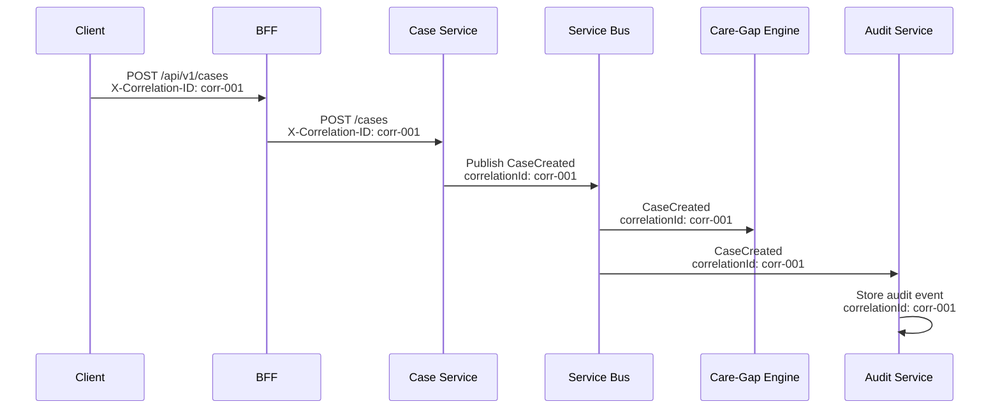

# Observability

**Document type:** Observability architecture
**Status:** Living document
**Last updated:** 2026-03-27

This document describes how CareBridge is observed in operation — what signals are emitted, how they are collected, and how engineers use them to understand system health and investigate issues. For related runbooks, see [docs/runbooks/](../runbooks/).

---

## Observability Goals

1. Understand system health at a glance from a single Grafana dashboard.
2. Trace any user action or event end-to-end across services using a correlation ID.
3. Detect degradation (latency increase, error rate spike, queue backup) before users report it.
4. Investigate incidents without SSH-ing into pods or reading raw container logs.
5. Prove SLA compliance with measurable SLIs and error budget tracking.

---

## Logging Strategy

### Stack
Application code (.NET 10) → `Microsoft.Extensions.Logging` + Serilog → OTEL Collector (DaemonSet) → Azure Monitor Logs (Log Analytics workspace)

### Structured Log Format
Every log entry is structured JSON with consistent fields:

```json
{
  "timestamp": "2026-03-27T14:30:00.123Z",
  "level": "Information",
  "messageTemplate": "Observation {ObservationId} processed for case {CaseId}",
  "properties": {
    "observationId": "obs-7890",
    "caseId": "case-5678",
    "observationType": "blood-pressure",
    "serviceId": "observation-service",
    "correlationId": "corr-3456",
    "traceId": "abc123def456",
    "spanId": "789ghi"
  }
}
```

### Log Levels

| Level | Usage | Example |
|---|---|---|
| Debug | Detailed diagnostic, dev only | "Evaluating rule {ruleId} against observation {obsId}" |
| Information | Normal operational events | "Case created: {caseId}" |
| Warning | Degraded but functional | "Service Bus consumer retry attempt 2/5 for message {msgId}" |
| Error | Failures needing attention | "Failed to write audit event: Cosmos DB returned 429" |
| Critical | System-level failures | "SQL connection pool exhausted, service unhealthy" |

### Log Hygiene
- No patient names, identifiers, observation values, or tokens in logs. See [Security — Logging Hygiene](security-and-compliance.md#logging-hygiene).
- Correlation IDs in every log entry for cross-service tracing.
- Service ID in every entry for filtering.

### KQL Query Examples

```kql
// Find all errors for a specific case in the last hour
AppTraces
| where TimeGenerated > ago(1h)
| where Properties.caseId == "case-5678"
| where SeverityLevel >= 3
| project TimeGenerated, Message, Properties.serviceId, Properties.correlationId

// Service Bus processing latency by service
AppMetrics
| where Name == "servicebus.processing.duration"
| summarize avg(Sum) by bin(TimeGenerated, 5m), tostring(Properties.serviceId)
| render timechart

// Top 10 error messages in the last 24 hours
AppTraces
| where TimeGenerated > ago(24h)
| where SeverityLevel >= 3
| summarize count() by Message
| top 10 by count_
```

---

## Metrics Strategy

### Instrumentation
OpenTelemetry Metrics SDK in each service → Prometheus exposition format on `/metrics` → Managed Prometheus scrapes → Managed Grafana visualizes.

### Standard HTTP Metrics (All API Services)

| Metric | Type | Labels |
|---|---|---|
| `http_server_request_duration_seconds` | Histogram | method, route, status_code |
| `http_server_active_requests` | Gauge | method, route |
| `http_client_request_duration_seconds` | Histogram | method, host, status_code |

### Custom Business Metrics

| Metric | Service | Type | Description |
|---|---|---|---|
| `carebridge_cases_created_total` | Case Service | Counter | Total cases created |
| `carebridge_observations_ingested_total` | Observation Service | Counter | Total observations processed |
| `carebridge_observations_rejected_total` | Observation Service | Counter | Rejected observations (validation failure) |
| `carebridge_alerts_raised_total` | Care-Gap Engine | Counter | Alerts generated, labeled by severity |
| `carebridge_tasks_created_total` | Task Service | Counter | Tasks created |
| `carebridge_tasks_overdue_gauge` | Task Service | Gauge | Current overdue task count |
| `carebridge_notifications_sent_total` | Notification Service | Counter | Notifications sent, labeled by channel and status |
| `carebridge_audit_events_written_total` | Audit Service | Counter | Audit events stored |
| `carebridge_readmodel_update_lag_seconds` | Reporting Service | Histogram | Time between event timestamp and read model update |

### Infrastructure Metrics (Via Container Insights + Prometheus)
- Pod CPU/memory usage, restart count, OOM kills
- Node CPU/memory/disk utilization
- HPA current/desired replica count
- Service Bus queue depth, DLQ count per subscription (via Azure Monitor metrics exporter)

---

## Tracing Strategy

### Stack
OpenTelemetry Tracing SDK → automatic instrumentation for ASP.NET Core, HttpClient, EF Core, Azure Service Bus SDK → OTLP exporter → Azure Monitor / Application Insights

### What Gets Traced
- Every HTTP request through the BFF and backend services (automatic)
- Every outbound HTTP call (automatic)
- Every SQL query via EF Core (automatic)
- Every Service Bus message send and receive (automatic via Azure SDK instrumentation)
- Custom spans for business logic (e.g., "evaluate-care-gap-rules", "render-notification-template")

### Trace Propagation
- **W3C TraceContext** standard for HTTP calls (automatic via OpenTelemetry).
- **Service Bus:** Trace context injected into message application properties by the Azure SDK. Consumer creates a child span linked to the producer's trace.

### Application Map
Application Insights automatically builds a dependency map showing:
- Which services call which other services
- Call volume and failure rate per dependency edge
- External dependency health (SQL, Cosmos DB, Service Bus)

---

## Correlation ID Propagation



- **Origin:** The BFF generates a correlation ID for every incoming request (or uses the client-provided `X-Correlation-ID` header).
- **Sync propagation:** Passed as an HTTP header to all downstream service calls.
- **Async propagation:** Included as a Service Bus message application property (`correlationId`).
- **Storage:** Stored in every audit event, enabling end-to-end queries like "show me everything that happened because of this discharge intake."
- **Relationship to OpenTelemetry traceId:** The correlation ID is a business-level identifier. The traceId is an infrastructure-level identifier. Both are logged, but the correlation ID persists across async boundaries where trace context may start a new trace.

---

## Dashboards

### Grafana Dashboard Inventory

| Dashboard | Audience | Key Panels |
|---|---|---|
| **Platform Overview** | All engineers | Request rate, error rate (%), p50/p95/p99 latency per service, active pod count |
| **Service Bus Health** | On-call, platform team | Queue depth per topic, DLQ count per subscription, consumer processing rate, message age |
| **Business Metrics** | Product, operations | Cases created/day, alerts raised/day (by severity), tasks overdue count, notification success rate, observation ingestion rate |
| **AKS Health** | Platform team | Pod restarts (last 1h), CPU/memory per node, HPA state (current vs max replicas), OOM kill count |
| **Cosmos DB** | Platform team | RU consumption, 429 throttle rate, request latency p50/p99, document count |
| **SQL Health** | Platform team | DTU utilization (elastic pool), active connections per database, query duration p95, deadlock count |

### Azure Portal Views
- **Application Insights → Application Map:** Visual service dependency graph with health indicators.
- **Application Insights → Transaction Search:** End-to-end transaction view by trace ID or correlation ID.
- **Application Insights → Failures:** Aggregated exception analysis by service and exception type.

---

## Alerts

| Alert | Condition | Severity | Action |
|---|---|---|---|
| DLQ messages detected | Any DLQ count > 0 for any subscription | Warning | Investigate via [Failed Message Processing runbook](../runbooks/failed-message-processing.md) |
| High error rate | Error rate > 5% for any service over 5 min | Critical | Check service health, recent deployments |
| High p95 latency | p95 > 2x baseline for any API service over 5 min | Warning | Check downstream dependencies, resource pressure |
| Pod restart loop | Pod restart count > 3 in 5 min | Critical | Check pod logs, OOM kill events, startup probe failures |
| HPA at max replicas | HPA at maxReplicas for > 10 min | Warning | Review scaling config, consider increasing limits |
| SQL DTU exhaustion | Elastic pool DTU > 90% for 10 min | Warning | Review query patterns, consider scaling pool |
| Cosmos DB throttling | 429 response rate > 1% over 5 min | Warning | Review RU consumption, optimize queries or scale |
| Alert generation stopped | Zero alerts raised in 1 hour (during active cases) | Warning | Check Care-Gap Engine health and connectivity |

Alerts route to email and Teams webhook (simulated for portfolio). In production, they would integrate with PagerDuty or Opsgenie.

---

## SLI/SLO Suggestions

| SLI | Measurement | SLO Target | Error Budget (Monthly) |
|---|---|---|---|
| **API Availability** | Successful responses (2xx, 4xx) / total requests | 99.5% | ~3.6 hours of downtime or equivalent error volume |
| **Case Page Latency** | p95 response time for GET /cases/{id} | < 500ms | 5% of requests may exceed 500ms |
| **Dashboard Latency** | p95 response time for GET /dashboard/summary | < 2s | 5% of requests may exceed 2s |
| **Alert Freshness** | Time from abnormal observation to AlertRaised event | < 30s (p95) | 5% of alerts may take longer |
| **Event Processing Freshness** | Lag between event publish and read model update | < 60s (p95) | 5% may lag longer |
| **Notification Delivery** | Successful delivery / total send attempts | 99% | 1% may fail (retried or DLQ) |

### Error Budget Example
- **API Availability SLO: 99.5%**
- Monthly request budget (assuming 1M requests/month): 5,000 allowed failures.
- If 3,000 failures are consumed by Day 15, the team should prioritize reliability work over feature development for the remainder of the month.
- Error budget is tracked on the Platform Overview dashboard.

---

## Operational Troubleshooting Flows

### "Dashboard is slow"

1. Open **Platform Overview** dashboard → check Reporting Service p95 latency.
2. If Reporting Service is slow → check **Cosmos DB** dashboard → RU consumption and 429 rate.
3. If Cosmos is throttled → check recent read model queries for inefficient cross-partition scans.
4. If Cosmos is fine → check Reporting Service pod CPU/memory → possible resource pressure.
5. If pods are healthy → check BFF → Reporting Service network latency (Application Insights dependency map).

### "Alerts are not firing"

1. Check **Business Metrics** dashboard → alert generation rate. Is it zero?
2. Check **Service Bus Health** → Care-Gap Engine subscription queue depth. Is it growing?
3. If queue is growing → Care-Gap Engine consumer is down or slow. Check pod status and logs.
4. If queue is empty → check Observation Service. Are observations being published?
5. Check **Service Bus Health** → observation-events topic message rate.
6. If observations are flowing → check Care-Gap Engine rule configuration. Are rules active?

### "Missing notification"

1. Get the correlation ID from the triggering event (e.g., AlertRaised event).
2. Search Application Insights → Transaction Search → filter by correlation ID.
3. Trace: AlertRaised → Notification Service consumer → delivery attempt → result.
4. If no Notification Service span → check notification-events subscription DLQ.
5. If delivery attempt failed → check delivery log in Notification Service → error detail.
6. If template rendering failed → check template configuration for the event type.

---

## Dead-Letter Queue Visibility

### Monitoring
- **Grafana panel:** DLQ message count per Service Bus subscription, updated every 30 seconds.
- **Azure Monitor alert:** Fires when any DLQ count > 0.

### Investigation
```bash
# View DLQ messages in Azure Portal:
# Service Bus → Topic → Subscription → Dead-letter queue → Peek messages

# Or via Azure CLI:
az servicebus topic subscription show \
  --resource-group rg-carebridge-prod \
  --namespace-name sb-carebridge-prod \
  --topic-name observation-events \
  --name caregap-engine-sub \
  --query "countDetails.deadLetterMessageCount"
```

### Resolution
DLQ messages are inspected manually and either:
1. **Replayed** after fixing the root cause (consumer bug, downstream outage).
2. **Discarded** with an audit note if the message is permanently invalid.

No automatic DLQ replay in MVP. See [Failed Message Processing runbook](../runbooks/failed-message-processing.md).

---

## Synthetic Monitoring Ideas

For production readiness, consider implementing:

1. **End-to-end canary:** Scheduled job that creates a synthetic observation every 5 minutes and verifies the full pipeline completes (observation → alert → task creation) within the expected SLO window. If the canary observation doesn't result in a task within 60 seconds, fire an alert.

2. **Health endpoint canary:** External monitor (Azure Monitor availability test) that hits the BFF `/healthz` endpoint every minute from outside the cluster. Detects ingress or DNS failures.

3. **Read model freshness check:** Scheduled query that compares the latest event timestamp in Service Bus with the latest update timestamp in the Cosmos DB read model. If the gap exceeds 5 minutes, fire a staleness alert.

These are documented as future improvements, not current implementations.

---

## What Engineers Should See During an Incident

When something breaks, an on-call engineer should be able to answer these questions within 5 minutes using dashboards and logs alone:

| Question | Where to Look |
|---|---|
| Which service is affected? | Platform Overview → error rate per service |
| When did it start? | Platform Overview → error rate timeline |
| Was there a recent deployment? | GitHub Actions → deployment history |
| Is it a dependency issue? | Application Insights → Application Map (red dependency edges) |
| Are messages backing up? | Service Bus Health → queue depth and DLQ panels |
| Are pods healthy? | AKS Health → restart count, OOM kills, CPU/memory |
| What does the error look like? | Log Analytics → KQL query by service + error level + time range |
| What user action triggered it? | Application Insights → Transaction Search by correlation ID |

No `kubectl exec` or pod log streaming should be needed for initial triage. If the dashboards and logs don't answer the question, that's an observability gap to fix.
