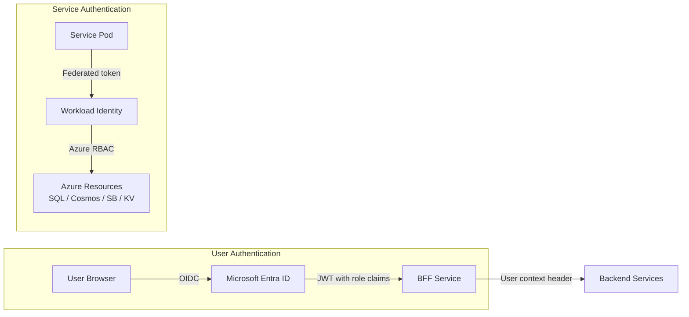
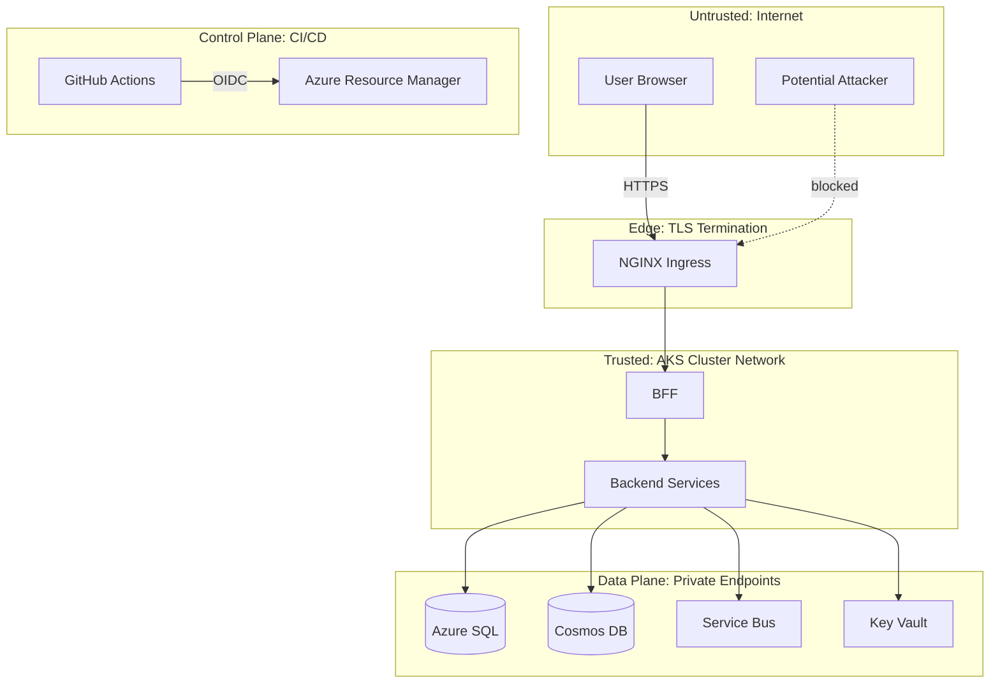

# Security and Compliance

**Document type:** Security architecture
**Status:** Living document
**Last updated:** 2026-03-27

This project is **HIPAA-aware by design**, uses **synthetic data only**, and is **not a certified production healthcare platform**. This document describes the security architecture honestly — what is implemented, what is designed for, and what is explicitly out of scope.

---

## Security Principles

1. **Defense in depth.** Multiple security layers — identity, network, encryption, audit — so no single failure exposes the system.
2. **Least privilege.** Every identity (user or service) gets only the access it needs. No shared admin accounts, no wildcard RBAC.
3. **Zero static secrets.** No passwords, connection strings, or API keys in source code, environment files, or Kubernetes manifests. Everything flows through Key Vault and Workload Identity.
4. **Audit everything.** Every state change is recorded with who, what, when, and why. The audit trail is immutable.
5. **Synthetic data only.** No real PHI enters the system. But the architecture applies PHI-protective patterns so the design is transferable to real-world scenarios.
6. **Assume breach, design defensively.** Network segmentation, encrypted channels, and scoped identities limit blast radius if any component is compromised.

---

## Identity Model



### Workforce Identity
- Users authenticate via **Microsoft Entra ID** using OAuth 2.0 / OIDC.
- The BFF receives a JWT containing user identity and role claims.
- Tokens are validated at the BFF on every request (signature, expiry, audience, issuer).
- Backend services receive user context via trusted internal headers from the BFF — they do not independently validate JWTs from external sources.

### Service Identity
- Each service pod authenticates to Azure resources via **AKS Workload Identity**.
- Each service has a dedicated Azure managed identity with scoped RBAC permissions.
- No static credentials exist anywhere in the deployment pipeline or runtime.

---

## RBAC Approach

### Roles

| Role | Description | Assigned To |
|---|---|---|
| CareCoordinator | Primary operational user. Manages cases, tasks, appointments. | Care coordinator staff |
| Clinician | Reviews cases, observations, escalated alerts. Read-heavy access. | Nurses, physicians |
| OperationsManager | Views dashboards, metrics, SLA compliance. No case modifications. | Team leads |
| PlatformAdmin | Configures templates, thresholds, routing. Views system health. | Technical admins |

### Permission Matrix

| Action | CareCoordinator | Clinician | OpsManager | PlatformAdmin |
|---|---|---|---|---|
| View cases | Yes | Yes | Yes | Yes |
| Create/update cases | Yes | No | No | No |
| View care plans | Yes | Yes | Yes | Yes |
| Update milestones | Yes | Yes | No | No |
| View observations | Yes | Yes | Yes | No |
| View/manage tasks | Yes | Yes (view only) | Yes (view only) | No |
| Create/manage appointments | Yes | Yes | No | No |
| View dashboard | Yes | Yes | Yes | Yes |
| View audit trail | No | Yes | Yes | Yes |
| Manage templates/thresholds | No | No | No | Yes |
| View system health/DLQ | No | No | No | Yes |

### Enforcement
- **BFF:** Enforces coarse-grained authorization at the route level using ASP.NET Core authorization policies mapped to JWT role claims.
- **Backend services:** Enforce fine-grained checks (e.g., "only the assigned coordinator can close this task") using claims passed from the BFF.

---

## Service Authentication and Authorization

### Internal Service Communication
- Services within the AKS cluster communicate via **ClusterIP** — not exposed externally.
- Service-to-service calls are **trusted within the cluster boundary**. The BFF passes user context (userId, roles) via a trusted header that backend services use for authorization decisions.
- **No service mesh mTLS** — this is an explicit trade-off. The cluster network is the trust boundary. For production with higher security requirements, a service mesh would add mTLS.

### Service Bus Messages
- Messages carry **correlation metadata** (correlationId, causationId, source) but **not user tokens**.
- Event consumers process messages under the service's own identity, not a user identity.
- Actions triggered by events (e.g., auto-creating a task from an alert) are recorded in audit as system-initiated with the source event correlation.

---

## Secret Management

### What Secrets Exist

| Secret | Stored In | Accessed By |
|---|---|---|
| SQL connection strings (per service DB) | Key Vault | Respective service via CSI Driver |
| Service Bus connection string | Key Vault | All event-producing/consuming services |
| FHIR service endpoint + credentials | Key Vault | Observation Service, FHIR Sync handler |
| Notification provider API keys (simulated) | Key Vault | Notification Service |
| TLS certificate for ingress | Key Vault (or cert-manager) | NGINX Ingress |

### Access Pattern
- **Secrets Store CSI Driver** mounts Key Vault secrets as files in pods.
- **Workload Identity** authenticates the CSI driver to Key Vault — no Key Vault access keys in the cluster.
- **No secrets in Kubernetes Secret objects from manifests.** SecretProviderClass CRDs point to Key Vault by reference.
- **Rotation:** Key Vault secrets can be rotated. CSI driver syncs on a configurable interval. Pod restart picks up new values.

### What Is NOT a Secret
- Service Bus topic/subscription names (config, not secret)
- FHIR base URL (config)
- Log level, feature flags (config via ConfigMap)

---

## Encryption in Transit and at Rest

| Layer | Encryption | Mechanism |
|---|---|---|
| Internet → Ingress | TLS 1.2+ | NGINX Ingress with cert-manager certificate |
| BFF → Backend services | Plaintext within cluster | Trusted cluster network (mesh would add mTLS) |
| Services → Azure SQL | TLS | Azure SQL enforces encrypted connections |
| Services → Cosmos DB | TLS | HTTPS-only endpoint |
| Services → Service Bus | TLS | AMQP over TLS |
| Services → Key Vault | TLS | HTTPS-only endpoint |
| Azure SQL at rest | AES-256 | Transparent Data Encryption (TDE), enabled by default |
| Cosmos DB at rest | AES-256 | Encryption at rest, enabled by default |
| Service Bus at rest | AES-256 | Enabled by default |
| Key Vault at rest | HSM-backed or software-backed keys | Azure-managed encryption |

---

## Audit Logging

### What Gets Audited

Every significant state change emits an audit event to the Audit Service via Service Bus:

- User sign-in (via BFF)
- Case creation and status changes
- Care plan activation and milestone updates
- Observation processing
- Alert raised, acknowledged, resolved
- Task created, assigned, completed
- Appointment booked, completed, missed
- Notification sent or failed
- Configuration changes (templates, thresholds)

### Audit Event Structure

```json
{
  "id": "evt-a1b2c3d4",
  "caseId": "case-5678",
  "timestamp": "2026-03-27T14:30:00Z",
  "actor": "user:sarah.chen@contoso.com",
  "action": "MilestoneCompleted",
  "entityType": "Milestone",
  "entityId": "ms-9012",
  "correlationId": "corr-3456",
  "metadata": {
    "milestoneName": "Initial Outreach",
    "previousStatus": "in-progress",
    "newStatus": "completed"
  }
}
```

### Audit Integrity
- Audit events are **append-only** in Cosmos DB. No update or delete operations.
- Audit read APIs are **read-only**. No endpoints modify audit data.
- Missing audit events (DLQ) are treated as high-priority operational issues.

---

## Sensitive Data Handling

### Synthetic Data Design
All patient data is generated by the synthetic data generator. No real clinical data, no real patient identifiers, no real addresses or phone numbers.

### PHI-Protective Patterns (Applied Even with Synthetic Data)
These patterns are implemented to demonstrate healthcare-aware design:

- **Field-level access control:** Patient contact information is only included in API responses for roles that need it (CareCoordinator, Clinician).
- **Log scrubbing:** Patient names, MRN, and contact details are never written to application logs. Logs reference entity IDs only.
- **Masked display:** SSN-like fields (synthetic) are masked in UI display (showing only last 4 digits).
- **Observation values in logs:** Vital sign values are not logged. Only observation IDs, types, and validation status are logged.
- **Audit payloads:** Reference entity IDs, not data values.

---

## Synthetic Data Policy

- All patient data is **generated**, not sourced from any real dataset.
- Synthetic data generator is a **separate tool** (`tools/synthetic-data-generator/`), not part of the runtime.
- Seed data is committed to the repo and clearly labeled as synthetic.
- No mechanism exists to import real patient data. The ingestion API accepts synthetic discharge bundles only.
- README, PRD, and all documentation state the synthetic-data-only policy explicitly.

---

## Logging Hygiene

### Structured Logging Format
```json
{
  "timestamp": "2026-03-27T14:30:00Z",
  "level": "Information",
  "message": "Observation processed successfully",
  "serviceId": "observation-service",
  "correlationId": "corr-3456",
  "traceId": "abc123",
  "spanId": "def456",
  "observationId": "obs-7890",
  "observationType": "blood-pressure",
  "caseId": "case-5678"
}
```

### What Is NOT Logged
- Patient names, addresses, phone numbers
- MRN or patient identifiers beyond synthetic case IDs
- Observation values (vital sign readings)
- JWT token contents
- Connection strings or secrets
- Full request/response bodies for APIs handling patient data

### Log Levels

| Level | When Used | Production |
|---|---|---|
| Debug | Detailed diagnostic info | Disabled |
| Information | Normal operational events | Enabled |
| Warning | Degraded conditions, retries, approaching limits | Enabled |
| Error | Failures requiring attention | Enabled |
| Critical | System-level failures | Enabled |

---

## Threat Boundaries



| Boundary | Trust Level | Protection |
|---|---|---|
| Internet → Ingress | Untrusted | TLS, rate limiting, JWT validation |
| Ingress → BFF | Edge | Authentication required, role-based authorization |
| BFF → Backend | Trusted (cluster) | Internal network, user context propagation |
| Services → Azure PaaS | Trusted (identity-based) | Workload Identity, private endpoints, RBAC |
| GitHub Actions → Azure | Controlled (CI/CD) | OIDC federation, no stored credentials |

---

## Abuse and Misuse Considerations

| Vector | Mitigation |
|---|---|
| Brute-force authentication | Entra ID handles lockout policies. BFF does not implement custom auth. |
| API abuse / high request rate | NGINX rate limiting at ingress. Per-IP and per-user limits. |
| Malformed observation data | Input validation on all fields. Data range checks. Invalid payloads rejected with 400. |
| Notification spam | Notification Service enforces per-case rate limits (max N notifications per hour). |
| Direct backend service access | Backend services are ClusterIP only. No external exposure. |
| SQL injection | EF Core parameterized queries. No raw SQL from user input. |
| XSS | React auto-escapes output. CSP headers from BFF. |
| Unauthorized data access | RBAC at BFF + service level. Field-level filtering by role. |

---

## Healthcare-Specific Compliance Posture

### What This Project Demonstrates
- **HIPAA-aware design patterns:** audit trail, access control, encryption, minimum necessary principle, logging hygiene.
- **FHIR R4 alignment:** standards-based clinical data representation via Azure Health Data Services.
- **Azure security best practices:** Workload Identity, Key Vault, private endpoints, managed identity RBAC.
- **NIST 800-66 awareness:** security controls informed by the HIPAA Security Rule implementation guide.

### What This Project Does NOT Claim
- **HIPAA certification** — HIPAA does not have a "certification." Compliance is assessed per covered entity.
- **BAA coverage** — No Business Associate Agreement is needed because no real PHI is processed.
- **SOC 2 compliance** — No formal audit has been conducted.
- **Penetration test results** — No formal pen test has been performed.
- **Production healthcare readiness** — This is a reference implementation using synthetic data.

### Honest Framing
This project shows that the architect understands healthcare security requirements and can design systems that respect them. It does not pretend to be a compliant production system. The gap between this reference implementation and a production-certified system is primarily operational (BAA, formal audits, incident response SLAs, staff training) rather than architectural.

---

## Threat Model

| # | Threat | Affected Component | Mitigation | Residual Risk |
|---|---|---|---|---|
| T1 | Stolen JWT used to access API | BFF, all services | Short token lifetime (1h), token validation on every request, Entra ID session revocation | Token valid until expiry if not revoked at IdP |
| T2 | SQL injection via API input | All SQL-backed services | EF Core parameterized queries, input validation, no raw SQL | Zero if EF Core is used correctly |
| T3 | Service Bus message replay | Event consumers | Idempotent consumers, processed-message dedup table, Service Bus duplicate detection | Replay within dedup window is caught; older replays may reprocess idempotently |
| T4 | DLQ message poisoning | Audit Service, Reporting | DLQ messages are inspected manually, not auto-replayed. Schema validation before processing. | Malicious DLQ message could cause consumer error on manual replay |
| T5 | Secret exposure in logs | All services | Log scrubbing, structured logging, no sensitive fields logged | Developer error could bypass scrubbing |
| T6 | RBAC bypass via role escalation | BFF, backend services | Role claims from Entra ID (not self-issued), BFF validates roles, backend re-checks | Misconfigured Entra ID role assignment |
| T7 | Patient data in log output | All services | Logging hygiene policy, no PII fields in log statements, code review enforcement | Developer error in new code |
| T8 | Unauthorized FHIR access | FHIR Service | Entra ID auth required, Workload Identity scoped to FHIR Data Contributor, no public FHIR endpoint | Overly broad FHIR RBAC role |
| T9 | DDoS at ingress | NGINX Ingress | Rate limiting, Azure NSG, AKS node autoscaling | Large-scale DDoS may exceed mitigation (Azure DDoS Protection Standard is out of scope) |
| T10 | Compromised container image | AKS workloads | ACR image scanning (Defender), Trivy in CI pipeline, base image from Microsoft | Zero-day in base image before scan detects it |
| T11 | Cross-service data access | Backend services | Per-service databases, per-service managed identities, no shared credentials | Misconfigured RBAC granting access to wrong DB |
| T12 | CI/CD pipeline compromise | GitHub Actions, Azure | OIDC (no stored secrets), branch protection, required reviews, no force push to main | Compromised GitHub account with merge permissions |
