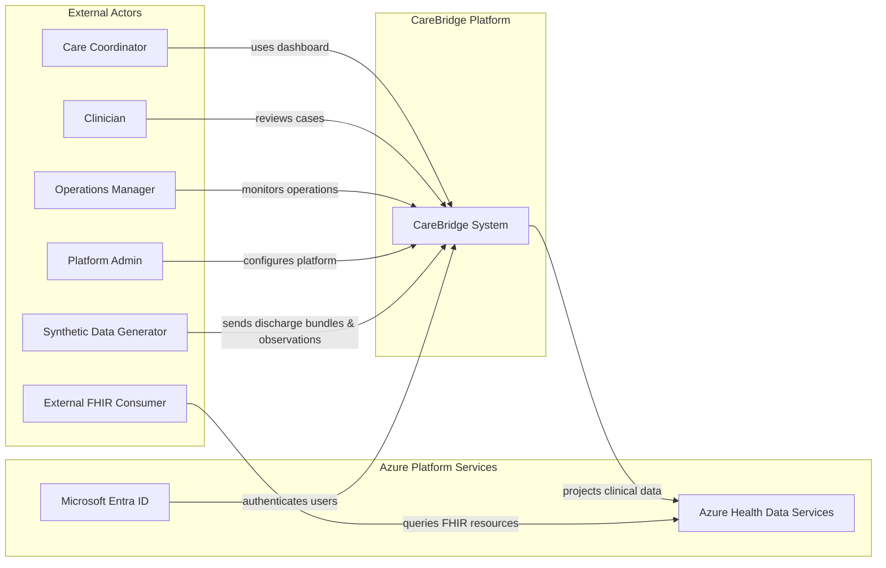
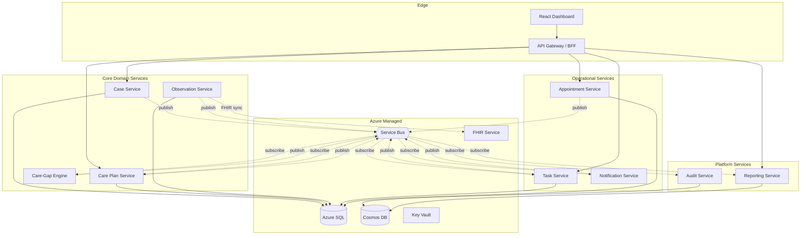
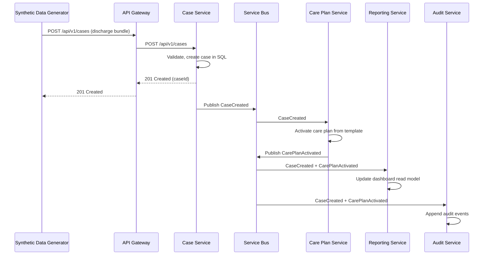
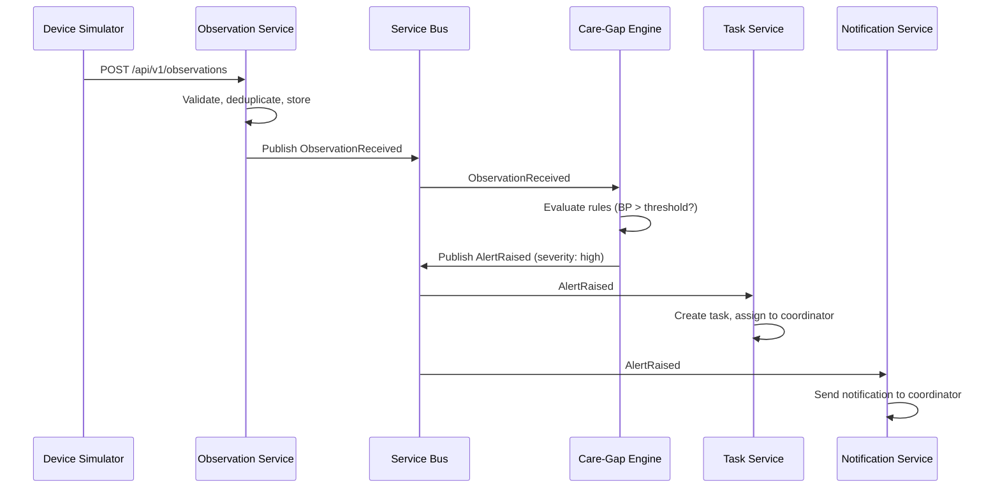
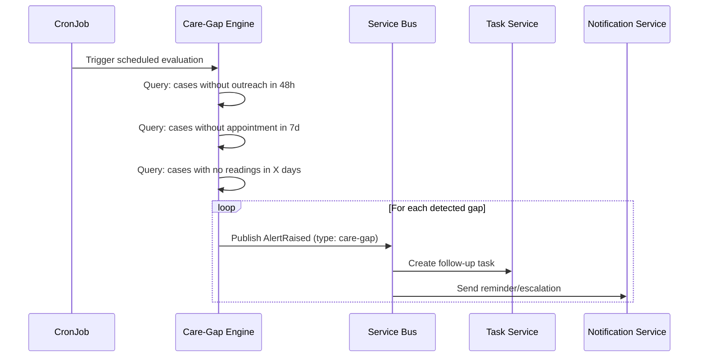
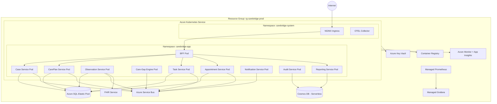

# Solution Architecture

**Document type:** Architecture overview
**Status:** Living document
**Last updated:** 2026-03-27

---

## Architecture Goals

1. **Demonstrate domain-oriented microservices** with clear bounded contexts, not arbitrary service splitting.
2. **Implement event-driven workflows** where asynchronous processing is the natural fit — discharge intake triggers a cascade of coordination actions, not a synchronous call chain.
3. **Use Azure services for defensible architectural reasons**, documented in [ADRs](../adr/).
4. **Design for operational visibility** — every service emits structured logs, metrics, and traces. The system's internal state is observable without SSH access.
5. **Apply healthcare-grade patterns** — audit trails, access control, data sensitivity awareness, FHIR alignment — without making misleading compliance claims.
6. **Keep the architecture honest** — this is a portfolio reference implementation, not an enterprise deployment. Scope boundaries and trade-offs are explicit.

---

## Architectural Drivers

| Driver | Influence on Design |
|---|---|
| Post-discharge care workflow | Shapes service decomposition around case lifecycle, care plans, observations, and tasks |
| Event-driven coordination | Mandates asynchronous messaging (Service Bus) between most services |
| Healthcare interoperability | Requires FHIR R4 alignment via Azure Health Data Services |
| Auditability | Requires immutable event log with correlation ID propagation |
| Portfolio demonstration | Influences technology choices toward Azure-native managed services |
| Operational maturity | Requires observability stack, health probes, runbooks, and SLI/SLO thinking |
| Synthetic data only | Simplifies compliance posture but still requires PHI-aware design patterns |

---

## Assumptions and Constraints

### Assumptions

- All patient data is synthetic. No real PHI enters the system at any point.
- The platform serves a single healthcare organization (single-tenant).
- User authentication is handled by Microsoft Entra ID. No custom identity provider.
- The platform targets a moderate scale benchmark (10K active cases, 500K observations/day) to demonstrate scaling patterns without requiring production-grade infrastructure.
- Services are developed by a small team and share a monorepo for simplicity.

### Constraints

- Azure-only deployment. No multi-cloud requirement.
- Budget-conscious infrastructure choices for portfolio hosting (serverless Cosmos DB, SQL elastic pool, B-series AKS nodes).
- No service mesh. The operational complexity is not justified for this scope — see [trade-offs](#trade-offs-and-design-rationale).
- No multi-region deployment. Single-region with availability zone redundancy where supported.

---

## Quality Attributes

| Attribute | Target | How Achieved |
|---|---|---|
| **Performance** | Case page p95 < 500ms, dashboard p95 < 2s | CQRS with Cosmos DB read models, denormalized views |
| **Scalability** | 10K cases, 500K observations/day | HPA for API services, KEDA for event consumers, partitioned data stores |
| **Reliability** | No silent message loss, idempotent processing | At-least-once delivery, consumer-side dedup, dead-letter queues |
| **Security** | Zero static secrets, RBAC, audit trail | Workload Identity, Entra ID, Key Vault, append-only audit store |
| **Observability** | End-to-end request tracing, operational dashboards | OpenTelemetry, Azure Monitor, Managed Grafana, correlation ID propagation |
| **Maintainability** | Independent service deployment, clear contracts | Service boundaries, documented API/event schemas, CI validation |
| **Interoperability** | FHIR R4 clinical data exchange | Azure Health Data Services, async FHIR projection from operational events |

See [Non-Functional Requirements](../product/non-functional-requirements.md) for detailed targets.

---

## System Context



**Actors:**
- **Care Coordinator** — Primary operational user. Manages tasks, outreach, and case follow-up.
- **Clinician** — Reviews escalated cases, observations, and care plan progress.
- **Operations Manager** — Monitors workload, SLA compliance, and queue health.
- **Platform Admin** — Configures templates, thresholds, and routing rules. Monitors system health.
- **Synthetic Data Generator** — External tool that produces discharge bundles and observation streams.
- **External FHIR Consumer** — Any system querying the FHIR interoperability layer (not part of MVP but the interface exists).

---

## Service Decomposition



**10 services, each with a clear reason to exist.** See [Service Catalog](service-catalog.md) for per-service details.

| Service | Type | Primary Store | Role |
|---|---|---|---|
| API Gateway / BFF | Edge | None (stateless) | Auth context, aggregation, routing |
| Case Service | Domain | Azure SQL | Case lifecycle, patient operational state |
| Care Plan Service | Domain | Azure SQL | Plan templates, milestone tracking |
| Observation Service | Domain | Azure SQL | Vital sign ingestion and validation |
| Care-Gap Engine | Domain | Azure SQL (config) | Rules evaluation, alert generation |
| Task Service | Operational | Azure SQL | Work item management |
| Appointment Service | Operational | Azure SQL | Follow-up scheduling |
| Notification Service | Operational | None (stateless + retry log) | Multi-channel notification delivery |
| Audit Service | Platform | Cosmos DB | Immutable event store |
| Reporting Service | Platform | Cosmos DB | Denormalized read models for dashboard |

---

## Bounded Contexts

The service decomposition follows domain-driven design boundaries. Each bounded context owns its language, data, and rules.

| Bounded Context | Services | Core Entities | Notes |
|---|---|---|---|
| **Case Management** | Case Service | Case, Patient (operational view), CaseTimeline | Owns the lifecycle of a post-discharge case |
| **Care Planning** | Care Plan Service | CarePlan, Milestone, Template | Owns plan structure and progression logic |
| **Clinical Observation** | Observation Service | Observation, DeviceReading | Owns ingestion, validation, and storage of readings |
| **Risk Detection** | Care-Gap Engine | Rule, Alert, Threshold | Owns detection logic, not the alert lifecycle after creation |
| **Operational Work** | Task Service | Task, Comment, Assignment | Owns task lifecycle independently of what triggered the task |
| **Scheduling** | Appointment Service | Appointment | Owns scheduling state; does not own provider/facility calendars |
| **Communication** | Notification Service | NotificationTemplate, DeliveryAttempt | Owns delivery; does not own business logic for when to notify |
| **Audit** | Audit Service | AuditEvent | Append-only. No business rules. |
| **Reporting** | Reporting Service | DashboardView, TimelineView | Read-only projections. Disposable and rebuildable. |

**Key boundary rule:** Services do not share databases. Cross-context data needs are satisfied through events or API calls. See [Coding Boundaries](../developer/coding-boundaries.md).

---

## Synchronous vs Asynchronous Communication

The system uses **two communication patterns** with clear criteria for when each applies.

### Synchronous (HTTP)

Used when the **user is waiting for a response** — typically BFF-to-service calls during a page load or form submission.

| From | To | Example |
|---|---|---|
| BFF | Case Service | GET case detail for the case page |
| BFF | Reporting Service | GET dashboard summary |
| BFF | Task Service | POST create task (manual) |
| BFF | Appointment Service | POST create appointment |
| BFF | Care Plan Service | PATCH update milestone status |

### Asynchronous (Service Bus)

Used when an **action triggers downstream processing** that the user does not need to wait for.

| Publisher | Event | Consumers |
|---|---|---|
| Case Service | CaseCreated | Care Plan Service, Reporting Service, Audit Service |
| Care Plan Service | MilestoneCompleted | Reporting Service, Audit Service |
| Care Plan Service | MilestoneOverdue | Care-Gap Engine, Audit Service |
| Observation Service | ObservationReceived | Care-Gap Engine, Reporting Service, Audit Service |
| Care-Gap Engine | AlertRaised | Task Service, Notification Service, Reporting Service, Audit Service |
| Task Service | TaskCreated, TaskCompleted | Reporting Service, Notification Service, Audit Service |
| Appointment Service | AppointmentBooked, AppointmentMissed | Care Plan Service, Notification Service, Reporting Service, Audit Service |
| Notification Service | NotificationSent, NotificationFailed | Audit Service |

**Design rule:** If the caller does not need the result to continue, use async. If it does, use sync. No hybrid "fire HTTP and poll" patterns.

---

## Event-Driven Workflow Design

### Discharge Intake Flow



### Observation Alerting Flow



### Care-Gap Detection (Scheduled)



---

## Data Ownership Model

Each service is the sole writer to its data store. No shared databases.

| Service | Store | Key Entities | Access Pattern |
|---|---|---|---|
| Case Service | Azure SQL (case-db) | Case, CaseStatus, PatientRef | CRUD by caseId |
| Care Plan Service | Azure SQL (careplan-db) | CarePlan, Milestone, Template | CRUD by planId, query by caseId |
| Observation Service | Azure SQL (observation-db) | Observation | Write-heavy, query by caseId + time range |
| Care-Gap Engine | Azure SQL (caregap-db) | Rule, Threshold, AlertConfig | Read-heavy config, write alerts |
| Task Service | Azure SQL (task-db) | Task, Comment, Assignment | CRUD by taskId, query by owner/status |
| Appointment Service | Azure SQL (appointment-db) | Appointment | CRUD by appointmentId, query by caseId |
| Audit Service | Cosmos DB (audit-container) | AuditEvent | Append-only, query by caseId/time |
| Reporting Service | Cosmos DB (readmodel-container) | DashboardView, TimelineView | Write from events, read for dashboard |

See [Data Architecture](data-architecture.md) for full data flow and consistency model.

---

## FHIR Integration Strategy

CareBridge uses **Azure Health Data Services (FHIR R4)** as an **interoperability projection**, not as the primary transactional store.

**Why this approach:**
- Operational services need relational, fast-write, transactionally consistent storage (Azure SQL).
- FHIR is optimized for clinical data exchange between systems, not for high-throughput operational workflows.
- Keeping FHIR as a secondary projection avoids coupling operational performance to FHIR API latency.

**How it works:**
1. Domain events (CaseCreated, ObservationReceived, etc.) flow to a **FHIR Sync Handler** via Service Bus.
2. The handler maps operational data to FHIR R4 resources (Patient, Encounter, Condition, Observation, CarePlan, Appointment).
3. Resources are written to Azure Health Data Services asynchronously.
4. External systems can query FHIR resources through the standard FHIR REST API.

**FHIR resource mapping:**

| Operational Entity | FHIR Resource | Sync Trigger |
|---|---|---|
| Case (patient data) | Patient | CaseCreated |
| Case (discharge context) | Encounter | CaseCreated |
| Primary conditions | Condition | CaseCreated |
| Vital sign reading | Observation | ObservationReceived |
| Care plan | CarePlan | CarePlanActivated |
| Follow-up appointment | Appointment | AppointmentBooked |

See [ADR-003](../adr/003-azure-health-data-services-fhir.md) for the decision rationale.

---

## Read/Write Separation

The system implements **CQRS (Command Query Responsibility Segregation)** for dashboard and timeline performance.

**Write side:** Each domain service writes to its own Azure SQL database using EF Core. Writes are transactionally consistent within a service boundary.

**Read side:** The Reporting Service consumes domain events and maintains denormalized views in Cosmos DB, optimized for dashboard queries:
- `CaseDashboardView` — aggregated case status, alert count, task count
- `PatientTimeline` — chronological event stream per case
- `OperationalMetrics` — daily aggregates for manager dashboards

**Why CQRS here:**
- Dashboard queries span data from multiple services (cases + alerts + tasks + appointments). Without CQRS, the BFF would need to fan out to 5+ services for every dashboard load.
- Read models are partitioned by `caseId` in Cosmos DB for single-partition reads (< 10ms).
- Read models are eventually consistent (seconds in normal operation) — acceptable for a dashboard that refreshes periodically.
- Read models are rebuildable by replaying events from Service Bus.

---

## Audit Strategy

Every meaningful state change produces an audit event. The Audit Service is a **dedicated, append-only event store** in Cosmos DB.

**What gets audited:** case creation, care plan changes, observation processing, alert lifecycle, task assignment/completion, notification delivery, appointment changes, configuration changes, user sign-in.

**Audit event structure:**
```json
{
  "id": "evt-uuid",
  "caseId": "case-uuid",
  "timestamp": "2026-03-27T14:30:00Z",
  "actor": "user:sarah.chen@contoso.com",
  "action": "TaskCompleted",
  "entityType": "Task",
  "entityId": "task-uuid",
  "correlationId": "corr-uuid",
  "metadata": { "previousStatus": "in-progress", "newStatus": "completed" }
}
```

**Design decisions:**
- No sensitive data values in audit payloads — reference IDs only.
- Partition key is `caseId` for efficient per-case queries.
- TTL of 365 days (configurable).
- No updates or deletes — the container is append-only by application convention.
- Audit events flow through Service Bus, not direct writes, to decouple audit from transaction performance.

See [Security and Compliance](security-and-compliance.md) for the full audit logging design.

---

## Deployment Topology on Azure



**Key deployment decisions:**
- Single AKS cluster per environment (dev uses namespaces, prod gets a dedicated cluster in enterprise scenarios).
- NGINX Ingress Controller routes external traffic to BFF only. No direct access to backend services.
- All Azure PaaS services are accessed via private endpoints where feasible.
- Workload Identity provides pod-to-Azure authentication without static secrets.

See [Azure Architecture](azure-architecture.md) and [Kubernetes Architecture](kubernetes-architecture.md) for detailed platform design.

---

## Security Model

| Layer | Mechanism |
|---|---|
| **User identity** | Microsoft Entra ID, OAuth 2.0 / OIDC, JWT tokens with role claims |
| **Service identity** | AKS Workload Identity, per-service managed identities |
| **API authorization** | Role-based (CareCoordinator, Clinician, OpsManager, Admin) enforced at BFF and service level |
| **Secret management** | Azure Key Vault, Secrets Store CSI Driver, no secrets in source or manifests |
| **Encryption** | TLS at ingress, HTTPS to Azure services, SQL TDE, Cosmos encryption at rest |
| **Audit** | Immutable append-only audit log in Cosmos DB |
| **Network** | Private endpoints for PaaS services, NSGs, no public database endpoints |

See [Security and Compliance](security-and-compliance.md) for the full security architecture and threat model.

---

## Observability Model

| Signal | Tool | Purpose |
|---|---|---|
| **Logs** | Serilog → OTEL Collector → Azure Monitor Logs | Structured operational logging, KQL queries |
| **Metrics** | OpenTelemetry SDK → Managed Prometheus → Grafana | Request rates, error rates, latency, business metrics |
| **Traces** | OpenTelemetry SDK → Application Insights | Distributed request tracing, dependency mapping |
| **Health** | ASP.NET health checks → K8s probes | Liveness, readiness, startup verification |
| **Dashboards** | Managed Grafana | Platform overview, Service Bus health, business metrics, AKS health |
| **Alerts** | Azure Monitor Alerts | DLQ count > 0, error rate > 5%, pod restarts, HPA at max |

**Correlation ID propagation:** A correlation ID is generated at the BFF for every incoming request. It propagates through synchronous HTTP calls (via header) and asynchronous Service Bus messages (via message property). Audit events store the correlation ID. This enables end-to-end tracing from discharge intake to notification delivery.

See [Observability](observability.md) for SLIs, SLOs, dashboards, and troubleshooting flows.

---

## Resilience Patterns

| Pattern | Where Applied | Purpose |
|---|---|---|
| **Retry with backoff** | Service Bus consumers, HTTP clients | Tolerate transient failures |
| **Dead-letter queue** | Every Service Bus subscription | Capture messages that fail after max retries |
| **Circuit breaker** | BFF → backend service calls | Prevent cascade failures when a service is down |
| **Idempotent consumers** | All event handlers | Tolerate duplicate message delivery |
| **Health probes** | Every service (liveness, readiness, startup) | Kubernetes removes unhealthy pods from traffic |
| **Timeout** | All HTTP calls, DB queries | Prevent unbounded waits |
| **Graceful degradation** | Dashboard reads from Cosmos DB | Dashboard works even if some write-side services are degraded |
| **Outbox pattern** | Domain services publishing events | Ensure events are published only after DB commit succeeds |

**What we intentionally omit:**
- **Saga orchestration** — The current workflow is event choreography, which is simpler and sufficient for this scope. A saga orchestrator would add complexity without clear benefit for linear care coordination flows.
- **Bulkhead isolation** — Not implemented in-cluster. Azure managed services provide natural isolation (each service has its own SQL database, separate Service Bus subscriptions).

---

## Scaling Approach

| Component | Scaling Mechanism | Trigger |
|---|---|---|
| API services (BFF, Case, Task, etc.) | HPA (Horizontal Pod Autoscaler) | CPU > 70% or request rate |
| Event consumers (Care-Gap Engine, Notification, Audit, Reporting) | KEDA (Kubernetes Event-Driven Autoscaling) | Service Bus queue depth |
| Azure SQL | Elastic pool DTU scaling | Manual or scheduled for portfolio; auto-scale in production |
| Cosmos DB | Serverless (auto-scales RU) | Automatic based on request volume |
| Service Bus | Standard tier (auto-scales) | Managed by Azure |

**Portfolio vs production scaling:**
- Portfolio: 1 replica per service, B-series AKS nodes, serverless Cosmos DB, Basic SQL elastic pool.
- Production: 2+ replicas for critical services, D-series nodes, provisioned Cosmos DB throughput, Standard SQL tier, zone redundancy.

---

## Trade-offs and Design Rationale

| Decision | Trade-off | Why We Accept It |
|---|---|---|
| **Microservices over monolith** | Higher operational complexity | Portfolio goal is to demonstrate microservices and K8s orchestration skills |
| **Service Bus over direct HTTP** | Eventual consistency, message ordering complexity | Event-driven workflows are core to the architecture story; care coordination is inherently async |
| **CQRS with Cosmos DB** | Two data paths, eventual consistency on reads | Dashboard performance requires denormalized views; single-partition Cosmos reads are fast and cheap |
| **No service mesh** | No automatic mTLS, no traffic policies | Operational complexity not justified for portfolio scope; services are in a trusted cluster network |
| **No saga orchestrator** | Less explicit workflow coordination | Event choreography is simpler and sufficient; workflows are mostly linear |
| **Single AKS cluster (non-prod)** | Shared blast radius | Cost-effective for portfolio; prod would use dedicated clusters |
| **FHIR as projection, not primary store** | Data exists in two places | Operational services need relational speed; FHIR service is for interoperability, not workflow execution |
| **Azure SQL over PostgreSQL** | Vendor alignment over open-source preference | Stronger EF Core integration, native Azure ecosystem alignment for a portfolio showcasing Azure skills |
| **Synthetic data only** | Cannot demonstrate real-world data volumes or edge cases | Eliminates compliance burden for a public repository; patterns are PHI-ready even if data is not |

Each of these decisions has a corresponding [ADR](../adr/) with full context, alternatives, and consequences.
