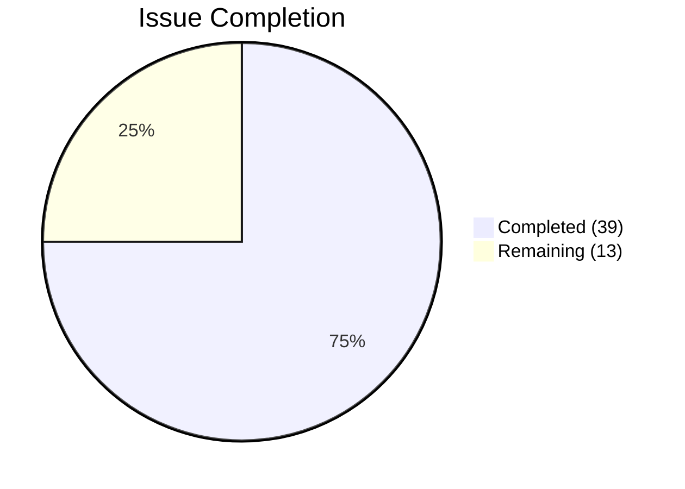
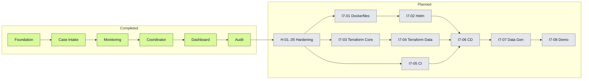

# Delivery Dashboard

**Status:** Living document — updated after each completed issue
**Last updated:** 2026-04-01
**Scope:** CareBridge MVP — 52 issues across 7 epics, delivered in 8 waves

---

## Progress Snapshot

```text

  ███████████████░░░░░  75% COMPLETE  ·  39 of 52 issues delivered

```

| Metric | Value |
|--------|------:|
| Issues completed | **39** / 52 |
| Epics completed | **6** / 7 |
| Waves fully completed | **5** / 8 |
| Current wave | Wave 5 — Dashboard & Audit (9 / 9) DONE |
| Unit tests passing | **140** |
| Next up | `H-01` Health endpoints across all services |



---

## Wave Progress

```text
Wave 1 · Foundation       ████████████████████  6/6   100%  DONE
Wave 2 · Case Intake      ████████████████████  9/9   100%  DONE
Wave 3 · Monitoring       ████████████████████  7/7   100%  DONE
Wave 4 · Coordinator      ████████████████████  8/8   100%  DONE
Wave 5 · Dashboard/Audit  ████████████████████  9/9   100%  DONE
Wave 6 · Hardening        ░░░░░░░░░░░░░░░░░░░░  0/5     0%  PLANNED
Wave 7 · Cloud Deploy     ░░░░░░░░░░░░░░░░░░░░  0/6     0%  PLANNED
Wave 8 · Demo-Ready       ░░░░░░░░░░░░░░░░░░░░  0/2     0%  PLANNED
```

---

## Epic Completion

| # | Epic | Progress | Status |
|--:|------|:--------:|:------:|
| 1 | Foundation & Developer Experience | 6 / 6 (100%) | Done |
| 2 | Case Intake Pipeline | 9 / 9 (100%) | Done |
| 3 | Remote Monitoring & Alerting | 7 / 7 (100%) | Done |
| 4 | Coordinator Workflows | 8 / 8 (100%) | Done |
| 5 | Dashboard, Timeline & Reporting | 6 / 6 (100%) | Done |
| 6 | Audit & Compliance | 3 / 3 (100%) | Done |
| 7 | Infrastructure & Cloud Deployment | 0 / 13 (0%) | Planned |

---

## Remaining Work

### Hardening & Observability — 5 issues · Wave 6

| ID | Issue | Scope |
|----|-------|-------|
| H-01 | Health endpoints across all services | /startup, /ready, /healthz for every service |
| H-02 | Structured JSON logging standardization | Consistent format with correlation IDs |
| H-03 | OpenTelemetry distributed tracing | Basic trace emission across service calls |
| H-04 | Circuit breakers for inter-service HTTP | Resilience on critical communication paths |
| H-05 | Error handling review and edge case hardening | Systematic audit of error paths |

### Cloud Deployment — 6 issues · Wave 7

| ID | Issue | Scope |
|----|-------|-------|
| I7-01 | Multi-stage Dockerfiles | All services and frontend |
| I7-02 | Helm charts | Per-service chart with values files |
| I7-03 | Terraform — core Azure resources | AKS, ACR, networking, resource groups |
| I7-04 | Terraform — data and messaging services | Azure SQL, Cosmos DB, Service Bus |
| I7-05 | GitHub Actions CI pipeline | Build, test, lint, scan on PR |
| I7-06 | GitHub Actions CD pipeline | Deploy to dev AKS on merge |

### Demo-Ready — 2 issues · Wave 8

| ID | Issue | Scope |
|----|-------|-------|
| I7-07 | Synthetic data generator | Seeds a realistic demo dataset |
| I7-08 | Demo walkthrough documentation | End-to-end guided script |

---

## Milestone Tracker

| Version | Milestone | Status |
|:-------:|-----------|:------:|
| v0.1 | Foundation — solution structure, local dev, shared libs | **Done** |
| v0.2 | Case Pipeline — first vertical slice: discharge to UI | **Done** |
| v0.3 | Monitoring Loop — observations in, alerts out, visible in UI | **Done** |
| v0.4 | Operational Workflows — tasks, appointments, notifications | **Done** |
| v0.5 | Dashboard & Audit — CQRS proven, full UI, immutable audit trail | **Done** |
| v0.6 | Hardened — observability and resilience patterns | Planned |
| v0.7 | Cloud-Deployed — running on Azure AKS | Planned |
| v1.0 | Demo-Ready — portfolio release | Planned |

---

## Critical Path



---

## Navigation

| Need | Document |
|------|----------|
| Visual top-level status | [Delivery Dashboard](README.md) _(this file)_ |
| Detailed execution plan and stage history | [Delivery Plan](delivery-plan.md) |
| Execution-ready scope for each epic | [Epic Files](epics/) |
| How to introduce additional committed work | [How to Add New Scope](how-to-add-new-scope.md) |

---

## Counting Rules

- Issue counts come from the 52-item execution plan in [delivery-plan.md](delivery-plan.md).
- Completed work includes Epics 1–6 (39 issues).
- Remaining work includes Epic 7 (13 issues).
- The documentation follow-up in Wave 8 is tracked separately and not counted in the 52-issue total.
