# Delivery Dashboard

**Document type:** Delivery status dashboard
**Status:** Living document
**Last updated:** 2026-03-31
**Scope:** Top-level view of completed and remaining delivery work for CareBridge

---

CareBridge has completed the local-first core product through dashboard and reporting. The remaining scope is audit, hardening, cloud deployment, and demo readiness.

## Snapshot

| Metric | Value |
|---|---|
| Fully completed waves | `4 / 8` |
| Current wave | `Wave 5` (`6 / 9` issues complete) |
| Completed epics | `5 / 7` |
| Completed issues | `36 / 52` |
| Remaining issues | `16 / 52` |
| Next executable item | `A6-01` — Audit Service event consumer and storage |

---

## Progress View

```text
Overall delivery       [#####################---------] 36 / 52
Fully complete waves   [###############---------------]  4 /  8
Current wave (Wave 5)  [####################----------]  6 /  9
Audit                  [------------------------------]  0 /  3
Hardening              [------------------------------]  0 /  5
Cloud deployment       [------------------------------]  0 /  6
Demo-ready             [------------------------------]  0 /  2
```

---

## Remaining Work By Stream

| Stream | Status | Done / Total | Remaining | What is left |
|---|---|---:|---:|---|
| Audit | Next | 0 / 3 | 3 | Event consumer and storage, query API, BFF + React audit view |
| Hardening | Planned | 0 / 5 | 5 | Health endpoints, structured logging, OpenTelemetry, circuit breakers, error hardening |
| Cloud deployment | Planned | 0 / 6 | 6 | Dockerfiles, Helm charts, Terraform core/data, GitHub Actions CI/CD |
| Demo-ready | Planned | 0 / 2 | 2 | Synthetic data generator and demo walkthrough |

---

## Critical Path

```mermaid
flowchart LR
    subgraph Done
        E1[Foundation]
        E2[Case Intake]
        E3[Monitoring and Alerting]
        E4[Coordinator Workflows]
        E5[Dashboard and Reporting]
    end

    subgraph Remaining
        A1[A6-01 Audit consumer and storage]
        A2[A6-02 Audit query API]
        A3[A6-03 Audit UI]
        H[H-01 to H-05 Hardening]
        D1[I7-01 Dockerfiles]
        D2[I7-02 Helm charts]
        T1[I7-03 Terraform core]
        T2[I7-04 Terraform data]
        CI[I7-05 CI pipeline]
        CD[I7-06 CD pipeline]
        G[I7-07 Synthetic data generator]
        W[I7-08 Demo walkthrough]
    end

    E1 --> E2 --> E3 --> E4 --> E5 --> A1 --> A2 --> A3 --> H
    H --> D1 --> D2 --> CD
    H --> T1 --> T2 --> CD
    H --> CI --> CD
    CD --> G --> W

    classDef done fill:#d9f99d,stroke:#3f6212,color:#111827;
    classDef next fill:#fde68a,stroke:#92400e,color:#111827;
    classDef later fill:#e5e7eb,stroke:#6b7280,color:#111827;

    class E1,E2,E3,E4,E5 done;
    class A1,A2,A3 next;
    class H,D1,D2,T1,T2,CI,CD,G,W later;
```



---

## Navigation

| Need | Document |
|---|---|
| Visual top-level status | [Delivery Dashboard](README.md) |
| Detailed execution order and stage history | [Delivery Plan](delivery-plan.md) |
| Execution-ready scope for each epic | [Epic Files](epics/) |

---

## Counting Rules

- Issue counts come from the 52-item execution plan in [delivery-plan.md](delivery-plan.md).
- Completed work includes Epics 1-5 only (`36` issues).
- Remaining work includes Epic 6 (`3` issues) and Epic 7 (`13` issues).
- The documentation follow-up item in Wave 8 is tracked separately and is not counted in the `52` issue total.
