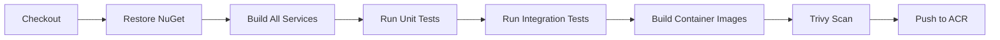

# CI/CD Pipeline

**Document type:** Pipeline reference
**Status:** Living document
**Last updated:** 2026-03-27

---

## Pipeline Overview

CareBridge uses **GitHub Actions** for CI/CD with **OIDC federation to Azure** — no stored credentials in GitHub.

All pipeline definitions live in `.github/workflows/`.

---

## Trigger Strategy

| Trigger | Pipeline | Deploys To |
|---|---|---|
| Pull request opened/updated | Build + Test + Lint | Nothing (validation only) |
| Merge to `develop` | Build + Test + Deploy | Dev environment |
| Merge to `main` | Build + Test + Deploy | Staging environment |
| Manual dispatch (with approval) | Deploy | Prod environment |

---

## Build Pipeline



```yaml
# Simplified workflow structure
name: Build and Deploy
on:
  push:
    branches: [develop, main]
  pull_request:
    branches: [develop, main]

jobs:
  build:
    runs-on: ubuntu-latest
    steps:
      - uses: actions/checkout@v4

      - uses: actions/setup-dotnet@v4
        with:
          dotnet-version: '10.0.x'

      - run: dotnet restore
      - run: dotnet build --no-restore
      - run: dotnet test tests/unit/ --no-build

      - name: Integration tests
        run: |
          docker-compose -f docker-compose.test.yml up -d
          dotnet test tests/integration/ --no-build
          docker-compose -f docker-compose.test.yml down

      - name: Build container images
        run: |
          for service in case-service careplan-service observation-service caregap-engine task-service appointment-service notification-service audit-service reporting-service gateway; do
            docker build -t acrcarebridge.azurecr.io/$service:${{ github.sha }} \
              -f src/services/$service/Dockerfile .
          done

      - name: Trivy vulnerability scan
        uses: aquasecurity/trivy-action@master
        with:
          scan-type: 'image'
          severity: 'CRITICAL,HIGH'

      - name: Login to ACR
        uses: azure/login@v1
        with:
          client-id: ${{ secrets.AZURE_CLIENT_ID }}
          tenant-id: ${{ secrets.AZURE_TENANT_ID }}
          subscription-id: ${{ secrets.AZURE_SUBSCRIPTION_ID }}

      - name: Push to ACR
        run: |
          az acr login --name acrcarebridge
          for service in case-service careplan-service ...; do
            docker push acrcarebridge.azurecr.io/$service:${{ github.sha }}
          done
```

---

## Deploy Pipeline

```yaml
  deploy-dev:
    needs: build
    if: github.ref == 'refs/heads/develop'
    runs-on: ubuntu-latest
    environment: dev
    steps:
      - uses: azure/login@v1
        with:
          client-id: ${{ secrets.AZURE_CLIENT_ID }}
          tenant-id: ${{ secrets.AZURE_TENANT_ID }}
          subscription-id: ${{ secrets.AZURE_SUBSCRIPTION_ID }}

      - name: Get AKS credentials
        run: az aks get-credentials --resource-group rg-carebridge-dev --name aks-carebridge-dev

      - name: Run database migrations
        run: |
          kubectl apply -f deploy/jobs/migration-job.yaml -n carebridge-dev
          kubectl wait --for=condition=complete job/db-migration -n carebridge-dev --timeout=120s

      - name: Deploy services via Helm
        run: |
          for service in case-service careplan-service ...; do
            helm upgrade --install $service deploy/helm/charts/$service \
              -n carebridge-dev \
              -f deploy/helm/values/global-dev.yaml \
              -f deploy/helm/charts/$service/values-dev.yaml \
              --set image.tag=${{ github.sha }} \
              --wait --timeout 300s
          done

      - name: Run smoke tests
        run: |
          # Verify health endpoints
          kubectl run smoke-test --rm -i --restart=Never \
            --image=curlimages/curl -- \
            curl -sf http://bff.carebridge-dev.svc.cluster.local/healthz

      - name: Notify on failure
        if: failure()
        run: echo "Deployment to dev failed" # Replace with Teams/Slack webhook
```

---

## PR Validation

Required checks before merge:

| Check | Description |
|---|---|
| `build` | All services compile |
| `unit-tests` | All unit tests pass |
| `integration-tests` | API and event contract tests pass |
| `lint` | dotnet format check, ESLint for frontend |
| `helm-lint` | `helm lint` on all charts |
| `trivy-scan` | No critical CVEs in container images |
| `terraform-plan` | Preview infra changes (if `infra/` files modified) |

All checks must pass. Branch protection enforces this on `develop` and `main`.

---

## Image Tagging Strategy

| Context | Tag Format | Example |
|---|---|---|
| PR build | `{branch}-{sha}` | `case-service:feature-xyz-abc1234` |
| Develop merge | `{sha}` | `case-service:abc1234567` |
| Main merge | `{semver}-{sha}` | `case-service:1.2.0-abc1234` |
| Production | Same tag as staging | `case-service:1.2.0-abc1234` |

No `latest` tag. Every deployment references an explicit, immutable tag.

---

## Security Scanning

| Tool | What It Scans | When |
|---|---|---|
| **Trivy** | Container image CVEs | Every build |
| **Dependabot** | NuGet and npm dependency vulnerabilities | Continuous (GitHub-managed) |
| **dotnet format** | Code style consistency | PR check |
| **GitHub secret scanning** | Accidentally committed secrets | Continuous (GitHub-managed) |

---

## Monitoring Deployment Success

After each deployment:

1. **Pod health:** All pods in `Running` state with `Ready` condition.
2. **Startup probes:** Pass within expected timeout (60s).
3. **Error rate:** No spike above pre-deployment baseline.
4. **Smoke tests:** Core endpoints return 200.
5. **DLQ check:** No new DLQ messages within 5 minutes of deploy.

---

## What's Not Automated Yet

| Feature | Status | Notes |
|---|---|---|
| Load testing | Not implemented | Would run before prod promotion |
| Chaos testing | Not implemented | Would verify resilience patterns |
| Automatic prod rollback | Not implemented | Manual rollback via Helm |
| Canary deployments | Not implemented | Would require traffic splitting (Flagger or NGINX canary) |
| Blue-green deployments | Not implemented | Would require duplicate namespace or traffic switching |

These are documented as future improvements appropriate for a production-grade deployment.
