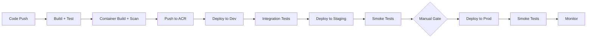

# Deployment Strategy

**Document type:** Deployment architecture
**Status:** Living document
**Last updated:** 2026-03-27

---

## Deployment Philosophy

- **Immutable containers.** What is built and tested is exactly what gets deployed. No patching running containers.
- **Declarative infrastructure.** All Azure resources provisioned via Terraform. All Kubernetes resources via Helm charts.
- **Repeatable deployments.** Same pipeline, same charts, same images across all environments. Differences are configuration only.
- **No manual changes in production.** Every change goes through the CI/CD pipeline and version control.
- **Secretless authentication.** GitHub Actions uses OIDC to Azure. Pods use Workload Identity. No stored credentials anywhere.

---

## Container Build Strategy

Each service has its own Dockerfile using multi-stage builds:

```dockerfile
# Build stage
FROM mcr.microsoft.com/dotnet/sdk:10.0 AS build
WORKDIR /src
COPY . .
RUN dotnet publish src/services/case-service -c Release -o /app

# Runtime stage
FROM mcr.microsoft.com/dotnet/aspnet:10.0
WORKDIR /app
COPY --from=build /app .
EXPOSE 8080
ENTRYPOINT ["dotnet", "CaseService.dll"]
```

**Image tagging:**
- PR builds: `{service}:{branch}-{short-sha}` (e.g., `case-service:feature-xyz-abc123`)
- Main branch: `{service}:{semver}-{short-sha}` (e.g., `case-service:1.2.0-abc123`)
- No `latest` tag in production. Every deployment references an explicit tag.

---

## Helm-Based Deployment

One Helm chart per service. Values files per environment.

```bash
# Deploy a service to dev
helm upgrade --install case-service deploy/helm/charts/case-service \
  -n carebridge-dev \
  -f deploy/helm/values/global-dev.yaml \
  -f deploy/helm/charts/case-service/values-dev.yaml \
  --set image.tag=1.2.0-abc123
```

See [Kubernetes Architecture — Helm Chart Structure](../architecture/kubernetes-architecture.md#helm-chart-structure).

---

## Deployment Pipeline Overview



| Stage | Trigger | Fails If |
|---|---|---|
| Build + Test | PR or merge | Compilation error, unit test failure |
| Container Scan | After build | Critical/high CVE detected |
| Deploy to Dev | Merge to develop | Helm upgrade fails, pods don't become ready |
| Integration Tests | After dev deploy | API contract or workflow tests fail |
| Deploy to Staging | Merge to main | Same as dev |
| Manual Gate | Before prod | Reviewer doesn't approve |
| Deploy to Prod | After approval | Rollout fails, smoke tests fail |

---

## Database Migration Strategy

EF Core migrations run as a **Kubernetes Job** before application deployment:

```bash
# Migration job runs dotnet ef database update
# against the target environment's SQL database
```

**Rules:**
1. Migrations must be **backward-compatible.** The previous code version must work with the new schema.
2. Adding a column: make it nullable or provide a default.
3. Removing a column: deploy code that stops using it first. Remove the column in a later release.
4. Never rename columns. Add a new column, migrate data, remove old column across releases.
5. Migration jobs use the same Workload Identity as the service, scoped to the service's database.

---

## Infrastructure Provisioning

Terraform provisions all Azure resources from the `infra/terraform/` directory:

```bash
# Plan changes
terraform plan -var-file=environments/dev.tfvars

# Apply changes (requires approval for prod)
terraform apply -var-file=environments/prod.tfvars
```

- **State management:** Remote state in Azure Storage Account, one state file per environment.
- **Pipeline integration:** `terraform plan` runs on PR for visibility. `terraform apply` runs on merge with approval gate for prod.
- **Drift detection:** Scheduled pipeline runs `terraform plan` weekly to detect manual changes.

---

## Secretless Authentication

### CI/CD: GitHub Actions → Azure

```yaml
# GitHub Actions OIDC to Azure — no stored secrets
- uses: azure/login@v1
  with:
    client-id: ${{ secrets.AZURE_CLIENT_ID }}
    tenant-id: ${{ secrets.AZURE_TENANT_ID }}
    subscription-id: ${{ secrets.AZURE_SUBSCRIPTION_ID }}
```

`AZURE_CLIENT_ID` is a managed identity client ID, not a secret. The OIDC token exchange uses GitHub's identity provider and a federated credential in Entra ID.

### Runtime: Pods → Azure Resources

AKS Workload Identity. Each pod gets a federated token scoped to its managed identity. No connection strings, passwords, or API keys stored in GitHub or Kubernetes.

See [Azure Architecture — Workload Identity](../architecture/azure-architecture.md#aks-workload-identity).

---

## Validation Gates

| Gate | Stage | What It Checks |
|---|---|---|
| Unit tests | Build | Business logic correctness |
| Integration tests | Post-dev-deploy | API contracts, DB operations, event publishing |
| Contract tests | Build | Event schema compatibility between producers and consumers |
| Container scan (Trivy) | After container build | Known CVEs in base images and dependencies |
| Helm lint | Build | Chart syntax and template validity |
| Terraform plan | PR (infra changes) | Infrastructure change preview, no unexpected deletions |
| Smoke tests | Post-deploy (staging + prod) | Core endpoints respond, health checks pass |

---

## Rollback Strategy

- **Helm rollback:** `helm rollback <service> <revision> -n carebridge-app`
- **Database:** Forward-only by convention. Create a new migration to fix issues.
- **Immediate response time:** Rollback should complete within 5 minutes.

See [Deployment Rollback runbook](../runbooks/deployment-rollback.md).
