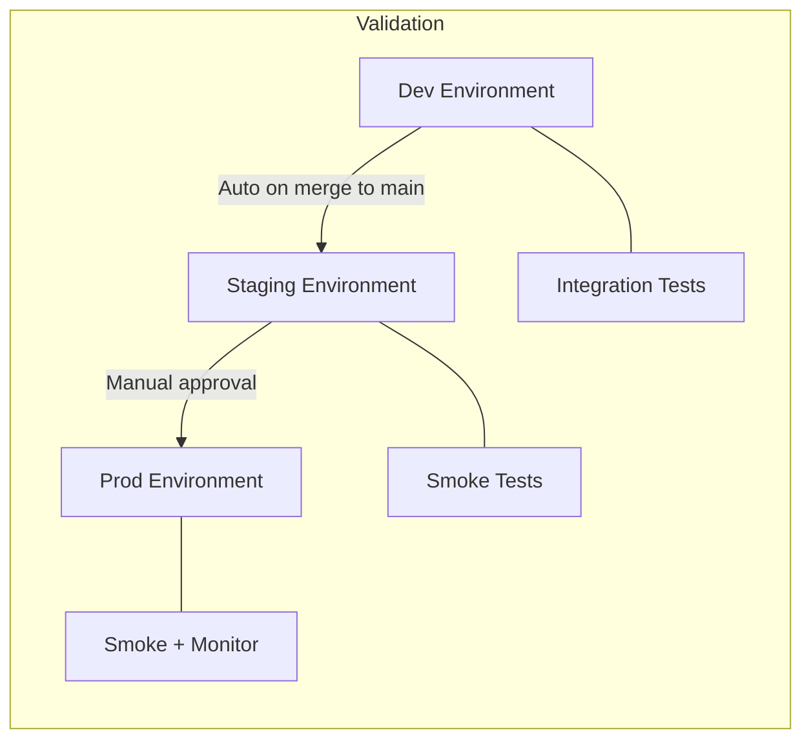

# Environment Strategy

**Document type:** Environment reference
**Status:** Living document
**Last updated:** 2026-03-27

---

## Environment Overview

| Environment | Purpose | Resource Group | AKS Namespace | Deploy Trigger |
|---|---|---|---|---|
| **dev** | Development, integration testing, experimentation | rg-carebridge-dev | carebridge-dev | Auto on merge to `develop` |
| **staging** | Pre-production validation, demo preparation | rg-carebridge-staging | carebridge-staging | Auto on merge to `main` |
| **prod** | Production demo, portfolio showcase | rg-carebridge-prod | carebridge-app | Manual approval gate |

---

## Resource Naming Convention

**Pattern:** `{resource-type}-carebridge-{env}`

| Resource | Dev | Staging | Prod |
|---|---|---|---|
| Resource Group | rg-carebridge-dev | rg-carebridge-staging | rg-carebridge-prod |
| AKS Cluster | aks-carebridge-dev | aks-carebridge-dev (shared) | aks-carebridge-prod |
| SQL Server | sql-carebridge-dev | sql-carebridge-staging | sql-carebridge-prod |
| Cosmos DB | cosmos-carebridge-dev | cosmos-carebridge-staging | cosmos-carebridge-prod |
| Service Bus | sb-carebridge-dev | sb-carebridge-staging | sb-carebridge-prod |
| Key Vault | kv-carebridge-dev | kv-carebridge-staging | kv-carebridge-prod |

**Shared resources:** ACR (`acrcarebridge`) is shared across all environments. Images are promoted by tag, not rebuilt.

---

## Configuration Differences by Environment

| Config Item | Dev | Staging | Prod |
|---|---|---|---|
| Replicas per service | 1 | 1-2 | 2+ |
| CPU requests | 50m | 100m | 100-200m |
| Memory requests | 128Mi | 256Mi | 256-512Mi |
| Log level | Debug | Information | Information |
| AKS node count | 1-2 | 2 | 3+ |
| AKS node SKU | Standard_B2s | Standard_B4ms | Standard_D4s_v5 |
| SQL tier | Basic (5 DTU) | Basic (50 DTU pool) | Standard (100 DTU pool) |
| Cosmos DB mode | Serverless | Serverless | Serverless (or provisioned) |
| Service Bus tier | Standard | Standard | Standard |
| FHIR service | Shared instance | Dedicated | Dedicated |
| HPA enabled | Yes (low thresholds) | Yes | Yes |
| PDBs | No | No | Yes |
| Private endpoints | Optional | Recommended | Required |

---

## Secrets Management Per Environment

Each environment has its own Azure Key Vault. Secrets are environment-specific:

| Secret | Example (dev) | Example (prod) |
|---|---|---|
| SQL connection | `sql-carebridge-dev` → case-db | `sql-carebridge-prod` → case-db |
| Service Bus | `sb-carebridge-dev` connection | `sb-carebridge-prod` connection |
| FHIR endpoint | `fhir-carebridge-dev` | `fhir-carebridge-prod` |

Same Workload Identity pattern across all environments. Different managed identities per environment.

---

## Data Isolation

- Each environment has its **own databases, Service Bus namespace, Cosmos DB account, and FHIR service instance.**
- No shared data across environments.
- Synthetic data is seeded independently per environment using the same generator tool.
- Destroying a non-prod environment has zero impact on other environments.

---

## Cost Optimization for Non-Production

| Strategy | Savings |
|---|---|
| B-series burstable AKS nodes (dev) | ~60% vs D-series |
| Basic SQL tier with minimal DTU (dev) | ~80% vs Standard |
| Serverless Cosmos DB (all non-prod) | Pay only for actual RU consumption |
| Single AKS cluster shared between dev and staging | ~50% compute savings |
| `az aks stop` when not actively developing | 100% compute savings during idle |
| No Managed Grafana in dev (use Azure Portal instead) | ~$20/month saved |

---

## Environment Promotion Flow

**Promotion means:**
1. The same container image (same SHA tag) is deployed to the next environment.
2. Environment-specific Helm values are applied.
3. Validation tests run post-deployment.
4. No code changes between environments — only configuration differs.
