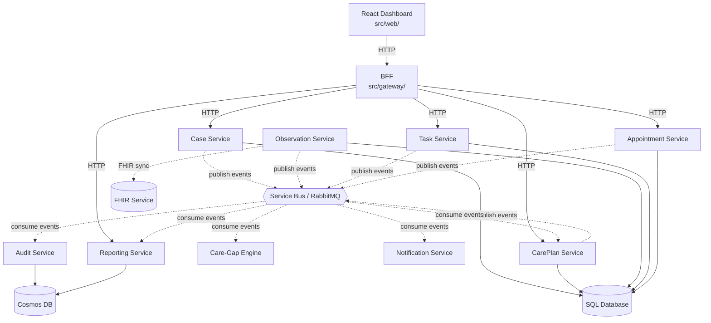

# Architecture Overview for Developers

**Document type:** Developer reference
**Last updated:** 2026-03-27

This is a practical guide for developers working in the CareBridge codebase. For the full architecture design, see [Solution Architecture](../architecture/solution-architecture.md).

---

## How the System Fits Together



**Two communication patterns:**
- **Solid arrows (→):** Synchronous HTTP. Used when a user is waiting for a response.
- **Dashed arrows (-.->):** Asynchronous events via Service Bus. Used when an action triggers downstream processing.

---

## Request Flow: Synchronous

When a user loads a page or submits a form:

1. React app sends HTTP request to BFF.
2. BFF validates JWT, extracts user context (userId, roles).
3. BFF forwards request to the appropriate backend service, passing user context via internal headers.
4. Backend service processes the request, reads/writes to its own database.
5. Response flows back through BFF to the React app.

**Key detail:** The BFF is the only service exposed to the internet. All backend services are internal (ClusterIP in Kubernetes, localhost in local dev).

---

## Request Flow: Asynchronous

When a service action triggers downstream processing:

1. Service commits its database transaction.
2. Within the same transaction (outbox pattern), an event record is written to an outbox table.
3. A background worker reads the outbox and publishes events to Service Bus (or RabbitMQ locally).
4. Downstream services consume the event from their subscription.
5. Each consumer processes the event and commits to its own database.
6. Consumer acknowledges the message to Service Bus.

**Why the outbox pattern:** Without it, you could commit to the database but fail to publish the event (or vice versa). The outbox ensures both happen or neither happens.

---

## Service Template Structure

Every service follows the same project layout:

```
src/services/{service-name}/
├── Program.cs                  # Host configuration, DI registration, middleware pipeline
├── Endpoints/                  # Minimal API endpoint definitions
│   ├── CaseEndpoints.cs
│   └── HealthEndpoints.cs
├── Domain/                     # Domain entities, value objects, enums
│   ├── Case.cs
│   └── CaseStatus.cs
├── Application/                # Command/query handlers, business logic
│   ├── Commands/
│   │   └── CreateCaseCommand.cs
│   ├── Queries/
│   │   └── GetCaseQuery.cs
│   └── EventHandlers/
│       └── OnCaseCreated.cs
├── Infrastructure/             # External integrations (DB, messaging, external APIs)
│   ├── Persistence/
│   │   ├── CaseDbContext.cs
│   │   ├── Migrations/
│   │   └── Repositories/
│   ├── Messaging/
│   │   ├── CaseEventPublisher.cs
│   │   └── ServiceBusConsumer.cs
│   └── ExternalServices/
├── Contracts/                  # Public DTOs, event definitions (shared with consumers)
│   ├── CaseCreatedEvent.cs
│   └── CaseDto.cs
├── appsettings.json
├── appsettings.Development.json
└── Dockerfile
```

---

## Key Patterns Used

### Minimal APIs (Not Controllers)
Endpoints are defined as static methods mapped in `Program.cs`:

```csharp
app.MapPost("/api/v1/cases", CreateCaseEndpoint.Handle)
   .RequireAuthorization("CareCoordinator");
```

### Command/Query Separation
Within each service, commands (writes) and queries (reads) are separated. MediatR or a similar dispatcher routes them:

```csharp
// Command
public record CreateCaseCommand(string PatientId, DateOnly DischargeDate, ...);
// Handler
public class CreateCaseHandler : IRequestHandler<CreateCaseCommand, CaseDto> { ... }
```

### Repository Pattern Over EF Core
Repositories encapsulate data access. Services don't call `DbContext` directly from endpoints or handlers:

```csharp
public interface ICaseRepository
{
    Task<Case?> GetByIdAsync(Guid caseId);
    Task<Case> CreateAsync(Case newCase);
}
```

### Outbox Pattern for Reliable Event Publishing
After a database commit, events are published via an outbox table:

1. Handler creates a domain entity and an outbox record in one transaction.
2. Background worker (`OutboxProcessor`) reads unsent outbox records.
3. Publishes each event to Service Bus/RabbitMQ.
4. Marks the outbox record as sent.

### Adapter Pattern for Cloud Services
Each cloud dependency has an interface with two implementations:

```csharp
public interface IEventPublisher
{
    Task PublishAsync<T>(T @event) where T : IDomainEvent;
}

// Azure implementation
public class ServiceBusEventPublisher : IEventPublisher { ... }

// Local development implementation
public class RabbitMqEventPublisher : IEventPublisher { ... }
```

The correct implementation is registered in DI based on the environment.

---

## How Auth Works

```
Entra ID → JWT → BFF validates → extracts claims → passes to backend
```

1. User logs in via Microsoft Entra ID (OIDC flow in the React app).
2. React app sends the JWT as a `Bearer` token in the `Authorization` header.
3. BFF validates the JWT (signature, expiry, audience).
4. BFF extracts user claims: `userId`, `roles`, `email`.
5. BFF passes these as trusted internal headers to backend services: `X-User-Id`, `X-User-Roles`.
6. Backend services use these headers for authorization decisions.

**In local development:** A mock auth middleware generates fake claims for a configurable role. No Entra ID setup needed.

---

## How to Add a New Endpoint

1. **Define the endpoint** in `Endpoints/`:
   ```csharp
   public static class GetCaseByIdEndpoint
   {
       public static async Task<IResult> Handle(Guid caseId, ICaseRepository repo)
       {
           var c = await repo.GetByIdAsync(caseId);
           return c is null ? Results.NotFound() : Results.Ok(c.ToDto());
       }
   }
   ```

2. **Register in Program.cs:**
   ```csharp
   app.MapGet("/api/v1/cases/{caseId}", GetCaseByIdEndpoint.Handle)
      .RequireAuthorization();
   ```

3. **Add a unit test** in `tests/unit/{service}/`.

---

## How to Add a New Event

1. **Define the event contract** in `Contracts/`:
   ```csharp
   public record CaseEscalatedEvent(Guid CaseId, string Reason, DateTime EscalatedAt);
   ```

2. **Publish from the handler:**
   ```csharp
   await _eventPublisher.PublishAsync(new CaseEscalatedEvent(case.Id, reason, DateTime.UtcNow));
   ```

3. **Add a consumer in the subscribing service** under `Application/EventHandlers/`.

4. **Register the subscription** in Service Bus topic configuration (or RabbitMQ binding for local dev).

5. **Add contract tests** validating the event schema matches what consumers expect.

---

## Where to Find Things

| Concept | Location |
|---|---|
| API routes | `src/services/*/Endpoints/` and `src/gateway/Endpoints/` |
| Database schema | `src/services/*/Infrastructure/Persistence/Migrations/` |
| Event definitions | `src/services/*/Contracts/` and `src/shared/Events/` |
| Shared middleware | `src/shared/` (correlation ID, health checks, OTEL config) |
| Helm charts | `deploy/helm/charts/` |
| Terraform | `infra/terraform/` |
| CI/CD workflows | `.github/workflows/` |
| Synthetic data | `tools/synthetic-data-generator/` |
| Architecture docs | `docs/architecture/` |
| ADRs | `docs/adr/` |
