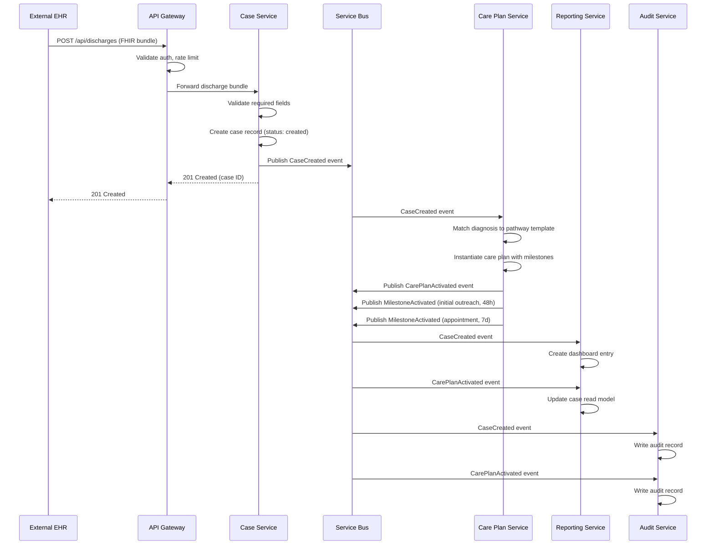
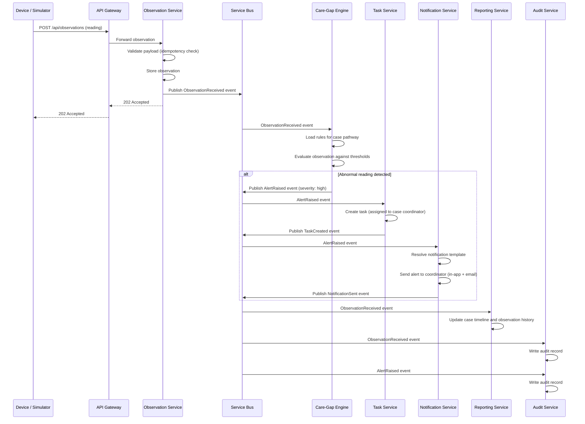
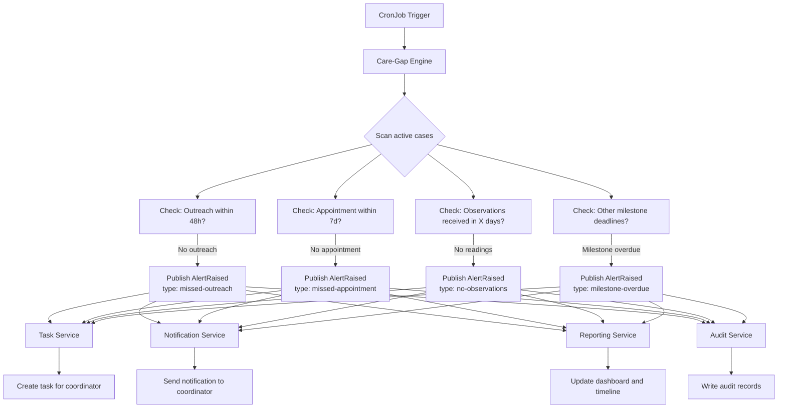
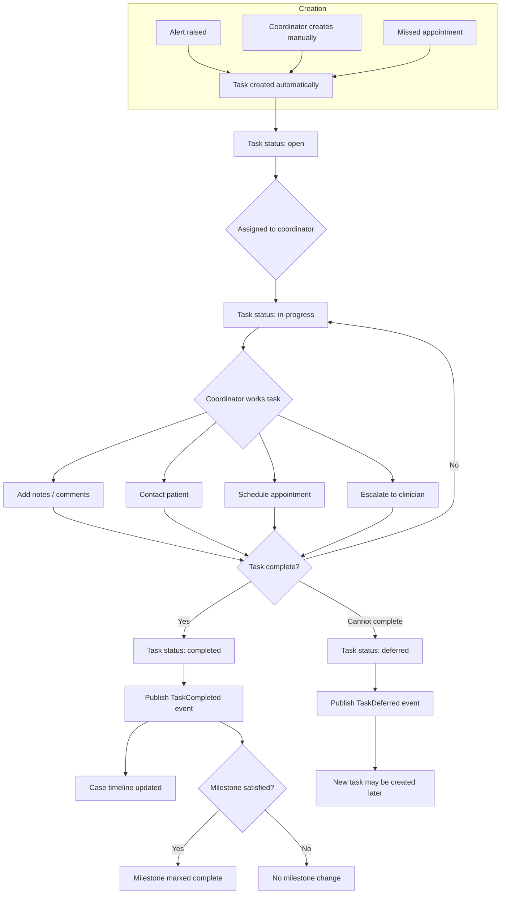
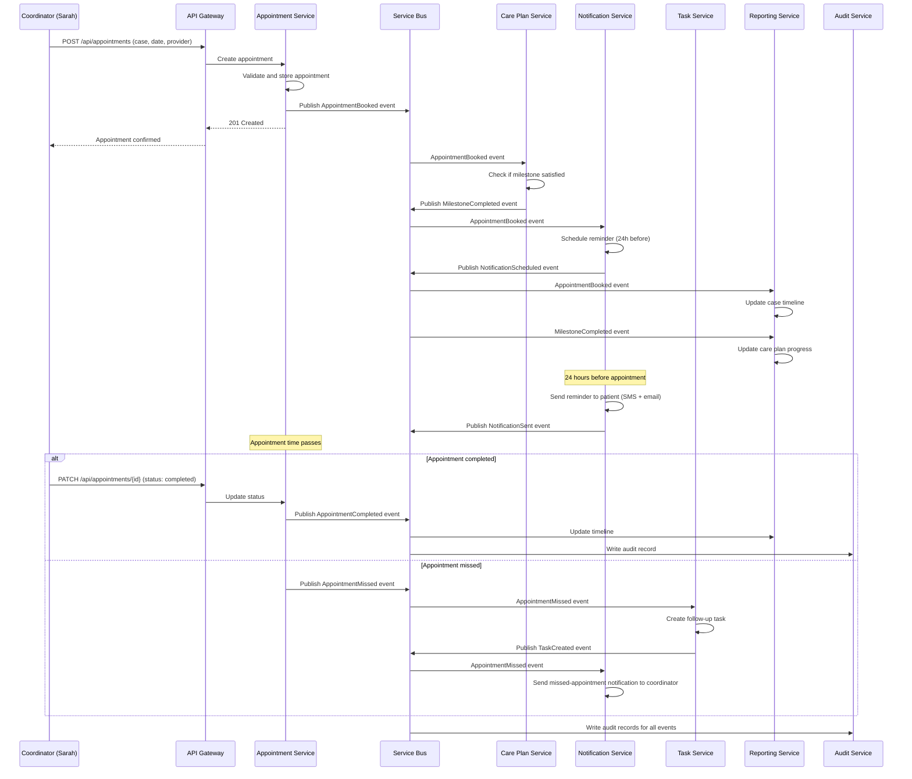
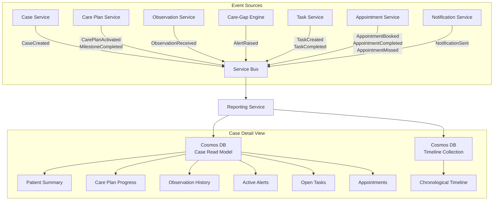
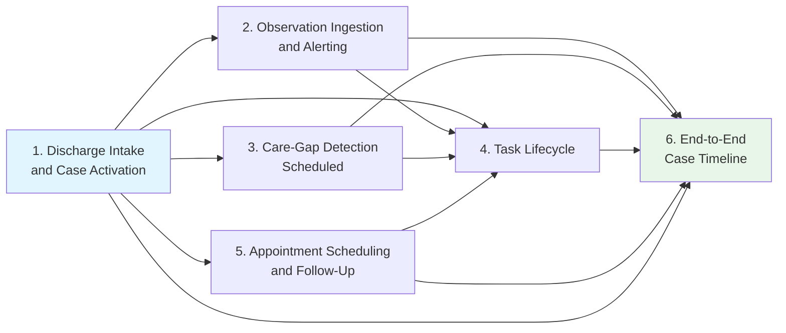

# Core Workflows

**Document type:** Workflow reference
**Last updated:** 2026-03-27

---

## Overview

This document describes the core operational workflows in CareBridge. Each workflow specifies the trigger, the services involved, the events exchanged, and what the user sees. Mermaid diagrams illustrate the sequence or flow of each workflow.

These workflows map directly to the functional requirements in the [PRD](prd.md) (Sections FR-1 through FR-9) and the domain concepts defined in the [Domain Overview](domain-overview.md).

---

## 1. Discharge Intake and Case Activation

### Description

When a patient is discharged from the hospital, an external system sends a synthetic FHIR-aligned discharge bundle to CareBridge. This triggers the creation of a new post-discharge case, automatic activation of a diagnosis-specific care plan, and population of the coordinator dashboard with a new actionable case.

This is the entry point for all downstream coordination workflows. Everything in CareBridge begins with a discharge event.

### Sequence Diagram

### Services Involved

| Service | Role |
|---|---|
| API Gateway | Authentication, validation, routing |
| Case Service | Creates and owns the case lifecycle |
| Care Plan Service | Instantiates care plan from template, activates milestones |
| Reporting Service | Builds dashboard and timeline read models |
| Audit Service | Records immutable audit events |

### Events Exchanged

| Event | Publisher | Subscribers |
|---|---|---|
| `CaseCreated` | Case Service | Care Plan Service, Reporting Service, Audit Service |
| `CarePlanActivated` | Care Plan Service | Reporting Service, Audit Service |
| `MilestoneActivated` | Care Plan Service | Reporting Service, Audit Service |

### What the User Sees

- **Sarah (Coordinator):** A new case appears on the coordinator dashboard within seconds. The case detail view shows the patient summary, discharge context, and an active care plan with pending milestones (initial outreach due in 48h, follow-up appointment due in 7d).
- **Maria (Ops Manager):** The operations dashboard intake count increments. The new case appears in the SLA tracking view.

---

## 2. Observation Ingestion and Alerting

### Description

After discharge, a patient submits remote monitoring readings (simulated by a device simulator in this reference implementation). Each observation is validated, stored, and evaluated against configured thresholds. If an abnormal reading is detected, the Care-Gap Engine raises an alert, which triggers task creation and notification to the assigned coordinator.

### Sequence Diagram

### Services Involved

| Service | Role |
|---|---|
| API Gateway | Authentication, routing |
| Observation Service | Validates, deduplicates, stores readings, publishes events |
| Care-Gap Engine | Evaluates observations against threshold rules |
| Task Service | Creates tasks from alerts |
| Notification Service | Sends alerts to coordinators |
| Reporting Service | Updates case timeline and observation history |
| Audit Service | Records audit events |

### Events Exchanged

| Event | Publisher | Subscribers |
|---|---|---|
| `ObservationReceived` | Observation Service | Care-Gap Engine, Reporting Service, Audit Service |
| `AlertRaised` | Care-Gap Engine | Task Service, Notification Service, Reporting Service, Audit Service |
| `TaskCreated` | Task Service | Reporting Service, Audit Service |
| `NotificationSent` | Notification Service | Audit Service |

### What the User Sees

- **Sarah (Coordinator):** If the reading is abnormal, an alert appears in the dashboard alert panel. A new task appears in her task list with the alert context. She receives an in-app notification and an email.
- **Dr. Rivera (Physician):** If the alert is escalated, he sees it in his clinical review queue with the observation value, threshold exceeded, and trend context.
- **Alex (Admin):** Normal processing is invisible. If the observation fails validation, it appears in the dead-letter inspector.

---

## 3. Care-Gap Detection (Scheduled)

### Description

Not all care gaps are triggered by incoming data. Some are detected by the absence of expected activity. A scheduled process (CronJob on AKS) triggers the Care-Gap Engine to scan for cases that are missing expected actions within their SLA windows: no outreach in 48 hours, no appointment in 7 days, no observations received in a configured number of days.

### Flow Diagram

### Services Involved

| Service | Role |
|---|---|
| CronJob (AKS) | Triggers the scheduled scan on a configured interval |
| Care-Gap Engine | Queries case and milestone state, evaluates gap rules, publishes alerts |
| Task Service | Creates tasks from care-gap alerts |
| Notification Service | Notifies coordinators of detected gaps |
| Reporting Service | Updates dashboards with new alerts and care gap indicators |
| Audit Service | Records alert and task creation events |

### Events Exchanged

| Event | Publisher | Subscribers |
|---|---|---|
| `AlertRaised` | Care-Gap Engine | Task Service, Notification Service, Reporting Service, Audit Service |
| `TaskCreated` | Task Service | Reporting Service, Audit Service |
| `NotificationSent` | Notification Service | Audit Service |

### What the User Sees

- **Sarah (Coordinator):** New tasks appear in her queue flagged as care gaps. The alert panel shows missed-outreach or missed-appointment alerts with the specific SLA window that was exceeded.
- **Maria (Ops Manager):** SLA compliance metrics update. Cases that fell out of compliance are visible in the SLA report. Rising care-gap volumes indicate a potential staffing or process issue.

---

## 4. Task Lifecycle

### Description

Tasks are the fundamental unit of work for care coordinators. They can be created automatically (from alerts, care-gap detection, or missed appointments) or manually by a coordinator or clinician. Each task follows a defined lifecycle from creation through closure, with every state change recorded in the audit trail and reflected in the case timeline.

### Flow Diagram

### Services Involved

| Service | Role |
|---|---|
| Task Service | Owns task lifecycle: creation, assignment, status changes, closure |
| Case Service | Receives task completion events to update case status |
| Care Plan Service | Evaluates whether a completed task satisfies a milestone |
| Reporting Service | Updates case timeline and dashboard task counts |
| Audit Service | Records every task state transition |

### Events Exchanged

| Event | Publisher | Subscribers |
|---|---|---|
| `TaskCreated` | Task Service | Reporting Service, Audit Service |
| `TaskAssigned` | Task Service | Notification Service, Audit Service |
| `TaskCompleted` | Task Service | Care Plan Service, Reporting Service, Audit Service |
| `TaskDeferred` | Task Service | Reporting Service, Audit Service |

### What the User Sees

- **Sarah (Coordinator):** Tasks appear in her task list sorted by priority and due date. She opens a task, sees the patient context and alert details, performs the required action, adds notes, and marks the task as completed. Completed tasks move to a "done" view. If a task satisfies a care plan milestone, the milestone indicator updates on the case detail view.
- **Maria (Ops Manager):** The operations dashboard shows open task counts, overdue tasks, and completion rates by coordinator. She can identify coordinators with growing backlogs and rebalance assignments.

---

## 5. Appointment Scheduling and Follow-Up

### Description

Follow-up appointments are a critical milestone in post-discharge care. Coordinators schedule appointments for patients, which satisfy care plan milestones. The system sends reminders before the appointment. If an appointment is missed, the system detects this and creates a new follow-up task.

### Sequence Diagram

### Services Involved

| Service | Role |
|---|---|
| Appointment Service | Creates and manages appointment lifecycle |
| Care Plan Service | Evaluates whether a booked appointment satisfies a milestone |
| Notification Service | Schedules and sends appointment reminders; notifies on missed appointments |
| Task Service | Creates follow-up tasks when appointments are missed |
| Reporting Service | Updates case timeline and milestone progress |
| Audit Service | Records all appointment events |

### Events Exchanged

| Event | Publisher | Subscribers |
|---|---|---|
| `AppointmentBooked` | Appointment Service | Care Plan Service, Notification Service, Reporting Service, Audit Service |
| `MilestoneCompleted` | Care Plan Service | Reporting Service, Audit Service |
| `NotificationScheduled` | Notification Service | Audit Service |
| `NotificationSent` | Notification Service | Audit Service |
| `AppointmentCompleted` | Appointment Service | Reporting Service, Audit Service |
| `AppointmentMissed` | Appointment Service | Task Service, Notification Service, Reporting Service, Audit Service |
| `TaskCreated` | Task Service | Reporting Service, Audit Service |

### What the User Sees

- **Sarah (Coordinator):** She creates an appointment from the case detail view. The care plan milestone for "follow-up appointment within 7 days" changes from pending to completed. If a patient misses an appointment, a new task appears in her queue.
- **Patient (simulated):** Receives a reminder notification 24 hours before the appointment via simulated SMS and email.
- **Maria (Ops Manager):** Appointment scheduling rates and no-show rates appear on the operations dashboard.

---

## 6. End-to-End Case Timeline

### Description

Every event that occurs for a case — from discharge intake through care plan completion — flows to the Reporting Service, which builds a chronological, unified case timeline. This timeline is the primary view for understanding the complete history of a patient's post-discharge coordination. It aggregates events from every service into a single, ordered, filterable view.

### Flow Diagram

### Timeline Event Types

| Event Type | Source Service | Timeline Display |
|---|---|---|
| Case created | Case Service | Case intake with patient summary and discharge context |
| Care plan activated | Care Plan Service | Care plan name and initial milestones |
| Milestone activated | Care Plan Service | Milestone name and due date |
| Milestone completed | Care Plan Service | Milestone completion with who and how |
| Observation received | Observation Service | Reading type, value, and normal/abnormal indicator |
| Alert raised | Care-Gap Engine | Alert type, severity, and trigger details |
| Alert acknowledged | Care-Gap Engine | Who acknowledged and when |
| Alert resolved | Care-Gap Engine | Resolution notes |
| Task created | Task Service | Task type, assignee, and source alert |
| Task completed | Task Service | Completion notes and time to resolution |
| Appointment booked | Appointment Service | Date, provider, and appointment type |
| Appointment completed | Appointment Service | Completion confirmation |
| Appointment missed | Appointment Service | No-show flag and follow-up task reference |
| Notification sent | Notification Service | Channel, recipient, template, and delivery status |

### Services Involved

| Service | Role |
|---|---|
| Reporting Service | Consumes events from all services, builds denormalized read models in Cosmos DB |
| All other services | Publish domain events that feed the timeline |
| API Gateway | Serves timeline data to the frontend |

### What the User Sees

- **Sarah (Coordinator):** The case detail view shows a unified timeline with every event in chronological order. She can filter by event type (observations only, alerts only, etc.) to focus on specific aspects of the case. The timeline gives her complete context when working a task or preparing for a patient call.
- **Dr. Rivera (Physician):** The case timeline provides clinical context — observation trends, alert history, and care plan progress — in one view without switching between systems.
- **Maria (Ops Manager):** Can open any case and see the full operational history. Useful for investigating SLA misses, understanding escalation patterns, or reviewing a case before a team meeting.
- **Alex (Admin):** The timeline complements the audit log. While the audit log is the system-of-record for compliance, the timeline is the user-facing operational narrative.

---

## Workflow Integration Map

The following diagram shows how the six workflows connect to form the complete CareBridge operational flow.

**Workflow 1** (Discharge Intake) is the entry point that activates all other workflows. **Workflows 2-5** represent the operational activities during the 30-day post-discharge window. **Workflow 6** (Case Timeline) is the aggregation layer that unifies all activity into a coherent operational record.

---

## Cross-References

- [Product Requirements Document](prd.md) — functional requirements FR-1 through FR-9
- [Domain Overview](domain-overview.md) — domain concepts referenced in these workflows
- [User Personas](user-personas.md) — who executes and benefits from each workflow
- [Solution Architecture](../architecture/solution-architecture.md) — service design and infrastructure supporting these workflows
- [Non-Functional Requirements](non-functional-requirements.md) — performance and reliability constraints on these workflows
