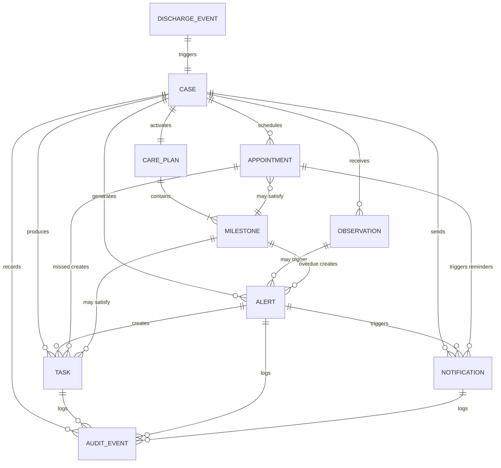
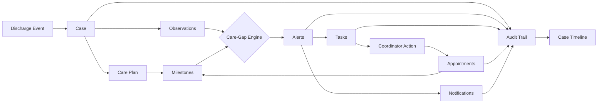

# Domain Overview

**Document type:** Domain reference
**Last updated:** 2026-03-27

---

## The Post-Discharge Care Problem

The 30 days following hospital discharge are among the most dangerous in a patient's care journey. During this window, patients face compounding risks: missed or incorrect medications, delayed follow-up appointments, undetected deterioration in vital signs, and gaps in communication between the hospital team and outpatient providers. These failures contribute directly to preventable hospital readmissions, adverse events, and higher costs for both patients and healthcare organizations.

Structured post-discharge care coordination — timely outreach, remote monitoring, milestone tracking, and proactive escalation — has been shown to materially reduce readmission risk. The challenge is operational: most provider organizations lack a unified system to orchestrate these activities across patients, staff, and time windows.

CareBridge addresses this gap as a reference implementation using synthetic data only.

---

## CareBridge Domain Focus

CareBridge covers a **narrow, well-defined operational scope**: the workflow from hospital discharge event through 30-day follow-up completion.

The platform begins when a patient is discharged and ends when their post-discharge care plan is complete (all milestones satisfied, follow-up appointments attended, and no outstanding alerts). Everything inside this window — case tracking, care plan execution, observation intake, alerting, task management, appointment scheduling, notifications, and audit logging — is CareBridge's domain.

### What CareBridge is not

| Not this | Why |
|---|---|
| An EHR (Electronic Health Record) | CareBridge does not manage the clinical record of truth. It receives discharge data from an external EHR. |
| A billing or claims system | No reimbursement, coding, or financial workflows. |
| A patient portal | The MVP targets internal operational users (coordinators, clinicians, managers, admins), not patients directly. |
| A medical device or diagnostic tool | CareBridge ingests readings and applies rules. It does not generate clinical diagnoses or treatment recommendations. |
| A general-purpose scheduling system | Appointment coordination is scoped to post-discharge follow-ups only. |

CareBridge is a **coordination layer**. It connects the dots between discharge, monitoring, outreach, and follow-up — surfacing risk and driving action for operational teams.

---

## Key Domain Concepts

| Concept | Definition |
|---|---|
| **Discharge Event** | The trigger that initiates the care coordination workflow. Represents a patient leaving the hospital after an inpatient encounter. Contains patient identity, discharge date, primary conditions, and follow-up recommendations. Received as a synthetic FHIR-aligned bundle from an external system. |
| **Case** | The primary operational unit in CareBridge. A case tracks a single patient's post-discharge period from intake through 30-day completion (or closure). Every observation, alert, task, appointment, and notification is associated with a case. Cases have a lifecycle: `created`, `active`, `at-risk`, `completed`, `closed`. |
| **Care Plan** | A structured set of milestones and actions activated for a specific case based on diagnosis pathway or discharge type. Care plans are instantiated from configurable templates. They define what should happen and when during the post-discharge window. |
| **Milestone** | A specific checkpoint within a care plan that must be completed within a defined timeframe. Examples: initial outreach within 48 hours, medication review within 72 hours, follow-up appointment within 7 days. Milestones have states: `pending`, `active`, `completed`, `overdue`, `skipped`. |
| **Observation** | A remote patient monitoring reading submitted by a simulated home device. Includes vital signs such as blood pressure, heart rate, SpO2, temperature, blood glucose, and weight. Each observation carries a patient ID, timestamp, type, value, and source identifier. |
| **Alert** | A system-detected issue that requires attention. Alerts are raised by the Care-Gap Engine when an abnormal observation is received, a milestone is overdue, or a care gap is detected. Severity levels: `informational`, `medium`, `high`, `critical`. States: `open`, `acknowledged`, `resolved`, `dismissed`. |
| **Task** | An assigned work item for a care coordinator. Tasks are created automatically (from alerts or milestone deadlines) or manually by staff. Each task has an owner, patient context, priority, due date, status, and comments. Tasks drive the day-to-day operational work of coordination. |
| **Appointment** | A scheduled follow-up visit tied to a case. States: `proposed`, `booked`, `completed`, `canceled`, `no-show`. Booking an appointment can satisfy a care plan milestone. Missed appointments trigger new tasks and alerts. |
| **Notification** | A message sent to a patient or staff member. Types include reminders (appointment, medication), escalations (clinician alert), and operational notices (admin alert). Channels for MVP: email, in-app, simulated SMS. Each notification attempt is logged with delivery status. |
| **Audit Event** | An immutable record of a system or user action. Every significant operation — case creation, care plan change, alert raised, task assigned, notification sent, configuration change — generates an audit event with timestamp, actor, action, entity type, entity ID, and correlation ID. |

---

## Domain Boundaries

CareBridge operates within clearly defined boundaries. The following diagram and table clarify what is inside the CareBridge domain versus what is treated as external.

### Inside CareBridge (owned)

- Case lifecycle management
- Care plan template instantiation and milestone tracking
- Observation ingestion, validation, and storage
- Care-gap detection and alert generation
- Task creation, assignment, and lifecycle
- Appointment scheduling and follow-up tracking
- Notification templating, delivery, and logging
- Audit event capture and storage
- Dashboard and timeline read models
- API gateway and BFF for the web UI

### External to CareBridge (integrated but not owned)

| External System | Relationship to CareBridge |
|---|---|
| **EHR / Hospital System** | Source of the discharge event bundle. CareBridge receives data but does not write back to the EHR. |
| **Patient Identity Source** | Patient demographics and identifiers originate externally. CareBridge stores a local operational reference but is not the identity system of record. |
| **Pharmacy Systems** | Medication lists come from discharge data. CareBridge tracks medication review milestones but does not interact with pharmacy dispensing. |
| **Insurance / Payer Systems** | Out of scope entirely. No billing, claims, or eligibility checks. |
| **Device / RPM Vendors** | Simulated in the reference implementation. In a production scenario, device readings would arrive via vendor APIs or integration gateways. |
| **Microsoft Entra ID** | Provides workforce authentication and identity for internal users. CareBridge delegates authentication but owns authorization (role-based access). |
| **Azure Infrastructure** | Compute, messaging, and storage are provided by Azure services. CareBridge services run on AKS and integrate with Service Bus, SQL, Cosmos DB, and Key Vault. |

---

## Domain Concept Relationships

### Concept flow (simplified)

---

## Cross-References

- [Product Requirements Document](prd.md) — full product scope, functional requirements, and delivery milestones
- [Solution Architecture](../architecture/solution-architecture.md) — how domain concepts map to services and infrastructure
- [Core Workflows](core-workflows.md) — operational workflows that connect these concepts in practice
- [User Personas](user-personas.md) — who interacts with these domain concepts and how
