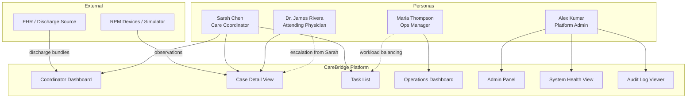

# User Personas

**Document type:** Product reference
**Last updated:** 2026-03-27

---

## Overview

CareBridge serves four primary user roles. Each persona represents a distinct set of responsibilities, workflows, and information needs. These personas drive UI design decisions, access control policies, and feature prioritization.

All personas interact with synthetic data in this reference implementation. The workflows and screens described below reflect realistic operational patterns in post-discharge care coordination.

---

## 1. Sarah Chen — Care Coordinator

**Role:** Post-Discharge Care Coordinator
**Department:** Care Management
**Technical level:** Non-technical — comfortable with web applications but not a developer or clinician
**Caseload:** 40 to 60 active cases at any given time

### Goals

- Ensure every discharged patient receives timely outreach and follow-up within SLA windows
- Identify which patients need attention today and prioritize accordingly
- Complete assigned tasks efficiently and close care gaps before they escalate
- Keep case records accurate so clinicians and managers have reliable information

### Daily Workflow

1. **Morning triage (8:00 AM):** Opens the coordinator dashboard. Reviews new cases assigned overnight from discharge intake. Checks overdue tasks and unresolved alerts sorted by priority.
2. **Outreach block (8:30 - 11:00 AM):** Works through the task list. Calls patients for initial post-discharge outreach. Documents outreach results. Marks milestones as completed or escalates issues.
3. **Midday review (11:00 AM):** Checks incoming observations for flagged readings. Reviews any new alerts generated by the Care-Gap Engine. Acknowledges alerts and creates follow-up tasks where needed.
4. **Appointment coordination (1:00 - 3:00 PM):** Schedules follow-up appointments for cases approaching the 7-day milestone. Confirms upcoming appointments with patients. Handles appointment reschedules and cancellations.
5. **End-of-day wrap (3:30 - 4:30 PM):** Updates task statuses. Adds notes to case records. Reviews tomorrow's task and appointment preview.

### What Sarah Needs from CareBridge

- A single view of "what do I need to do today" — sorted by urgency, not just chronological order
- Clear indicators for overdue milestones, unresolved alerts, and approaching deadlines
- Fast access to case details without navigating through multiple screens
- The ability to complete tasks, schedule appointments, and send notifications from the case context
- Confidence that the system is surfacing everything that needs attention — no silent failures

### Key Screens and Features

| Screen | Purpose |
|---|---|
| **Coordinator Dashboard** | Daily work queue: new cases, overdue tasks, open alerts, today's appointments |
| **Task List** | Filterable list of assigned tasks with priority, due date, patient context, and quick actions |
| **Case Detail** | Full operational view of a single patient case: summary, care plan progress, observations, alerts, tasks, appointments, timeline |
| **Notification Center** | Outbound notifications sent and pending, delivery status, retry actions |
| **Appointment Scheduler** | Create, view, and manage follow-up appointments tied to a case |

### Frustrations Without a System Like CareBridge

- Tracking patients in spreadsheets and email threads, leading to missed outreach windows
- No reliable way to know which patients are overdue for follow-up without manually checking each case
- Alerts from monitoring devices arrive in a separate system with no connection to the care plan
- Handoffs between shifts are verbal or paper-based, causing information loss
- No audit trail to prove that outreach was attempted on time

---

## 2. Dr. James Rivera — Attending Physician

**Role:** Attending Physician / Clinical Reviewer
**Department:** Internal Medicine
**Technical level:** Moderate — uses clinical systems daily but expects tools to surface information, not require hunting
**Patient volume:** Reviews 10 to 20 high-risk post-discharge cases per week when flagged by coordinators

### Goals

- Quickly assess the clinical status of flagged patients without wading through operational noise
- Review recent observations and identify trends that warrant intervention
- Confirm that care plan milestones are progressing on schedule for high-risk patients
- Provide clinical input on escalated alerts and approve or redirect care plan adjustments

### Daily Workflow

1. **Morning review (7:30 AM):** Checks a filtered view of high-risk and escalated cases assigned for clinical review. Scans recent observation trends for flagged patients.
2. **Alert review (as needed):** Receives in-app or email notifications when a coordinator escalates an alert. Opens the case detail view, reviews the observation history, and provides a clinical note or recommendation.
3. **Care plan oversight (weekly):** Reviews care plan progress for patients under their service. Identifies cases that are stalling or at risk of readmission.
4. **Case conference (as scheduled):** References case timelines during team discussions. Uses observation history and alert summaries to support clinical decisions.

### What Dr. Rivera Needs from CareBridge

- A concise, clinically oriented patient summary — not a task management interface
- Observation history with trend visualization (recent readings, direction of change)
- Clear display of care plan progress: which milestones are done, which are overdue, which are upcoming
- Escalated alert detail with enough context to make a decision without calling the coordinator
- Minimal clicks to reach the relevant clinical information from a notification

### Key Screens and Features

| Screen | Purpose |
|---|---|
| **Case Detail View** | Patient summary, discharge context, care plan progress, and clinical notes |
| **Observation History** | Time-series view of remote monitoring readings with threshold indicators |
| **Alert Review** | Escalated alerts with severity, source observation or milestone, and coordinator notes |
| **Care Plan View** | Milestone status, completion dates, and overdue indicators |

### Frustrations Without a System Like CareBridge

- Receives escalation calls or pages with insufficient context, requiring chart review from scratch
- No consolidated view of a post-discharge patient's monitoring data alongside their care plan
- Observation readings are in one system, care plan status in another, and tasks in a third
- No easy way to see whether a patient's condition is trending in the wrong direction over days
- Clinical time is wasted re-gathering information that should be pre-assembled

---

## 3. Maria Thompson — Operations Manager

**Role:** Care Coordination Operations Manager
**Department:** Care Management
**Technical level:** Moderate — works with dashboards and reports, expects operational KPIs without manual data assembly
**Team size:** Manages a team of 8 to 12 care coordinators

### Goals

- Maintain SLA compliance: initial outreach within 48 hours, appointment scheduled within 7 days
- Balance workload across the coordinator team to prevent bottlenecks and burnout
- Identify systemic issues: rising alert volumes, growing task backlogs, missed milestones across the team
- Report on operational performance to leadership with reliable data

### Daily Workflow

1. **Morning operations check (7:45 AM):** Opens the operations dashboard. Reviews overnight intake volume (new cases). Checks SLA compliance metrics: percentage of cases with outreach in 48h, percentage with appointments in 7d.
2. **Workload balancing (8:15 AM):** Reviews task distribution across coordinators. Identifies coordinators with overloaded queues. Reassigns cases or tasks as needed.
3. **Midday pulse (12:00 PM):** Checks alert queue health: open alerts by severity, average time to acknowledgment. Reviews any dead-letter or failed message indicators for processing issues.
4. **Weekly reporting (Friday):** Pulls operational summary: cases opened and closed, SLA compliance rates, alert volumes and resolution times, task completion rates. Identifies trends week over week.
5. **Escalation handling (as needed):** Investigates cases flagged as at-risk by multiple alerts. Coordinates with clinical team when patterns suggest a systemic care gap.

### What Maria Needs from CareBridge

- Operational dashboards with real-time workload, SLA, and queue health metrics
- Team-level views: tasks per coordinator, cases per coordinator, overdue items per coordinator
- Trend visibility: are things getting better or worse over the past week?
- The ability to drill down from a metric to the specific cases or tasks driving it
- Confidence that the numbers reflect reality — no tasks stuck in unknown states, no silent processing failures

### Key Screens and Features

| Screen | Purpose |
|---|---|
| **Operations Dashboard** | Team-wide metrics: intake volume, SLA compliance, alert queue depth, task backlog, appointment rates |
| **Workload View** | Per-coordinator breakdown of active cases, open tasks, and overdue items |
| **SLA Compliance Report** | Percentage of cases meeting outreach (48h) and appointment (7d) targets over time |
| **Queue Health** | Service Bus queue depth, dead-letter counts, failed message visibility |
| **Case List (filtered)** | Cases filtered by status, risk level, coordinator, or SLA compliance state |

### Frustrations Without a System Like CareBridge

- SLA compliance is calculated manually from spreadsheets, often days after the window has passed
- No visibility into individual coordinator workloads until someone is already overwhelmed
- Alert volumes and task backlogs are invisible until a patient is readmitted
- Reporting to leadership requires assembling data from multiple disconnected sources
- No way to detect processing failures (stuck messages, failed notifications) until a patient falls through the cracks

---

## 4. Alex Kumar — Platform Administrator

**Role:** Platform Administrator
**Department:** Health IT
**Technical level:** Technical — comfortable with configuration management, system monitoring, and troubleshooting
**Responsibility:** Maintains the CareBridge platform for the care coordination program

### Goals

- Keep the platform running reliably: services healthy, messages flowing, queues clear
- Manage care pathway configuration: templates, thresholds, routing rules, and notification templates
- Detect and resolve processing issues before they affect patient care workflows
- Support the operations team with configuration changes and troubleshooting

### Daily Workflow

1. **Morning health check (7:00 AM):** Opens the system health view. Checks service status, recent deployment health, and error rates. Reviews Service Bus queue depths and dead-letter counts.
2. **Configuration management (as needed):** Updates care pathway templates when new discharge types are added. Adjusts alert thresholds based on clinical feedback. Modifies notification templates for new communication requirements. Updates task routing rules when team structure changes.
3. **Troubleshooting (as needed):** Investigates failed messages in dead-letter queues. Traces specific events through the system using correlation IDs. Reviews audit logs to understand unexpected behavior. Replays or manually processes stuck messages.
4. **Capacity review (weekly):** Checks resource utilization across services. Reviews autoscaling behavior during peak intake periods. Monitors database performance and query latency.

### What Alex Needs from CareBridge

- A clear system health overview: service status, error rates, queue depths, recent deployments
- Dead-letter queue inspection with message content, failure reason, and replay capability
- Configuration management for care pathways, alert rules, notification templates, and routing without code changes
- Audit log access for security reviews and incident investigation
- Correlation ID tracing to follow a single event through the entire service chain

### Key Screens and Features

| Screen | Purpose |
|---|---|
| **System Health View** | Service-level status, error rates, uptime, recent deployments, resource utilization |
| **Admin Panel** | Manage care pathway templates, alert thresholds, notification templates, and routing rules |
| **Dead-Letter Inspector** | View failed messages, failure reasons, and replay or discard actions |
| **Audit Log Viewer** | Searchable audit trail filtered by user, case, action type, time range, and correlation ID |
| **Queue Monitor** | Service Bus topic and subscription depths, processing rates, and consumer lag |

### Frustrations Without a System Like CareBridge

- Configuration changes require code deployments instead of administrative updates
- Failed messages silently disappear with no visibility into what went wrong
- No centralized health view — must check each service and infrastructure component individually
- Troubleshooting requires direct database access or log file searches across multiple services
- No correlation between a user-reported issue and the specific system events that caused it

---

## Persona Interaction Map

The following diagram shows how the four personas interact with CareBridge and with each other through the platform.

---

## Cross-References

- [Product Requirements Document](prd.md) — target users (Section 7) and UX requirements (Section 18)
- [Domain Overview](domain-overview.md) — the domain concepts each persona interacts with
- [Core Workflows](core-workflows.md) — the operational workflows these personas execute
- [Non-Functional Requirements](non-functional-requirements.md) — performance and availability expectations that affect user experience
